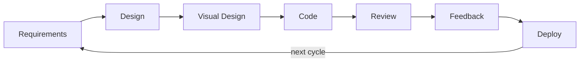

# SDLC Process

The Software Development Life Cycle using orchestrated agents. Each cycle delivers incremental value. Product Owner may trigger new cycles for split-out work.

## Agents

| Agent | Phase | Responsibility |
|-------|-------|----------------|
| Coordinator | Orchestration | Assesses tasks, spawns agents dynamically, gates transitions |
| Product Owner | Requirements | Gathers requirements, validates final result |
| Architect | Design | Creates ADR + PLAN, proposes options |
| Designer | Visual Design | Creates HTML + CSS mockups (2-3 drafts), iterates with user |
| Frontend Engineer | Frontend Code | Implements client-side code, extracts from approved mockups |
| Backend Engineer | Backend Code | Implements server-side code, APIs, DB, WASM |
| Reviewer | Validation | Per-stage adversarial review + final gate with external triage |
| Maintainer | Deploy | Merges PR, handles releases |

## Dynamic Agent Selection

The Coordinator assesses each task and spawns only the agents needed. Not every cycle uses every agent.

| Task Type | Typical Agents |
|-----------|--------------|
| UI feature | PO → Architect → Designer → Frontend Engineer → Reviewer → Maintainer |
| API/backend feature | PO → Architect → Backend Engineer → Reviewer → Maintainer |
| Full-stack feature | PO → Architect → (Designer if UI) → Frontend + Backend Engineers → Reviewer → Maintainer |
| Config/docs/chore | PO → Architect → Engineer (coordinator picks) → Reviewer → Maintainer |
| Bug fix | PO → Architect → specialized engineer → Reviewer → Maintainer |

## Flow

1. Requirements → Product Owner gathers requirements
2. Design → Architect creates .state/<branch>/ADR.md + PLAN.md
3. Visual Design → [Optional] Designer creates 2-3 drafts, user approves (when UI work present)
4. Code → Engineer(s) implement per PLAN stages
5. Review → Reviewer validates per stage (blocking → fix loop) + final review
6. Feedback → Product Owner reviews spec compliance
7. Deploy → Maintainer merges after approvals

## Iterative Cycle

Product Owner decides when to ship vs iterate.
