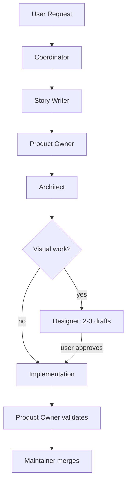
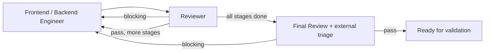

# Workflow

SDLC workflow variants and shared agent protocols.

## Purpose

Agents separate concerns across the SDLC. Each agent has a distinct responsibility and fresh context, preventing one agent from doing everything and accumulating bias.

## Architecture

Each agent is defined as a single agent file in `.agents/agents/`. The agent file contains:

1. **YAML frontmatter** — configuration (model, tools, permissions, skills, maxTurns)
2. **Markdown body** — agent-specific behavioral instructions, workflow, and output format

The Coordinator spawns agents by name via `Task(agent-name, "prompt with context")`. Each spawned agent:
- Starts with its behavioral instructions from its agent file body
- Preloads shared protocols via the `skills: [workflow, instructions]` field
- Has independent model/tool/permission configuration

Shared protocols (blocked request protocol, cross-consultation, verification, phases) are defined in `SKILL.md` and loaded by all agents via the `skills` field.

## Flow

SDLC phases (top-down):



Implementation loop (left-right):



## Design Documents

### ADR.md (Architecture Decision Record)

Immutable after approval. The contract everyone works against.

| Section | Purpose |
|---------|---------|
| Status | Proposed → Accepted → (Rejected/Superseded) |
| Context | Problem being solved, forces at play |
| Options | 2-3 approaches with pros/cons |
| Decision | Chosen option and why |
| Consequences | What becomes easier/harder, follow-ups |
| Decision History | Numbered log of decisions made with user |

Modified only by: Architect (with Product Owner approval in a formal loop)

### PLAN.md (Execution Plan)

Mutable during implementation. Detailed work tracking.

| Section | Purpose |
|---------|---------|
| Open Questions | Implementation challenges for engineers to solve |
| Stages | Tasks with goals, files, considerations |
| Dependencies | What must complete before what |
| Progress | Status tracking updated by engineers |

Modified by: Engineers (progress), Architect (scope changes via ADR loop)

## Agents

### Coordinator
- Coordinates the SDLC flow
- Never writes code
- Assesses each task and dynamically selects which agents to spawn
- Spawns other agents with fresh context
- Gates transitions between phases
- Orchestrates cross-consultation between PO and Architect
- Spawns reviewer after each PLAN stage during implementation

### Story Writer
- Translates requests into user stories from multiple stakeholder perspectives
- Always runs first in both SDLC and Direct Assist flows
- Consults `platform-user` for end-user reaction, `researcher` for codebase context, and optionally other agents
- User approves or modifies stories before proceeding

### Platform User
- Role-plays as an end-user of the platform (non-technical)
- Consulted by the story-writer to surface user-facing impact
- Reacts to proposed changes from a daily-workflow perspective
- Can spawn `ui-explorer` to look at the actual platform UI
- Does NOT read code or access the codebase

### UI Explorer
- Navigates the running platform UI via Playwright, captures screenshots, describes what it sees
- Read-only — observes and reports, never modifies
- Spawnable by any agent that needs visual context (`platform-user`, `story-writer`, `reviewer`, etc.)

### Product Owner
- Appears twice: requirements gathering (start) and validation (end)
- Conducts requirements interviews or drafts directly when clear
- Verifies ADR Context problem is solved
- Checks for scope creep
- Proposes splitting out-of-scope work

### Architect
- Creates ADR.md and PLAN.md
- Proposes 2-3 options, asks for user input
- Focuses on decisions, not implementation details
- Hands off only after explicit approval
- Can be consulted during PO phase for feasibility checks

### Designer
- Creates visual mockups and designs as HTML + CSS files, verified via browser MCP
- Iterates with user (max 5 iterations per design element)
- Hands off approved designs with screenshots and notes (via Coordinator)
- Does NOT write application code

### Frontend Engineer
- Scoped to client-side code (`src/client/`, `src/shared/`, `design/`)
- Implements UI to match approved designer mockups
- Works from PLAN.md stages
- Can run in parallel with Backend Engineer when stages don't overlap

### Backend Engineer
- Scoped to server-side code (`src/server/`, `packages/`)
- Handles Hono routes, DB layer, WASM packages
- Works from PLAN.md stages
- Can run in parallel with Frontend Engineer when stages don't overlap

### Reviewer
- Adversarial review used at two points: per-stage (after each PLAN stage) and post-implementation (final gate)
- Severity-classified findings: BLOCKING / WARNING / NIT
- BLOCKING findings trigger a fix loop — engineer must address before next stage
- Optionally triages external findings (CodeRabbit, SonarCloud) when provided by the coordinator

### Maintainer
- Merges PR after approvals
- Updates ADR Status to Accepted
- Handles releases
- Monitors CI and manages PR lifecycle

## Git Contract Enforcement

Each workflow variant in `variants/*.md` defines a git contract with allowed commit scopes. The `.husky/commit-msg` hook enforces this at commit time by dynamically parsing the `| Commit scopes |` row from every variant file.

**Adding a scope:** Add it to the relevant variant's git contract table — the hook picks it up automatically, no hardcoded lists to maintain.

**How it works:** The hook extracts backtick-wrapped scopes from the `Commit scopes` row of each variant, deduplicates them, and validates any `type(scope): message` commit against the union. Commits without a scope (e.g. `chore: description`) are allowed.

To see current scopes per variant, trigger the hook with an invalid scope:

```bash
echo 'feat(invalid): test' | bash .husky/commit-msg /dev/stdin
```

## Key Principles

1. Fresh context - each agent starts clean, no accumulated bias
2. ADR is the contract - implementation verified against it
3. PLAN is mutable - progress tracked without touching ADR
4. Scope discipline - out-of-scope work becomes new ADR cycle
5. Explicit approval - no phase transitions without sign-off
6. Agent files as configuration - each agent has its model, tools, and permissions defined in YAML frontmatter
7. Skills as shared protocols - cross-cutting concerns (collaboration protocol, verification rules, coding principles) loaded via the skills field
8. Dynamic agent selection - Coordinator picks only the agents needed per task
9. Agent isolation - each agent is a standalone black box with defined inputs and outputs; agents never address other agents directly; the Coordinator is the only component aware of the full topology and acts as a transparent routing layer

## Review Strategy

One `reviewer` agent, used twice per cycle:

1. **Per-stage:** After each PLAN stage completes, the coordinator spawns `reviewer` on the stage diff. BLOCKING findings must be fixed before the next stage proceeds. This catches issues early instead of accumulating them.
2. **Final gate:** After all stages complete, the coordinator spawns `reviewer` for a full review including external findings (CodeRabbit, SonarCloud). No blocking findings → PR is ready for merge.
