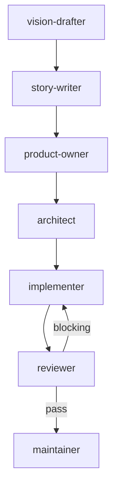

# Chore Workflow

For maintenance, config, docs, dependency updates, CI changes.

## Phases

| # | Agent | Gate |
|---|-------|------|
| 0 | `vision-drafter` | User approves VISION_STEP.md |
| 1 | `story-writer` | User approves or modifies stories |
| 2 | `product-owner` | REQUIREMENTS.md signed off (can be lightweight) |
| 3 | `architect` | ADR.md + PLAN.md approved (can be minimal) |
| 4 | `implementer` | All PLAN stages complete |
| 5 | `reviewer` | No blocking findings (includes triage of CodeRabbit/external findings when available) |
| 6 | `maintainer` | CI green, all approvals |

No pair review — chore tasks are typically small and don't benefit from incremental stage review.

## Git Contract

| Rule | Value |
|------|-------|
| Branch prefix | `chore/` |
| Commit scopes | `deps`, `config`, `docs`, `ci`, `agents` |
| Allowed paths | task-specific (defined in PLAN.md) |
| PR title | `chore: <description>` |
