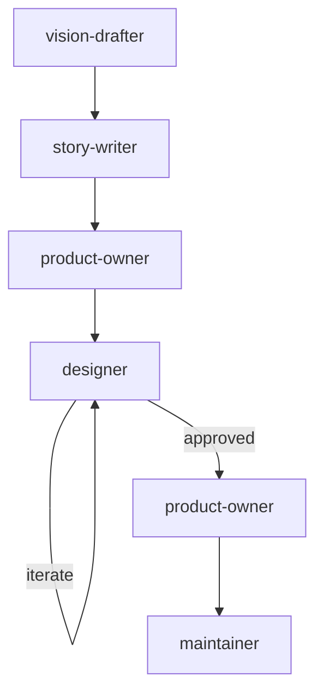

# Design Workflow

For visual design work only — no implementation.

## Phases

| # | Agent | Gate |
|---|-------|------|
| 0 | `vision-drafter` | User approves VISION_STEP.md |
| 1 | `story-writer` | User approves or modifies stories |
| 2 | `product-owner` | REQUIREMENTS.md signed off |
| 3 | `designer` | Mockups approved by user |
| 4 | `product-owner` | Validates designs match REQUIREMENTS.md |
| 5 | `maintainer` | CI green, all approvals |

No architect phase — design work doesn't need an ADR unless it involves architectural decisions (in which case, use the frontend or full-stack workflow instead).

## Git Contract

| Rule | Value |
|------|-------|
| Branch prefix | `design/` |
| Commit scopes | `design` |
| Allowed paths | `design/**`, `.state/**/designs/**` |
| PR title | `design: <description>` |
