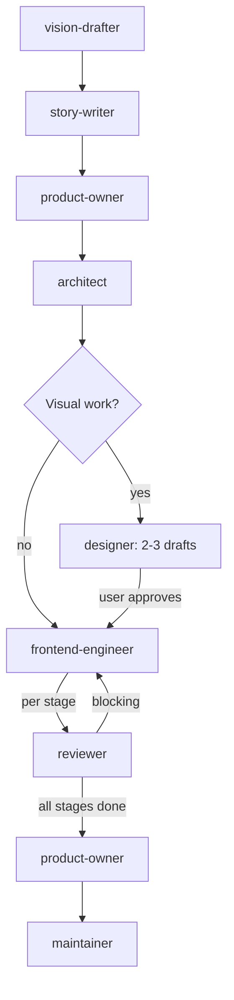

# Frontend Workflow

For tasks scoped to client-side code.

## Phases

| # | Agent | Gate |
|---|-------|------|
| 0 | `vision-drafter` | User approves VISION_STEP.md |
| 1 | `story-writer` | User approves or modifies stories |
| 2 | `product-owner` | REQUIREMENTS.md signed off |
| 3 | `architect` | ADR.md + PLAN.md approved |
| 4 | `designer` | Produces 2-3 design drafts per component/page. User decides — agents may recommend but never default to a draft. Coordinator blocks until user explicitly approves. No engineering starts until design is approved. |
| 5 | `frontend-engineer` + `reviewer` | Per stage: implement → review → fix blocking → next stage. All stages complete. |
| 6 | `reviewer` | Final review — no blocking findings (includes triage of CodeRabbit/external findings when available) |
| 7 | `product-owner` | Validates against REQUIREMENTS.md |
| 8 | `maintainer` | CI green, all approvals |

Phase 4 is skipped when the task has no visual changes (bug fixes, refactoring, logic-only changes).

Design decision rule: the designer presents options and may recommend. The user chooses. No agent is allowed to default to a draft. If the user hasn't explicitly said which draft to use, the workflow is blocked.

Mid-implementation design escalation: if the frontend-engineer discovers that a task requires visual changes that weren't anticipated (new button, new section, changed layout, new interface element), the engineer must pause, spawn a `designer` to produce 2-3 drafts, present them to the user, and wait for explicit approval before continuing. The engineer does not make visual design decisions.

## Git Contract

| Rule | Value |
|------|-------|
| Branch prefix | `feat/client-` or `fix/client-` |
| Commit scopes | `client`, `shared`, `design` |
| Allowed paths | `src/client/**`, `src/shared/**`, `design/**` |
| PR title | `feat(client): <description>` or `fix(client): <description>` |

Commits touching files outside allowed paths violate this contract. Stop and escalate to coordinator.
