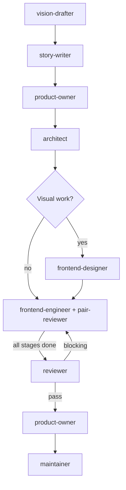

# Frontend Workflow

For tasks scoped to client-side code.

## Phases

| # | Agent | Gate |
|---|-------|------|
| 0 | `vision-drafter` | User approves VISION_STEP.md |
| 1 | `story-writer` | User approves or modifies stories |
| 2 | `product-owner` | REQUIREMENTS.md signed off |
| 3 | `architect` | ADR.md + PLAN.md approved |
| 4 | `frontend-designer` | Mockups approved (if visual work) |
| 5 | `frontend-engineer` + `pair-reviewer` | Per stage: implement → pair review → fix blocking → next stage. All stages complete. |
| 6 | `reviewer` | No blocking findings (includes triage of CodeRabbit/external findings when available) |
| 7 | `product-owner` | Validates against REQUIREMENTS.md |
| 8 | `maintainer` | CI green, all approvals |

Phase 4 is skipped when the task has no visual/UX changes.

## Git Contract

| Rule | Value |
|------|-------|
| Branch prefix | `feat/client-` or `fix/client-` |
| Commit scopes | `client`, `shared`, `design` |
| Allowed paths | `src/client/**`, `src/shared/**`, `design/**` |
| PR title | `feat(client): <description>` or `fix(client): <description>` |

Commits touching files outside allowed paths violate this contract. Stop and escalate to coordinator.
