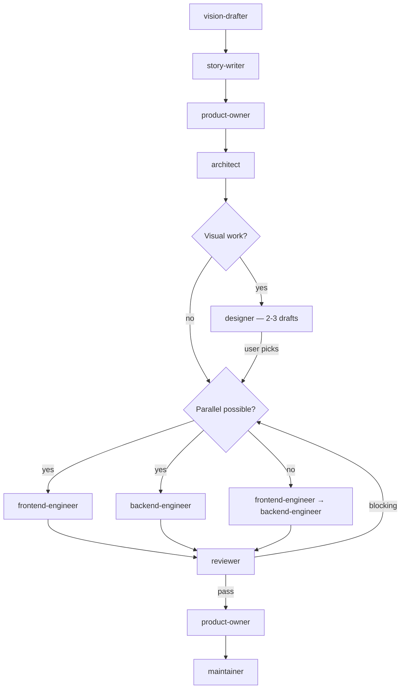

# Full-Stack Workflow

For tasks spanning both client and server code.

## Phases

| # | Agent | Gate |
|---|-------|------|
| 0 | `vision-drafter` | User approves VISION_STEP.md |
| 1 | `story-writer` | User approves or modifies stories |
| 2 | `product-owner` | REQUIREMENTS.md signed off |
| 3 | `architect` | ADR.md + PLAN.md approved |
| 4 | `designer` | Produces 2-3 design drafts. User decides — agents may recommend but never default to a draft. Coordinator blocks until user explicitly approves. No engineering starts until design is approved. (Skip if no visual work.) |
| 5 | `frontend-engineer` + `backend-engineer` + `reviewer` | Per stage: implement → review → fix blocking → next stage. All stages complete. |
| 6 | `reviewer` | Final review — no blocking findings (includes triage of CodeRabbit/external findings when available) |
| 7 | `product-owner` | Validates against REQUIREMENTS.md |
| 8 | `maintainer` | CI green, all approvals |

Phase 4 is skipped when the task has no visual changes (bug fixes, refactoring, logic-only changes).

Mid-implementation design escalation: if the frontend-engineer discovers unanticipated visual changes during Phase 5 (new button, new section, changed layout, new interface element), the engineer must pause, spawn a `designer` to produce 2-3 drafts, present them to the user, and wait for explicit approval before continuing.

Phase 5 parallelism rules:
- When PLAN stages have non-overlapping files and no dependencies, spawn `frontend-engineer` and `backend-engineer` in parallel.
- When stages share files or have dependencies, run them sequentially (frontend first, then backend, or vice versa per the dependency chain).
- Max 2 parallel agents. Never run two agents on the same files.

## Git Contract

| Rule | Value |
|------|-------|
| Branch prefix | `feat/` or `fix/` |
| Commit scopes | `client`, `server`, `shared`, `db`, `wasm` |
| Allowed paths | `src/**`, `packages/**` |
| PR title | `feat: <description>` or `fix: <description>` |
