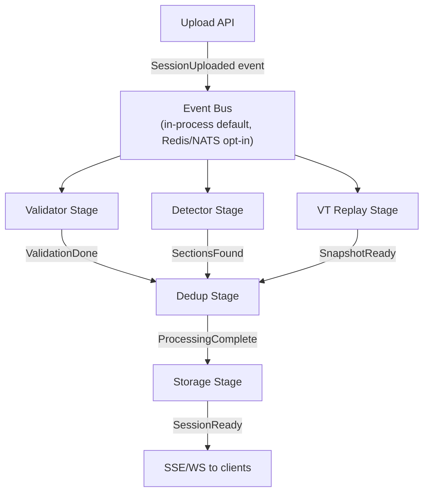
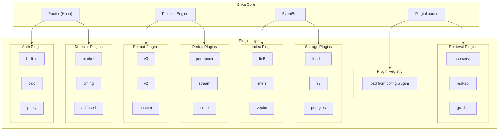
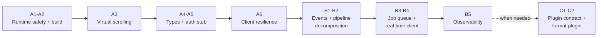

# Architecture Review: Weaknesses & Proposed Directions

Branch: `cursor/architecture-review-proposals-fb67`
Date: 2026-03-07
Status: Draft

---

## Methodology

Four independent review agents analyzed the codebase in parallel, each from a distinct angle:

| Agent | Scope | Focus |
|-------|-------|-------|
| **Server** | `src/server/`, `packages/vt-wasm/` | Processing pipeline, DB layer, API surface, WASM bridge |
| **Client** | `src/client/`, `src/shared/` | Component design, state management, performance, accessibility |
| **Domain** | Cross-cutting | Domain model, data flow, schema evolution, deployment topology |
| **DevOps** | CI/CD, build, testing | Test strategy, build system, production readiness, observability |

Findings were consolidated, deduplicated, and ranked. The 3 variant proposals at the bottom represent distinct architectural directions, each addressing the weaknesses differently.

---

## Part 1: Weakness Inventory

### Critical (blocks production use)

| # | Finding | Source | Evidence |
|---|---------|--------|----------|
| C1 | **No production server build** — `npm run start` expects `dist/server/start.js` which is never compiled. `tsconfig.json` uses `allowImportingTsExtensions` which blocks emit. | DevOps | `package.json` start script vs missing build step |
| C2 | **Synchronous file I/O** — `FsStorageImpl` uses `readFileSync`/`writeFileSync` wrapping them in async signatures. A 250MB file read blocks the entire event loop. | Server | `src/server/db/fs_storage_impl.ts:6-7` |
| C3 | **No authentication** — Every endpoint is public. Ranked #1 quality attribute in ARCHITECTURE.md, 0% implemented. | Server, Domain | `ARCHITECTURE.md` Section 3 vs codebase |
| C4 | **No virtual scrolling** — 40,000+ DOM nodes for a single large session (3,159 lines × ~13 nodes each). Multi-second renders, janky scrolling. | Client | `src/client/components/TerminalSnapshot.vue` |
| C5 | **Full in-memory event buffering** — Pipeline collects all events into a JS array. Upload validation splits the entire file content. Combined: ~500MB+ RAM for a 250MB file. | Server | `session-pipeline.ts:59`, `asciicast.ts:47` |

### High (will break under real use)

| # | Finding | Source | Evidence |
|---|---------|--------|----------|
| H1 | **No pipeline concurrency control** — Unbounded parallel pipelines, each allocating WASM instances + in-memory snapshots. 10 concurrent uploads = OOM. | Server | `pipeline-tracker.ts` tracks but doesn't limit |
| H2 | **No transaction boundaries** — Pipeline does 5+ sequential DB operations outside any transaction. Crash mid-loop = orphaned/partial sections. | Server, Domain | `session-pipeline.ts:55-264` |
| H3 | **WASM resource leak on error** — No `try/finally` protecting `vt.free()`. Error after `createVt()` leaks the WASM instance. | Server | `session-pipeline.ts:121-269` |
| H4 | **No rate limiting** — Upload endpoint accepts 250MB files with no per-IP or time-window throttling. Trivial DoS vector. | Server | All routes, no middleware |
| H5 | **API types not shared** — `SessionResponse` defined locally in client composable, server constructs ad-hoc response objects. Manual camelCase transforms with no type bridge. Drift guaranteed. | Client, Domain | `useSession.ts:27-49` vs `sessions.ts:97-105` |
| H6 | **No real-time processing status** — Client fetches once, never polls. Users see stale `detection_status` after upload. Must manually refresh. | Client | `useSession.ts` — no polling/SSE/WebSocket |
| H7 | **Zero ARIA accessibility** — No `role`, `aria-label`, `aria-expanded`, `aria-live` anywhere. Delete button uses `×` with no screen reader text. | Client | All `.vue` components |
| H8 | **Fire-and-forget pipeline** — Pipeline errors are logged but never stored, never surfaced to users, never retried. No dead-letter mechanism. | Server, Domain | `upload.ts:96-98` |
| H9 | **Monolithic pipeline function** — `processSessionPipeline` is 227 lines doing WASM init → streaming → detection → VT replay → epoch tracking → dedup → section creation → status updates. Single try/catch. | Server | `session-pipeline.ts:43-270` |
| H10 | **Toast state is non-singleton** — Each `useToast()` call creates a new `ref<Toast[]>([])`. Multiple consumers get separate toast arrays. | Client | `useToast.ts:12` |

### Medium (will cause pain at scale)

| # | Finding | Source | Evidence |
|---|---------|--------|----------|
| M1 | **Anemic domain model** — Session and Section are flat DTOs. No aggregate root, no invariants, no domain events. Status transitions via raw SQL. | Domain | `src/shared/types.ts:10-23` |
| M2 | **No migration framework** — Hand-rolled idempotent migrations with no version table, no ordering guarantee beyond call order, no rollback. | Domain, DevOps | `sqlite_database_impl.ts:58-63` |
| M3 | **Upload parses file 3 times** — `file.text()` → `validateAsciicast(content)` splits by `\n` → `parseAsciicast(content)` splits again → pipeline reads from disk via NdjsonStream. | Server | `upload.ts:49-65`, `session-pipeline.ts` |
| M4 | **Unbounded `findAll()`** — No pagination on session list. Grows linearly with session count. | Server | `session_adapter.ts:29`, `sessions.ts:24` |
| M5 | **Per-render style object allocation** — `getSpanStyle()` creates ~30,000 objects per render cycle for large sessions. | Client | `TerminalSnapshot.vue:83-90` |
| M6 | **Dead CSS** — 867-line `src/client/styles/terminal-colors.css` (256-color class system) never used. ~15KB shipped to production. | Client | Zero imports found |
| M7 | **Design system disconnected** — Components use `#4a9eff` blue and `system-ui` fonts. Design system defines `#00ff9f` green and Geist. Two parallel visual identities. | Client | Component styles vs `design/` tokens |
| M8 | **NdjsonStream swallows errors silently** — Malformed JSON lines get empty `catch {}`. No logging, no count. Partially corrupt files process without warning. | Server | `ndjson-stream.ts:55-57` |
| M9 | **Error details leak internals** — `err.message` returned to clients in error responses. Can expose filesystem paths, SQL errors, WASM internals. `nodeEnv` exists but unused for this. | Server | `upload.ts:79`, `sessions.ts:120` |
| M10 | **No HTTP client abstraction** — Raw `fetch()` everywhere. When auth arrives, every call needs modification. No retries, no timeout, no interceptors. | Client | All composables |
| M11 | **`session-processor.ts` is dead code** — Exported from `processing/index.ts` but never called. Pre-pipeline-refactor artifact. | Server | `session-processor.ts` |
| M12 | **No coverage thresholds** — Vitest `coverage` config has reporters but no minimums. Coverage can regress silently. | DevOps | `vite.config.ts` |
| M13 | **No `tsc --noEmit` in CI** — Type errors can reach main without detection. | DevOps | `.github/workflows/ci.yml` |
| M14 | **No Dockerfile for application** — Only WASM build has a Dockerfile. Self-hostability claim unfulfilled. | DevOps | Missing |
| M15 | **No dependency update automation** — No Dependabot, no Renovate, no `npm audit` in CI. | DevOps | Missing |
| M16 | **Redetect race condition** — Multiple rapid calls to `/api/sessions/:id/redetect` launch parallel pipelines for same session with interleaved section creation/deletion. | Server | `sessions.ts:199-206` |
| M17 | **No network error recovery** — All fetch calls catch errors and show messages but offer no retry. File reference lost after failed upload. | Client | All composables |
| M18 | **No upload progress tracking** — `fetch()` doesn't support progress events. Large files show only "Uploading..." | Client | `useUpload.ts` |
| M19 | **Composables have zero unit tests** — All 4 composables untested in isolation. | DevOps | `src/client/composables/` |

### Aspiration vs Reality

| ARCHITECTURE.md Claim | Reality | Gap |
|----------------------|---------|-----|
| "Multi-user" platform | No auth, no user model | Critical |
| "Security" = Priority #1 | Zero security implementation | Critical |
| "Multi-tenancy from day one" | No workspace, no tenant isolation | Critical |
| "Curated Segments" — core differentiator | No model, no API, no UI | High |
| "Same application code at every scale" | Single-process, fs-coupled, in-memory tracking | High |
| Docker Compose with PostgreSQL + Redis + AGR | Zero Docker Compose, zero PostgreSQL, zero Redis, zero AGR | High |
| AGR "runs as a service within the platform" | Zero AGR code exists | High |
| Database abstraction "fully implemented" | Correct — adapter pattern complete | **Match** |
| 6 bounded contexts | 2 partially implemented, 4 at 0% | Acknowledged |

---

## Part 2: Three Architectural Directions

Each variant addresses the weaknesses above with a different philosophy, risk profile, and timeline. They are not mutually exclusive — a chosen direction can absorb elements from the others.

---

### Variant A: "Harden the Foundation"

**Philosophy:** The current architecture is structurally sound. Fix the implementation deficiencies without changing the overall design. Make what exists production-ready before adding new capabilities.

**Risk:** Low — incremental changes, each independently testable and mergeable.

**Timeline:** 4-6 focused SDLC cycles.

#### What Changes

| Current state | Target state |
|---|---|
| FsStorageImpl: readFileSync | fs.promises (async I/O) |
| Unbounded pipeline concurrency | Semaphore (max 3 concurrent) |
| No try/finally on WASM | Resource guard pattern |
| Upload: 3 parse passes | Single-pass streaming validation |
| Pipeline: single 227-line function | Stage functions, still synchronous |
| findAll(): unbounded | Cursor-based pagination |
| Toast: per-instance state | Module-level singleton |
| TerminalSnapshot: 40K DOM nodes | @tanstack/vue-virtual |
| fetch() everywhere | Shared HTTP client with interceptors |
| Zero ARIA | Progressive ARIA pass |
| No production build | tsconfig.build.json + Dockerfile |
| No auth | Stub middleware (header-based initially) |
| No rate limiting | Hono middleware (rate-limit on upload) |
| No shared API types | Shared response types in src/shared/ |
| Dead code + dead CSS | Remove |

#### What Doesn't Change

- Single-process model (no event bus, no queue)
- SQLite as sole database
- Monolithic deployment topology
- Processing is synchronous and in-process
- No plugin/extension points
- Domain model stays flat (DTOs, no aggregates)

#### Stages

| Stage | Scope | Fixes |
|-------|-------|-------|
| 1 — Runtime Safety | Async I/O, pipeline semaphore, WASM resource guard, NdjsonStream error logging | C2, H1, H3, M8 |
| 2 — Build & Deploy | `tsconfig.build.json`, static file serving, Dockerfile, `.dockerignore`, health check depth | C1, M14 |
| 3 — Client Performance | Virtual scrolling, style memoization, dead CSS removal, lazy route loading | C4, M5, M6 |
| 4 — Type Safety & API | Shared response types, pagination, runtime validation (Zod), error sanitization | H5, M4, M9 |
| 5 — Auth Stub | Header-based auth middleware, user context propagation, basic RBAC types | C3 (partial) |
| 6 — Client Resilience | HTTP client abstraction, polling for processing status, upload progress, ARIA pass, toast singleton | H6, H7, H10, M10, M17, M18 |

#### Trade-offs

| Pro | Con |
|-----|-----|
| Lowest risk — each stage is a safe, testable increment | Doesn't solve the fundamental scaling problem |
| Fastest time to production-ready | Multi-tenancy, search, retrieval still require structural changes later |
| Preserves all existing tests and patterns | Pipeline remains monolithic — adding processing stages requires editing one large function |
| No learning curve — same stack, same patterns | AGR integration, plugin system, event-driven features will eventually force a redesign |

#### When to Choose

Choose Variant A if the immediate goal is to ship a production-ready single-tenant MVP that can serve a small team, and structural evolution can wait until real usage patterns emerge.

---

### Variant B: "Event-Driven Pipeline"

**Philosophy:** The pipeline is the heart of the system. Restructure it around domain events and a job queue to unlock observability, resilience, horizontal scaling, and real-time client updates. Let the event backbone become the integration layer for future features.

**Risk:** Medium — requires new abstractions (event bus, job queue, pipeline stages) but keeps existing domain logic intact. Each pipeline stage is refactored, not rewritten.

**Timeline:** 6-9 SDLC cycles (includes Variant A stages 1-2 as prerequisites).

#### What Changes

| Current state | Target state |
|---|---|
| Pipeline: one big async function | Discrete stage functions connected by an event bus |
| Fire-and-forget processing | Job queue with persistence, retry, and status tracking |
| Client polls never | SSE/WebSocket for real-time pipeline progress events |
| Status: pending\|processing\|completed | Status: queued\|validating\|detecting\|replaying\|deduplicating\|storing\|completed\|failed + per-stage progress |
| No observability | Event log = audit trail + metrics source |
| No retry on failure | Automatic retry with exponential backoff per stage (only failed stage re-runs) |
| Monolithic process | Optional: worker process for heavy stages (VT replay, dedup) |

#### Architecture



#### Domain Events

```typescript
type PipelineEvent =
  | { type: 'session.uploaded';       sessionId: string; filename: string }
  | { type: 'session.validation.ok';  sessionId: string; eventCount: number }
  | { type: 'session.validation.err'; sessionId: string; reason: string }
  | { type: 'session.detection.done'; sessionId: string; sectionCount: number }
  | { type: 'session.replay.done';    sessionId: string; lineCount: number }
  | { type: 'session.dedup.done';     sessionId: string; rawLines: number; cleanLines: number }
  | { type: 'session.ready';          sessionId: string }
  | { type: 'session.failed';         sessionId: string; stage: string; error: string; retryable: boolean }
```

#### Stages

| Stage | Scope | Prerequisite |
|-------|-------|-------------|
| 0 — Foundation | Variant A stages 1-2 (async I/O, build, deploy) | — |
| 1 — Event Types | Define `PipelineEvent` union, `EventBus` interface, in-process `EventEmitter` implementation | Stage 0 |
| 2 — Pipeline Decomposition | Extract 5 stage functions from `processSessionPipeline`. Each stage emits events. Wire stages via event bus. | Stage 1 |
| 3 — Job Queue | `JobQueue` interface with in-process implementation (BullMQ-compatible API). Persistence via SQLite `jobs` table. Retry policy per stage. | Stage 2 |
| 4 — Real-Time Client | SSE endpoint (`GET /api/events/:sessionId`). Client composable `useSessionEvents()` subscribes on upload. Toast on completion/failure. | Stage 3 |
| 5 — Observability | Event log table. Processing duration per stage. Pipeline health dashboard (pending/failed/avg time). Prometheus-compatible metrics endpoint. | Stage 4 |
| 6 — Worker Split (optional) | Heavy stages (VT replay, dedup) run in a worker thread or child process. Event bus bridges main ↔ worker. | Stage 5 |

#### Trade-offs

| Pro | Con |
|-----|-----|
| Each pipeline stage is independently testable, retryable, observable | More moving parts — event bus, job queue, stage interfaces |
| Real-time UI updates for free once SSE is in place | Debugging is harder — event chains vs linear function |
| Horizontal scaling path is clear (external event bus + workers) | Over-engineering if user base stays small |
| Event log becomes audit trail + metrics source | Migration from current pipeline requires careful cutover |
| Future features (webhooks, plugins, search indexing) subscribe to existing events | In-process event bus has no durability — events lost on crash without the job queue |

#### When to Choose

Choose Variant B if the pipeline's reliability, observability, and scalability are the primary concerns, and you expect the platform to handle concurrent users uploading large sessions regularly.

---

### Variant C: "Modular Platform"

**Philosophy:** Erika's vision is a self-hostable, white-label platform. That vision demands extension points. Redesign around a plugin architecture where formats, processors, storage backends, auth providers, and retrieval interfaces are swappable modules. Make Erika a framework that others adapt, not just a product they deploy.

**Risk:** High — requires upfront abstraction design, plugin contract definition, and registry mechanism. Risk of over-engineering if the community doesn't materialize.

**Timeline:** 8-12 SDLC cycles (includes Variant A stages 1-2 and elements of Variant B).

#### What Changes

| Current state | Target state |
|---|---|
| Hard-coded asciicast v3 only | FormatAdapter plugin (v2, v3, custom) |
| Single section detector | DetectorPlugin (marker, timing, AI-based) |
| Single dedup algorithm | DedupPlugin (per-epoch, stream, none) |
| SQLite only (adapter exists) | StoragePlugin (SQLite, PostgreSQL, S3) |
| No auth | AuthPlugin (built-in, OIDC, proxy-header) |
| No retrieval | RetrievalPlugin (MCP server, REST, GraphQL) |
| No search | IndexPlugin (FTS5, Meilisearch, vector) |
| Monolithic Hono app | Core + plugin modules loaded at startup |
| No theming | ThemePlugin (CSS tokens, branding) |
| No AGR integration | TransformPlugin (AGR, custom) |

#### Plugin Contract

```typescript
interface Plugin<Config = unknown> {
  name: string
  version: string
  type: PluginType
  init(config: Config, context: PluginContext): Promise<void>
  destroy(): Promise<void>
}

type PluginType =
  | 'format'      // Parse session files
  | 'detector'    // Find section boundaries
  | 'dedup'       // Clean scrollback duplication
  | 'storage'     // Persist files and metadata
  | 'auth'        // Authentication and authorization
  | 'retrieval'   // Agent-facing retrieval API
  | 'index'       // Search and indexing
  | 'transform'   // Session transformation (AGR)
  | 'theme'       // Visual customization

interface PluginContext {
  config: AppConfig
  logger: Logger
  eventBus: EventBus
  db: DatabaseAdapter
}
```

#### Architecture



#### Configuration Model

```yaml
# erika.config.yaml (or env vars for single-container)
plugins:
  auth:
    type: built-in
    config:
      allow_registration: false
      invite_only: true

  format:
    - type: asciicast-v3    # built-in
    - type: asciicast-v2    # built-in
    # - type: custom-format # npm package or local path

  detector:
    - type: marker          # built-in: asciicast markers
    - type: timing          # built-in: timing gap heuristic

  dedup:
    type: stream            # built-in: continuous stream dedup

  storage:
    files:
      type: local-fs
      config:
        path: ./data/sessions
    database:
      type: sqlite
      config:
        path: ./data/erika.db

  index:
    type: fts5              # built-in: SQLite FTS5
    # type: meilisearch
    # config:
    #   url: http://meilisearch:7700

  retrieval:
    - type: mcp-server
      config:
        port: 3001
    # - type: rest-api
```

#### Stages

| Stage | Scope | Prerequisite |
|-------|-------|-------------|
| 0 — Foundation | Variant A stages 1-2 + Variant B stage 1 (events) | — |
| 1 — Plugin Contract | Define `Plugin` interface, `PluginContext`, `PluginRegistry`. Loader reads config and initializes plugins at startup. | Stage 0 |
| 2 — Extract Format Plugin | Refactor asciicast v3 parsing into `AsciicastV3FormatPlugin`. Add `FormatAdapter` interface. Pipeline calls format plugin instead of hardcoded parsing. | Stage 1 |
| 3 — Extract Processing Plugins | `DetectorPlugin` (marker + timing as built-in plugins), `DedupPlugin` (per-epoch + stream as built-ins). Pipeline configurable. | Stage 2 |
| 4 — Auth Plugin | `AuthPlugin` interface. Built-in implementation (email+password). Proxy-header plugin for reverse-proxy auth. OIDC plugin (Authelia, Keycloak, etc.). | Stage 3 |
| 5 — Storage Plugin | Extract `FsStorageImpl` as `LocalFsStoragePlugin`. Add S3 plugin. Database plugin type for PostgreSQL. | Stage 4 |
| 6 — Index Plugin | `IndexPlugin` interface. FTS5 built-in. Meilisearch plugin. | Stage 5 |
| 7 — Retrieval Plugin | `RetrievalPlugin` interface. MCP server plugin. REST API plugin. | Stage 6 |
| 8 — Theme Plugin | CSS custom property injection. Branding config (logo, colors, fonts). | Stage 7 |

#### Trade-offs

| Pro | Con |
|-----|-----|
| Maximum extensibility — community can add formats, auth, storage | Substantial upfront design cost before any user-facing value |
| Clean separation of concerns — each plugin is isolated | Plugin API stability — breaking changes ripple to all plugins |
| White-label story is complete — theme plugin covers branding | Over-engineering if adoption doesn't warrant a plugin ecosystem |
| AGR becomes just another transform plugin, not a special case | Testing matrix explodes — N plugins × M configurations |
| Community contributions have clear entry points | Config complexity — YAML config with plugin references is harder than env vars |
| Multi-deployment topology falls out naturally (plugins = swap points) | Single-developer project may not sustain plugin API maintenance |

#### When to Choose

Choose Variant C if the long-term vision is a platform that others extend and white-label, and you're willing to invest in upfront abstraction design before delivering user-facing features.

---

## Part 3: Comparison Matrix

| Dimension | A: Harden | B: Event-Driven | C: Modular Platform |
|-----------|-----------|-----------------|---------------------|
| **Risk** | Low | Medium | High |
| **Time to production** | 4-6 cycles | 6-9 cycles | 8-12 cycles |
| **Addresses C1-C5** | All | All (inherits A stages 1-2) | All (inherits A+B foundations) |
| **Pipeline resilience** | Partial (semaphore + guard) | Full (retry, events, jobs) | Full (inherits B) |
| **Horizontal scaling** | Blocked | Enabled (worker split) | Enabled (plugin deployment) |
| **Auth path** | Stub middleware | Stub middleware | Full plugin system |
| **Multi-tenancy path** | Future redesign needed | Event-scoped tenancy possible | Plugin-scoped tenancy natural |
| **Observability** | Basic (health check) | Full (event log, metrics) | Full (inherits B) |
| **Extensibility** | None | Event subscribers | Full plugin API |
| **Format support** | asciicast v3 only | asciicast v3 only | Any format via plugin |
| **Community contribution** | PRs to monolith | PRs to monolith | Plugin packages |
| **Architectural change** | Minimal | Pipeline restructure | Full modular redesign |
| **Testing complexity** | Same as today | +event flow tests | +plugin contract tests |

---

## Part 4: Recommendation

**Start with Variant A, plan for Variant B.**

Variant A delivers the most immediate value with the least risk. Every fix is independently mergeable and testable. The critical blockers (C1-C5) are resolved without introducing new abstractions.

Variant B should be the next evolution once the foundation is solid. The event-driven pipeline is the natural next step — it solves the observability, resilience, and scaling problems that Variant A leaves open, and it creates the backbone that Variant C's plugins would eventually subscribe to.

Variant C is the end-state vision but premature today. The plugin contract should be designed during Variant B (events become the plugin integration layer), but the full plugin architecture should only be built when real users demonstrate the need for format/auth/storage diversity.

The recommended sequence:



---

## Appendix: Raw Findings by Agent

The detailed per-agent analyses with file paths and line references are available in the agent transcripts that produced this document. Key references:

- **Server agent**: `FsStorageImpl` sync I/O, pipeline memory model, WASM lifecycle, upload triple-parse, API security surface
- **Client agent**: Virtual scrolling math (40K nodes), toast singleton bug, complete ARIA audit, design system disconnect, composable lifecycle coupling
- **Domain agent**: Aspiration-vs-reality table, schema evolution risk matrix, deployment topology blockers, AGR integration fiction
- **DevOps agent**: Missing production build chain, CI gap analysis, dependency risk matrix, deployment readiness checklist
