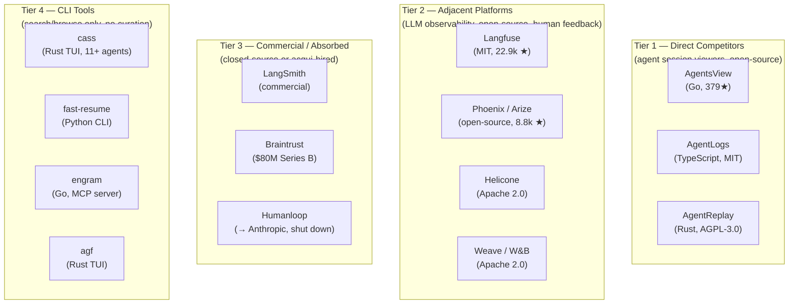
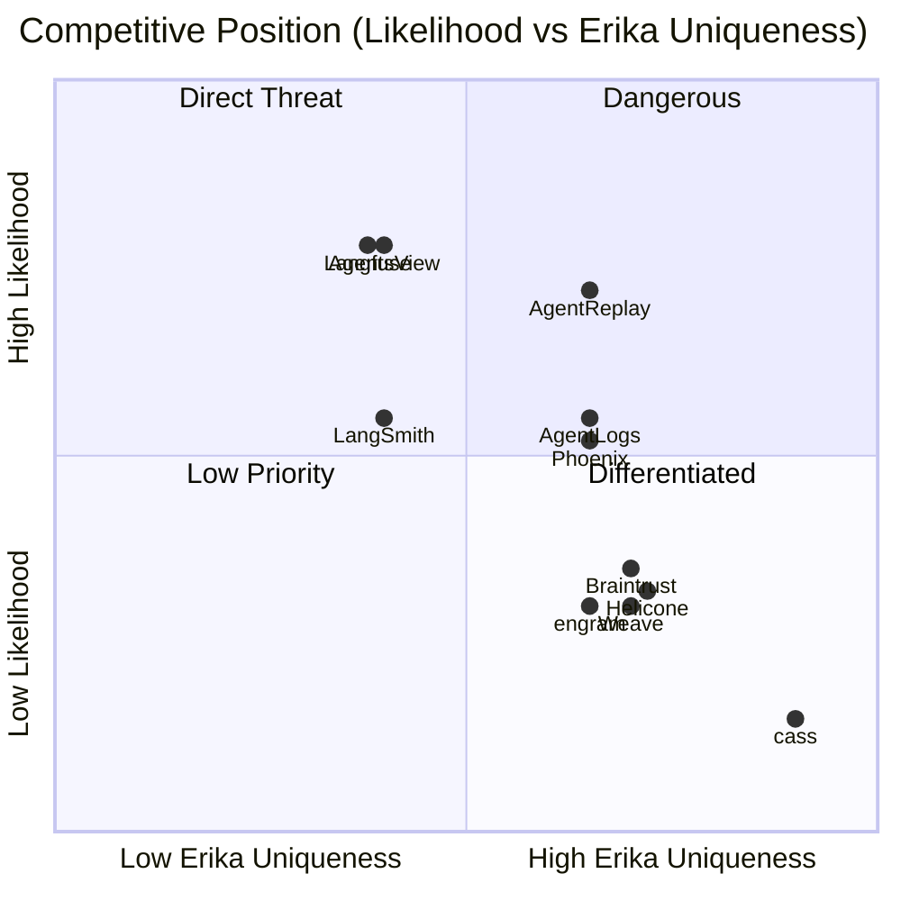
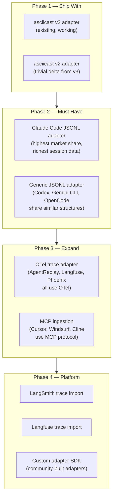

# Competitive Landscape: Erika vs the Field

Branch: `cursor/architecture-review-proposals-fb67`
Date: 2026-03-07
Status: Draft

---

## Context

This analysis rates competitors on two axes the user cares about:

1. **Likelihood** — How likely is this competitor to occupy the same niche Erika targets? (self-hosted, open-source, human-curated feedback loop for agent sessions)
2. **Uniqueness** — How differentiated is Erika from this competitor given the planned direction? (open-source, flexible adapter/module architecture, starting with asciicast but not locked to it)

Ratings use a 5-point scale: 1 = negligible, 5 = critical.

**Critical update:** Humanloop — originally identified as the closest competitor — was acqui-hired by Anthropic in August 2025. The product is shutting down. It is no longer a competitor but its absorption into Anthropic's enterprise tooling is itself a signal (see Section 4).

---

## 1. The Field

The competitive space splits into three tiers:

---

## 2. Tier 1 — Direct Competitors (Detailed)

These are the projects closest to Erika in concept: open-source tools for browsing AI agent sessions.

### AgentsView

| Dimension | Detail |
|-----------|--------|
| **URL** | [agentsview.io](https://agentsview.io) / [GitHub](https://github.com/wesm/agentsview) |
| **Stack** | Go single binary + embedded Svelte 5 frontend + SQLite with FTS5 |
| **License** | MIT |
| **Stars** | 379 (as of March 2026) |
| **Created** | 2026 |
| **Agents** | Claude Code, Codex, Copilot CLI, Gemini CLI, OpenCode, Amp, VSCode Copilot |
| **Input format** | Reads native agent JSONL session files directly from disk (not asciicast) |
| **Key features** | Full-text search, analytics dashboard (heatmaps, tool usage metrics, velocity), live SSE updates, vim-style keyboard nav, export to HTML/GitHub Gist |
| **Architecture** | Single binary, local-only, no server, reads agent files from `~/.claude/`, `~/.codex/` etc. |
| **Curation** | None |
| **Retrieval** | None |
| **Team** | None — single-user local tool |

**Likelihood: 4/5** — This is the closest direct competitor today. Same problem space (browse agent sessions), same technical approach (SQLite + FTS5), same self-hosted ethos. Ships as a single binary (better DX than Erika's npm-based setup). Multi-agent support out of the box.

**Uniqueness of Erika: 3/5** — AgentsView is a viewer. It has no curation, no retrieval, no feedback loop. If Erika ships the curation-to-retrieval loop, the differentiation is strong. Without it, AgentsView is a more polished viewer that supports more agents.

**Key gap AgentsView has:** No curation, no retrieval, no feedback loop, no web platform (local-only), no asciicast/terminal rendering (reads structured JSONL, not raw terminal output). No team features.

**What Erika should learn:** Single-binary distribution is superior DX. Multi-agent support from day one. Analytics dashboards (heatmaps, velocity) are immediately useful even without curation.

---

### AgentLogs

| Dimension | Detail |
|-----------|--------|
| **URL** | [agentlogs.ai](https://agentlogs.ai) / [GitHub](https://github.com/agentlogs/agentlogs) |
| **Stack** | TypeScript (96.6%), Cloudflare Workers, Bun |
| **License** | MIT |
| **Stars** | Low (new project, Feb 2026) |
| **Agents** | Claude Code, Codex, OpenCode, Pi |
| **Input format** | Agent-native JSONL session files |
| **Key features** | Team observability dashboard, git integration (link sessions to commits), activity metrics per team member, auto-sync, secret scanning/redaction |
| **Architecture** | Cloud-first with self-hosted option via Cloudflare Workers + GitHub OAuth |
| **Curation** | None |
| **Retrieval** | None |
| **Team** | Yes — team dashboards, per-member breakdowns, shared sessions |

**Likelihood: 3/5** — Overlaps on team observability but is cloud-first (Cloudflare Workers), which makes the self-hosted story weaker. The git integration (linking sessions to commits) is a genuinely novel feature that Erika lacks.

**Uniqueness of Erika: 4/5** — AgentLogs is a team dashboard, not a curation platform. No curation, no retrieval, no feedback loop. Erika's vision (curation → retrieval → alignment) is orthogonal. AgentLogs could be a *source* adapter for Erika (ingest AgentLogs sessions into Erika for curation). The git-commit linking is a feature Erika should consider.

**Key gap AgentLogs has:** No curation, no retrieval, no terminal rendering (structured JSONL view only), cloud-dependent self-hosting (Cloudflare Workers + GitHub OAuth required).

---

### AgentReplay

| Dimension | Detail |
|-----------|--------|
| **URL** | [agentreplay.dev](https://agentreplay.dev) / [GitHub](https://github.com/agentreplay/agentreplay) |
| **Stack** | Rust (62.4%) + TypeScript (30.8%) + Python (5.3%), local-first CLI + programmatic API |
| **License** | AGPL-3.0 (same as Erika) |
| **Stars** | New (created Jan 2026) |
| **Agents** | Claude Code, Cursor, Windsurf, Cline, VS Code Copilot |
| **Input format** | JSON/JSONL trace imports from agent frameworks |
| **Key features** | Built-in evaluators (hallucination detection, safety checking, completeness validation, AI-powered quality scoring), full session tracing, token/cost tracking, persistent memory across restarts, SQLite-backed local storage |
| **Architecture** | Local-first CLI tool with TypeScript/Node.js programmatic API, 100% local, zero cloud |
| **Curation** | None explicit — but evaluators auto-score sessions |
| **Retrieval** | Programmatic API exposes traces and memory |
| **Team** | None — single-user local tool |

**Likelihood: 4/5** — **A significant competitor.** Same license (AGPL-3.0). Built-in evaluators provide automated quality signals (Erika has none). Local-first CLI with programmatic API is low-friction for developers already in the terminal. Multi-agent support including non-terminal agents (Cursor, Windsurf, Cline). However, it is a single-user CLI tool — not a web platform or team product.

**Uniqueness of Erika: 4/5** — AgentReplay lacks human curation UX (its evaluators are automated, not human-guided). It lacks team features. It lacks the "asynchronous refinement loop" vision entirely — it's a local observability/debugging tool, not a learning platform. Its technical strengths are evaluators (hallucination detection, safety checking, quality scoring) and local-first simplicity, but it has no web UI, no team features, and no curation workflow.

**Key gap AgentReplay has:** No human curation workflow (auto-eval only), no team features, no web platform (CLI-only), no browsable document model (trace view, not scrollable terminal document).

**Critical threat:** AgentReplay is Rust-native, AGPL-3.0, and has built-in evaluators and a programmatic API. Its strengths are automated evaluation (hallucination, safety, completeness) and developer-friendly local CLI UX. If they add a human annotation layer, web UI, and team features, they could move toward Erika's vision — though from a CLI tool base rather than a web platform base.

---

## 3. Tier 2 — Adjacent Platforms (Rated)

These are broader LLM observability platforms that overlap on human feedback and evaluation but serve a wider market.

### Langfuse

| Dimension | Rating |
|-----------|--------|
| **Likelihood** | **4/5** |
| **Uniqueness of Erika** | **3/5** |

**Why high likelihood:** Langfuse is MIT-licensed, fully open-source, self-hostable, and has the most complete feature set in the open-source LLM observability space. It already has: annotation/data labeling, evaluation (LLM-as-judge + human), prompt management, datasets, CLI with agent integration, OpenTelemetry ingestion. It processes hundreds of events/second with Postgres + ClickHouse + Redis architecture.

**Why Erika is still unique:** Langfuse is a *general LLM observability platform*, not an *agent session curation platform*. It doesn't do terminal session rendering, scrollable document browsing, fold/unfold navigation, or scrollback dedup. Its annotation model operates on structured traces (tool calls, LLM responses), not on terminal output. The UX is designed for ML engineers tuning prompts, not for developers reviewing what agents did.

**Strategic consideration:** Langfuse's CLI (released Feb 2026) enables agents to interact with the platform directly — manage datasets, scores, prompts. This is close to Erika's planned MCP retrieval. Langfuse has a massive head start on infrastructure but its focus is broader (all LLM apps, not agent sessions specifically).

**Adapter opportunity:** Erika could ingest Langfuse traces as an input format (Variant B's multi-format direction). This makes Langfuse a data source, not a competitor.

---

### Phoenix (Arize)

| Dimension | Rating |
|-----------|--------|
| **Likelihood** | **3/5** |
| **Uniqueness of Erika** | **4/5** |

**Why moderate likelihood:** Phoenix is open-source, has 8.8k stars, provides agent tracing with OTel, human annotation, and evaluation tools. Strong in the ML/data science community. Recently added tool selection and tool invocation evaluators (Jan 2026).

**Why Erika is more unique:** Phoenix targets ML engineers and data scientists building AI applications. Its UX is trace-centric (spans, latency, token counts), not session-centric (browsing what an agent did). No terminal rendering, no session-as-document model. Phoenix is about *evaluating model performance*, Erika is about *learning from agent behavior*.

---

### Helicone

| Dimension | Rating |
|-----------|--------|
| **Likelihood** | **2/5** |
| **Uniqueness of Erika** | **4/5** |

**Why low likelihood:** Helicone is primarily a logging/analytics proxy (sits between app and LLM API). Self-hostable via Docker. Has user feedback (thumbs up/down) but no deep curation workflow. Focused on cost tracking, rate limiting, and request analytics. Very different UX from Erika.

**Why Erika is unique:** Different problem space. Helicone monitors LLM API calls; Erika reviews complete agent sessions. No overlap in UX or workflow.

---

### Weave (Weights & Biases)

| Dimension | Rating |
|-----------|--------|
| **Likelihood** | **2/5** |
| **Uniqueness of Erika** | **4/5** |

**Why low likelihood:** Weave is Apache 2.0, open-source, has agent evaluation and MCP auto-logging. But it's embedded in the W&B ecosystem (experiment tracking, model registry). Not positioned as a standalone agent session review tool. Targets ML teams already using W&B.

**Why Erika is unique:** Weave is a toolkit for ML practitioners within the W&B platform. Erika is a standalone platform for developers. No terminal rendering, no session document model, no curation-to-retrieval loop.

---

## 4. Tier 3 — Commercial / Absorbed

### Humanloop → Anthropic (DEAD)

**Status:** Acqui-hired by Anthropic, August 2025. Product shutting down. Co-founders (CEO, CTO, CPO) and ~12 engineers joined Anthropic.

**What this means for Erika:**
- The talent and ideas are now inside Anthropic. Expect some of Humanloop's evaluation/feedback UX to surface in Claude's native tooling (Claude Code, API console).
- This validates the "agent frameworks build native curation" threat (T1 from the architecture review).
- The market gap Humanloop occupied (enterprise LLM evaluation with human feedback) is now open for non-Anthropic-locked solutions.
- **Opportunity:** Teams that were Humanloop customers now need an alternative. If they want open-source + self-hosted, the field is Langfuse, Phoenix, or... Erika.

### LangSmith

| Dimension | Rating |
|-----------|--------|
| **Likelihood** | **3/5** |
| **Uniqueness of Erika** | **3/5** |

Commercial platform by LangChain. Self-hosted option exists. Feature-complete (tracing, annotation, datasets, evaluation, monitoring). But locked to the LangChain ecosystem in practice. Not open-source core.

### Braintrust

| Dimension | Rating |
|-----------|--------|
| **Likelihood** | **2/5** |
| **Uniqueness of Erika** | **4/5** |

$80M Series B. Human review workflows. But SaaS-only, commercial, focused on enterprise evaluation pipelines. Open-source component is limited to autoevals library. No self-hosted option. No terminal session support.

---

## 5. Tier 4 — CLI Tools (Rated)

These are lightweight search/browse tools. Not platforms, not competitors in the product sense, but they occupy mind-share with the same users.

| Tool | Stack | Agents | Key Feature | Likelihood | Uniqueness |
|------|-------|--------|-------------|------------|------------|
| **cass** (coding-agent-search) | Rust TUI | 11+ | Fastest multi-agent search, `--robot` flag for agent use | 1/5 | 5/5 |
| **fast-resume** | Python CLI | 6+ | Fuzzy search, keyword syntax (`agent:claude date:<1d`) | 1/5 | 5/5 |
| **engram** | Go + SQLite + FTS5 | Agent-agnostic | MCP server + HTTP API + CLI + TUI, persistent memory | 2/5 | 4/5 |
| **agf** | Rust TUI | 5 | Fuzzy search, bulk delete | 1/5 | 5/5 |

**Why low likelihood:** These are single-user CLI tools for finding and resuming sessions. No web UI, no curation, no team features, no retrieval loop. They're in the "grep for agent sessions" category.

**Exception — engram:** Worth watching. It provides MCP server + HTTP API for persistent agent memory, which is conceptually adjacent to Erika's retrieval vision. But it's a key-value memory store, not a curation platform. Could be a complementary tool or an adapter source.

**Adapter opportunity:** All of these tools know how to read agent-native session formats (Claude Code JSONL, Codex, Gemini CLI, etc.). Their parsing logic is a roadmap for Erika's format adapters.

---

## 6. Competitive Matrix

---

## 7. What This Means for Erika's Adapter Strategy

The user's stated focus: **open-source, flexible adapter/module architecture, start with asciicast but don't lock to it.**

### The Format Landscape

Every Tier 1 competitor reads agent-native session formats — NOT asciicast:

| Agent | Native Format | Who Reads It |
|-------|--------------|-------------|
| Claude Code | JSONL in `~/.claude/projects/` | AgentsView, AgentLogs, AgentReplay, cass, fast-resume, engram, agf |
| Codex | JSONL | AgentsView, AgentLogs, cass, fast-resume, agf |
| Cursor | IDE-internal + MCP | AgentReplay |
| Windsurf | MCP | AgentReplay |
| Cline | MCP | AgentReplay |
| Gemini CLI | JSONL | AgentsView, cass, fast-resume |
| OpenCode | JSONL | AgentsView, AgentLogs, cass, fast-resume, engram, agf |

**asciicast is NOT the lingua franca.** Agent-native JSONL and MCP/OTel are. Erika starting with asciicast is fine (AGR produces it, the VT rendering is genuinely novel) but the adapter architecture must support agent-native JSONL as a high-priority second format.

### Recommended Adapter Priority

### Why This Order

1. **asciicast (Phase 1)** — Already built. AGR produces it. The VT rendering, section detection, and scrollback dedup are genuinely unique capabilities no competitor has. This is Erika's current moat in terminal visualization.

2. **Claude Code JSONL (Phase 2)** — Claude Code is the dominant CLI agent. Every Tier 1 competitor supports it. The JSONL format is structured (tool calls, reasoning, responses are already separated), making it *easier* to curate than raw terminal output. This is the adapter that unlocks the largest user base.

3. **OTel traces (Phase 3)** — OpenTelemetry is becoming the standard ingestion protocol. AgentReplay, Langfuse, Phoenix all use it. Supporting OTel makes Erika compatible with any instrumented agent framework without per-framework adapters.

4. **MCP ingestion (Phase 3)** — Cursor, Windsurf, and Cline integrate via MCP. An MCP ingestion endpoint (separate from Erika's MCP *retrieval* server) would allow these tools to push session data to Erika.

---

## 8. Erika's Defensible Position

Given the competitive landscape and the adapter strategy, here is what makes Erika defensible:

### What Competitors DON'T Have (and would be hard to add)

| Capability | Erika | AgentsView | AgentLogs | AgentReplay | Langfuse |
|-----------|-------|-----------|-----------|-------------|---------|
| Human curation → retrieval loop | Planned (core thesis) | No | No | No (auto-eval only) | Partial (annotation, no retrieval loop) |
| Terminal document browsing (VT rendering) | Yes (WASM) | No | No | No | No |
| Scrollback dedup (TUI sessions) | Yes (unique) | No | No | No | No |
| Fold/unfold section navigation | Yes | No | No | No | No |
| AI-assisted curation suggestions | Planned | No | No | Auto-eval (different) | Partial (LLM-as-judge) |
| Team curation + playbooks | Planned | No | Basic team dashboard | No | No |
| Self-hosted web platform | Yes | Local-only app | Cloud-first | CLI-only | Yes |
| Format-agnostic adapter architecture | Planned | Hard-coded parsers | Hard-coded parsers | OTel-native | OTel + SDK |

### The Unique Combination

No single competitor combines:
1. **Terminal-native rendering** (VT WASM, scrollback dedup — unique to Erika)
2. **Human curation workflow** (section-level annotation, tags, retrieval intent)
3. **Agent retrieval API** (MCP server serving curated segments, not raw traces)
4. **Open-source self-hosted web platform** (not desktop-only, not cloud-first)
5. **Flexible adapter architecture** (asciicast today, JSONL/OTel/MCP tomorrow)

This combination is Erika's defensible position. Any competitor can build one or two of these. Building all five coherently — with the curation-to-retrieval loop as the unifying concept — is the moat.

### What Erika Must Ship to Defend This Position

| Capability | By When | Why |
|-----------|---------|-----|
| **Curation UX** | Next 2 cycles | Without it, Erika is "just another viewer" — and AgentsView is a better viewer today |
| **MCP retrieval server** | Same cycle as curation | Without it, curation is write-only. AgentReplay already has MCP. |
| **Claude Code JSONL adapter** | Next 3 cycles | Without it, Erika only serves AGR users. Every competitor supports Claude Code. |
| **OTel ingestion** | Next 4-5 cycles | Without it, Erika can't ingest from instrumented agent frameworks. AgentReplay and Langfuse already have this. |

---

## 9. The Humanloop Lesson

Humanloop's absorption into Anthropic is instructive:

1. **Enterprise AI tooling is being absorbed by foundation model companies.** Anthropic took Humanloop's talent. OpenAI acquired Rockset (for retrieval). Google integrated DeepMind more tightly. The standalone "AI evaluation platform" market is being eaten from above.

2. **Open-source is the counter-move.** Foundation model companies can acqui-hire SaaS startups but they can't acqui-hire open-source communities. Langfuse survived (and thrived) precisely because it's MIT-licensed with a self-hosted model. Erika's AGPL-3.0 license provides even stronger protection — forks must remain open.

3. **Self-hosted is the wedge.** Teams that lost Humanloop need an alternative. The ones who care about data sovereignty (the same ones who self-host) are Erika's target. This is a real, immediate market opportunity.

4. **The "human in the loop" thesis is validated.** Anthropic spent money to acquire the team that built human feedback tooling. The need is real. The question is whether it's served by platform-native features (Claude's built-in) or by an independent, framework-agnostic platform (Erika).

---

## 10. Summary Ratings

| Competitor | Likelihood | Erika Uniqueness | Category | Key Differentiator from Erika |
|-----------|-----------|-----------------|----------|-------------------------------|
| **AgentReplay** | 4/5 | 4/5 | Direct | Evaluators + local CLI + programmatic API; CLI-only, no curation UX |
| **AgentsView** | 4/5 | 3/5 | Direct | Better DX (single binary), more agents; no curation, no web platform |
| **Langfuse** | 4/5 | 3/5 | Adjacent | Most complete OSS platform; general LLM observability, not agent sessions |
| **AgentLogs** | 3/5 | 4/5 | Direct | Team features + git integration; cloud-first, no curation |
| **LangSmith** | 3/5 | 3/5 | Commercial | Feature-complete; commercial, LangChain-locked |
| **Phoenix** | 3/5 | 4/5 | Adjacent | Strong ML community; trace-centric, not session-centric |
| **Braintrust** | 2/5 | 4/5 | Commercial | $80M funded; SaaS-only, enterprise evaluation focus |
| **Helicone** | 2/5 | 4/5 | Adjacent | API proxy model; different problem space |
| **Weave** | 2/5 | 4/5 | Adjacent | W&B ecosystem; toolkit, not standalone platform |
| **engram** | 2/5 | 4/5 | CLI tool | MCP memory server; key-value store, not curation |
| **cass/fast-resume/agf** | 1/5 | 5/5 | CLI tools | Search-only; no web UI, no curation, no team |
| **Humanloop** | 0/5 | N/A | Dead | Acqui-hired by Anthropic, Aug 2025 |
