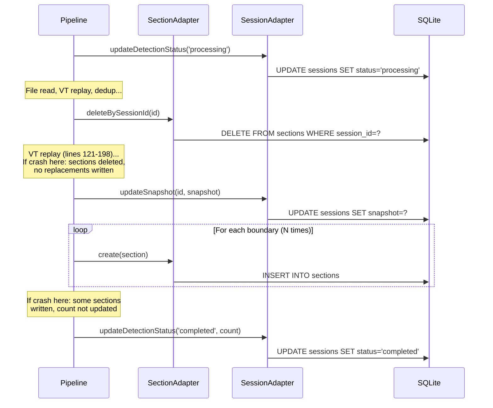
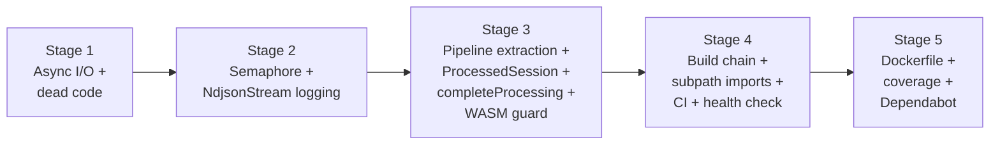
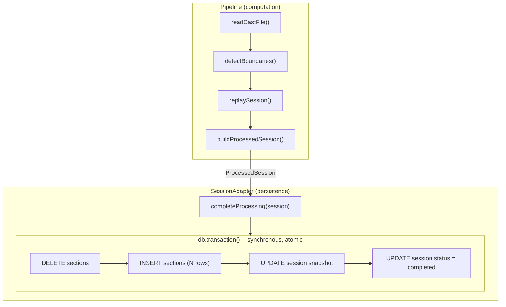
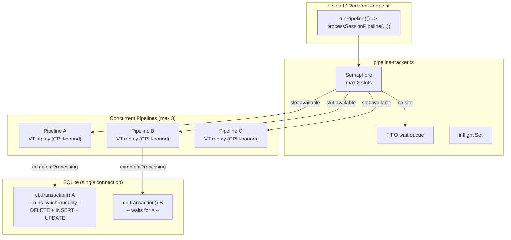
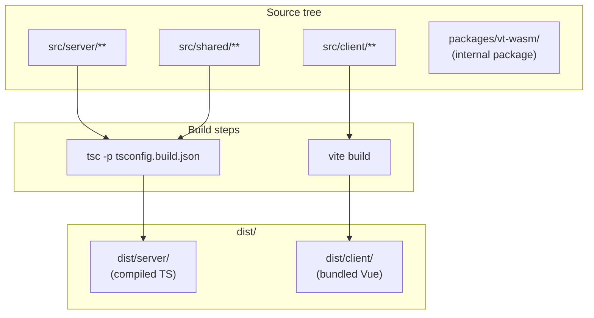
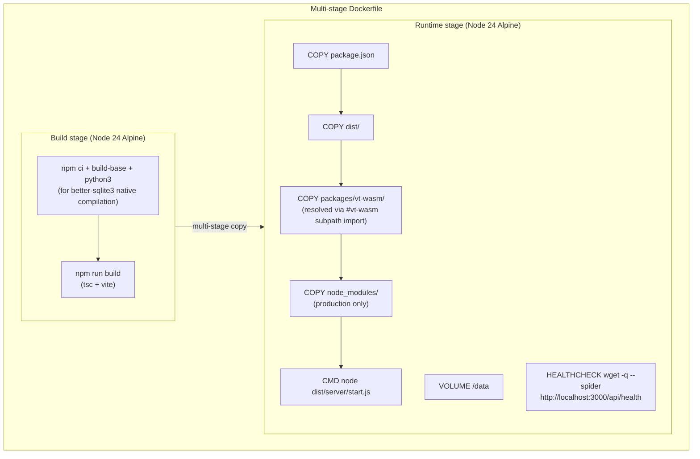

# ADR: Harden the Foundation (A1 Runtime Safety + A2 Build & Deploy)

## Status
Proposed

## Context

The architecture review (`.research/step1/ARCHITECTURE-REVIEW.md`) identified 6 critical, 10 high, and 19 medium findings across the codebase. The Part 4 recommendation is: **Start with Variant A ("Harden the Foundation"), plan for Variant B.**

This ADR covers the first two stages of Variant A:

- **A1 (Runtime Safety):** Fix synchronous file I/O that blocks the event loop, add WASM resource guards, add pipeline concurrency control, make pipeline DB writes atomic, extract pipeline functions, log silently swallowed errors, and remove dead code.
- **A2 (Build & Deploy):** Create a production build chain (currently broken), add a Dockerfile, add `tsc --noEmit` to CI, set coverage thresholds, and add Dependabot.

These are hardening changes -- no new features, no new abstractions. The goal is to make what exists production-ready.

### Forces

1. **C2 is a blocking deficiency.** `FsStorageImpl` uses `readFileSync`/`writeFileSync`/`unlinkSync`/`existsSync`/`mkdirSync` (all from `node:fs`) wrapped in async method signatures. A 250MB session file freezes the event loop during read/write. The `StorageAdapter` interface already declares async signatures, so fixing this requires no interface change.

2. **C1 blocks deployment.** `npm run start` expects `dist/server/start.js` which is never compiled. `tsconfig.json` sets `allowImportingTsExtensions: true` which blocks emit, but the codebase actually uses `.js` extensions throughout (verified: zero `.ts` extension imports in `src/server/`). A `tsconfig.build.json` that drops `allowImportingTsExtensions` and enables emit is sufficient.

3. **H1+H2+H3 compound under load.** Unbounded pipeline concurrency + no transaction boundaries + WASM leak on error = OOM and data corruption under concurrent uploads.

4. **H2 has a transaction design constraint.** The pipeline writes across two tables (`sessions` and `sections`) with 5+ sequential `await` calls and no atomicity. A crash mid-loop leaves orphaned data. The transaction boundary must live inside the adapter layer because `better-sqlite3`'s `db.transaction()` is synchronous and cannot wrap async pipeline code.

5. **H9 is a maintainability drag.** `processSessionPipeline` is 227 lines of inline code doing file reading, section detection, VT replay, epoch tracking, scrollback dedup, section construction, and DB writes. A single try/catch wraps everything. This is not the Variant B event-driven decomposition -- it is simple function extraction to make the pipeline readable and each step independently testable.

6. **M11 is noise.** `session-processor.ts` is dead code (superseded by `session-pipeline.ts`), re-exported from `processing/index.ts` (line 19) but never called by any route or pipeline. The `processing/index.ts` doc comment (lines 1-16) references the dead `processSession` function.

7. **M8 hides data corruption.** `NdjsonStream` lines 55-57 silently swallow malformed JSON with `catch { continue }`. Partially corrupt files process without any warning.

8. **No type checking in CI.** `tsc --noEmit` is not in the CI pipeline, so type errors can reach main undetected.

9. **C1 has two path resolution problems.** The production build (`tsc` output in `dist/`) breaks at runtime because (a) `session-pipeline.ts:28` imports from `../../../packages/vt-wasm/index.js` using a fragile relative path that only works when running from the project root, and (b) `sqlite_database_impl.ts:57` reads `schema.sql` via `readFileSync(join(__dirname, 'sql', 'schema.sql'))` which fails when `__dirname` changes to `dist/server/db/sqlite/` and the `.sql` file is not copied. Both must be solved without post-build file copying hacks.

### Current Pipeline DB Writes

The pipeline currently writes to the database through 7+ individual adapter calls with no atomicity:



Every arrow is a separate statement with no transaction wrapping. A failure at any point leaves the database in an inconsistent state.

### Variant Split

This work crosses two workflow variants:

- **Stages 1-3** touch `src/server/**` and `packages/**` -- backend variant (`feat/server-*`, scopes: `server`, `db`, `wasm`)
- **Stages 4-5** touch CI config, Docker, `tsconfig.build.json`, `vite.config.ts` -- chore variant (`chore/`, scopes: `ci`, `config`)

This is acceptable because the stage groups stay within their variant's allowed paths. The ADR and PLAN live in a shared state directory since they describe a single architectural decision spanning both variants.

## Options Considered

### Option 1: Five sequential PRs (chosen)

Split into 5 strictly sequential PRs:
- Stage 1: Async I/O + dead code removal (~60 lines changed, 3 files modified + 2 deleted)
- Stage 2: Pipeline concurrency semaphore + NdjsonStream logging (~100 lines, 3-4 files)
- Stage 3: Pipeline function extraction + ProcessedSession + completeProcessing + WASM guard (~200 lines, 5-6 files)
- Stage 4: Production build chain + CI type checking + health check (~80 lines, 4-5 files)
- Stage 5: Dockerfile + coverage thresholds + Dependabot (~100 lines, 4 new files)

All stages are strictly sequential: 1 then 2 then 3 then 4 then 5.

- **Pros:** Small, independently reviewable PRs. Each stage has a single concern. No merge conflicts because stages are sequential. Rollback is granular. Transaction design (Stage 3) builds on semaphore (Stage 2) cleanly.
- **Cons:** Five PRs for hardening work is process-heavy. Calendar time is longer than parallel development.

### Option 2: Parallel Stages 1+2, then sequential 3+4+5

Same content as Option 1, but develop Stages 1 and 2 in parallel since they touch mostly different files.

- **Pros:** Slightly faster calendar time.
- **Cons:** Both Stages 1 and 2 modify `session-pipeline.ts`. Stage 2 adds the malformed line warning after the stream loop. The merge conflict in `session-pipeline.ts` would be nontrivial. The calendar time savings (hours, not days) do not justify the risk.

### Option 3: Two PRs (runtime + build)

Combine Stages 1+2+3 into one "Runtime Safety" PR and Stages 4+5 into one "Build & Deploy" PR.

- **Pros:** Fewer PRs, less overhead.
- **Cons:** The runtime safety PR touches 8+ files across three different concerns (I/O, concurrency, transactions + function extraction). Harder to review. A revert would undo all runtime changes at once.

## Decision

**Option 1: Five sequential PRs.**

The five-stage sequential split was chosen after an adversarial review process identified that parallelizing Stages 1 and 2 would create a nontrivial merge conflict in `session-pipeline.ts`. The slight calendar cost of sequential development is justified by zero merge conflicts and cleaner review boundaries.

### Sequencing



### Key Design Decisions

#### Transaction design: ProcessedSession + completeProcessing (H2)

This was the most debated design decision. Three approaches were considered and rejected before arriving at the final design.

**Rejected approaches:**

*Approach A: `runInTransaction` on `DatabaseContext`.* Add a `runInTransaction(fn)` method and have the pipeline call it around its DB writes. **Rejected.** The pipeline is `async` and its DB operations use `await`. `better-sqlite3`'s `db.transaction()` is synchronous. Wrapping `await` calls in a synchronous callback creates an impedance mismatch. Using explicit `BEGIN`/`COMMIT`/`ROLLBACK` via `db.exec()` would work for single-connection SQLite but creates a concurrency hazard when two pipelines share the same connection.

*Approach B: `replaceSections` + `completeProcessing` on adapters.* Add batch methods to both `SectionAdapter` and `SessionAdapter`. **Rejected.** The pipeline still orchestrates writes across two adapters with no cross-table atomicity. `replaceSections` bundles delete + N inserts as a SQL operation, not a domain concept.

*Approach C: Async `withTransaction` using `BEGIN`/`COMMIT`/`ROLLBACK`.* **Rejected.** While `BEGIN` state persists on a single SQLite connection across `await` boundaries, two concurrent pipelines sharing the same connection would conflict -- the second `BEGIN` fails because a transaction is already active. The semaphore limits concurrency but does not eliminate this hazard unless set to 1.

**Chosen approach: Result Object + Aggregate Root persistence.**

The pipeline produces a typed **ProcessedSession** -- the complete output of session processing. The `SessionAdapter` receives it via `completeProcessing(session)` and persists it atomically. The method name follows the session lifecycle: `updateDetectionStatus('processing')` starts processing, `completeProcessing(session)` finishes it. The transaction boundary lives inside the adapter, invisible to the pipeline.



This design works because:

- **The pipeline becomes a pure computation.** It reads the file, detects boundaries, replays VT, deduplicates scrollback, and produces a `ProcessedSession`. It does not manage transactions or orchestrate cross-table writes.
- **The adapter owns the transaction.** The SQLite implementation uses `db.transaction()` which is synchronous -- the entire delete + insert + update sequence runs to completion before returning. No async/sync impedance mismatch.
- **The pipeline drops `SectionAdapter` as a dependency.** Currently the pipeline receives both `sectionRepo` and `sessionRepo`. After this change, it only receives `sessionRepo`. Section writes are internal to `completeProcessing`.
- **Old sections survive until replacement.** Currently, `deleteBySessionId` runs at line 114 before VT replay. If VT replay fails (lines 121-198), sections are gone with no replacement. With `completeProcessing`, the delete happens atomically with the insert -- old sections remain until the replacement is ready.
- **The method name follows the session lifecycle.** The existing interface already has `updateDetectionStatus(id, 'processing')` to start processing. `completeProcessing(session)` is its natural counterpart -- it transitions the session to its completed state with all associated data (snapshot, sections, counts, status).
- **Future PostgreSQL works naturally.** A PostgreSQL implementation uses `BEGIN`/`COMMIT`/`ROLLBACK` with a dedicated connection from the pool. Same interface, no design changes.

The `ProcessedSession` type:

```typescript
interface ProcessedSession {
  sessionId: string;
  snapshot: string;                // JSON-serialized TerminalSnapshot
  sections: CreateSectionInput[];  // Sections to create (replaces all existing)
  eventCount: number;
  detectedSectionsCount: number;
}
```

The new method on `SessionAdapter`:

```typescript
interface SessionAdapter {
  // ... existing methods unchanged ...
  completeProcessing(session: ProcessedSession): Promise<void>;
}
```

The SQLite implementation prepares its own section statements (INSERT and DELETE) for use inside the synchronous `db.transaction()` callback. This duplicates two SQL statements from `SqliteSectionImpl`, which is acceptable because:
- The duplication is localized to one class and serves a distinct purpose (atomic aggregate persistence vs. individual CRUD)
- It avoids coupling between adapter implementations
- The SQL is trivial (one INSERT, one DELETE)

#### Pipeline function extraction (H9)

The current 227-line `processSessionPipeline` function is refactored into a coordinator that calls four extracted functions. This is simple function extraction within the same file -- not the Variant B event-driven decomposition.

After extraction, the pipeline reads as:

```typescript
export async function processSessionPipeline(
  filePath: string,
  sessionId: string,
  markers: Marker[],
  sessionRepo: SessionAdapter
): Promise<void> {
  try {
    await initVt();
    await sessionRepo.updateDetectionStatus(sessionId, 'processing');

    const { header, events } = await readCastFile(filePath);
    const boundaries = detectBoundaries(events, markers);
    const { rawSnapshot, sectionData, epochBoundaries } = replaySession(header, events, boundaries);
    const processed = buildProcessedSession(sessionId, rawSnapshot, sectionData, epochBoundaries, boundaries, events.length);

    await sessionRepo.completeProcessing(processed);
  } catch (error) {
    log.error({ err: error, sessionId }, 'Session processing failed');
    await sessionRepo.updateDetectionStatus(sessionId, 'failed');
  }
}
```

The four extracted functions:

1. **`readCastFile(filePath)`** -- Reads the .cast file via `NdjsonStream`, returns `{ header, events }`. Includes header normalization. Currently lines 57-78.

2. **`detectBoundaries(events, markers)`** -- Runs `SectionDetector` and synthesizes preamble boundary when markers exist. Returns the boundaries array. Currently lines 80-99. Pure function, no side effects.

3. **`replaySession(header, events, boundaries)`** -- Creates the VT instance, replays all events, tracks alt-screen state, epoch boundaries, and section data captures. Returns `{ rawSnapshot, sectionData, epochBoundaries }`. Currently lines 121-204. **This function owns the WASM lifecycle** -- `createVt()` through `vt.free()` are enclosed in a `try/finally` inside this function (H3 fix). The WASM guard is a natural part of this extraction, not a separate concern.

4. **`buildProcessedSession(...)`** -- Runs scrollback deduplication via `buildCleanDocument`, constructs the `CreateSectionInput[]` array with line range remapping, computes `detectedSectionsCount`. Returns a complete `ProcessedSession`. Currently lines 206-256. **Pure function, no side effects** -- no DB calls, no WASM, no I/O.

All functions are module-private (not exported), defined in `session-pipeline.ts`. They are called only by `processSessionPipeline`.

**Why the WASM guard (H3) moves to Stage 3:** The `try/finally` for `vt.free()` naturally belongs inside `replaySession()`, which owns the full `createVt()` through `vt.free()` lifecycle. Adding the guard inline in Stage 1 and then immediately restructuring it in Stage 3 is wasteful -- the Stage 1 reviewer sees code that gets moved one PR later. Instead, Stage 1 handles async I/O and dead code; Stage 3 handles the full pipeline refactoring including the WASM guard inside the extracted function.

#### Concurrency model



Key properties:
- `runPipeline(fn)` acquires a semaphore slot before calling `fn()`, releases in `finally`
- Each pipeline's `completeProcessing` call is a synchronous `db.transaction()` -- it runs to completion before returning
- SQLite serializes concurrent write transactions via WAL mode -- no explicit mutex needed beyond the semaphore
- The semaphore prevents OOM from unbounded WASM allocations, not DB contention

**Semaphore integration (H1):** The current `trackPipeline(promise)` receives an already-started promise -- the pipeline is executing when tracking begins (`upload.ts:96-98`). A semaphore inside `trackPipeline` would gate tracking, not execution. The solution is `runPipeline(fn)` which acquires a slot, calls `fn()`, and releases in `finally`. This replaces `trackPipeline` at all call sites.

**WASM resource guard (H3):** Wrapped inside the extracted `replaySession()` function. The `createVt()` call opens the resource, the `try/finally` guarantees `vt.free()` runs even if VT replay throws. The guard is co-located with the code that uses the resource -- not spread across 83 lines of mixed concerns.

**Async file I/O (C2):** Replace all `node:fs` sync imports in `FsStorageImpl` with `node:fs/promises`. The `StorageAdapter` interface already declares async signatures, so no interface change needed. `SqliteDatabaseImpl.initialize()` also uses `readFileSync` and `mkdirSync` (lines 7, 39, 58) but this is startup-only sync I/O that runs before the HTTP server starts -- documented as an accepted exception.

**NdjsonStream error logging (M8):** Add a `malformedLineCount` property to `NdjsonStream` and increment it on catch (line 55). After the `for await` loop in `session-pipeline.ts`, log a warning if `stream.malformedLineCount > 0`.

**Import extensions (C1):** The `.ts` extension concern identified in the original architecture review is a phantom problem. Grep confirms zero `.ts` extension imports in `src/server/` -- the codebase uses `.js` extensions throughout. `tsconfig.build.json` simply drops `allowImportingTsExtensions` and enables emit.

**Docker health check (M14):** Use `wget -q --spider` instead of `curl` because Alpine Linux ships `wget` but not `curl`.

#### Build and deploy architecture

The production build has two path resolution challenges. Both are solved with proper Node.js/TypeScript mechanisms -- no post-build file copying.

**Problem 1: WASM import path.** `session-pipeline.ts:28` imports `from '../../../packages/vt-wasm/index.js'` using a deep relative path. This works in development (running from project root) because the relative path from `src/server/processing/` reaches `packages/vt-wasm/`. After `tsc` compiles to `dist/server/processing/session-pipeline.js`, the same relative path `../../../packages/vt-wasm/index.js` resolves back to the project root -- which works locally but fails in a Docker container where only selective directories are copied.

**Solution: Node.js subpath imports.** The `"imports"` field in `package.json` provides stable, location-independent module aliases that Node.js resolves at runtime relative to the nearest `package.json`. TypeScript 5.4+ supports `#imports` with `moduleResolution: "bundler"` and `"nodenext"`.

Add to `package.json`:
```json
{
  "imports": {
    "#vt-wasm": "./packages/vt-wasm/index.js",
    "#vt-wasm/types": "./packages/vt-wasm/types.js"
  }
}
```

Add matching TypeScript paths to `tsconfig.json`:
```json
{
  "paths": {
    "#vt-wasm": ["./packages/vt-wasm/index.ts"],
    "#vt-wasm/types": ["./packages/vt-wasm/types.ts"]
  }
}
```

All 10 import sites (after dead code deletion in Stage 1) change from `../../../packages/vt-wasm/index.js` to `#vt-wasm` or `#vt-wasm/types`. The resolution chain:

1. Node sees `import ... from '#vt-wasm'`
2. Finds `"imports"` in the nearest ancestor `package.json`
3. Resolves `./packages/vt-wasm/index.js` relative to that `package.json`
4. Works identically whether the importing file is in `src/` or `dist/` because the resolution anchor is `package.json`, not the importing file

For Docker, `packages/vt-wasm/` is copied into the container alongside `dist/`, `node_modules/`, and `package.json`. It is a first-class internal package, not a build artifact.

**Problem 2: SQL schema file read.** `sqlite_database_impl.ts:57` reads `schema.sql` via `readFileSync(join(__dirname, 'sql', 'schema.sql'))`. After `tsc`, `__dirname` is `dist/server/db/sqlite/` and the `sql/` subdirectory does not exist there.

**Solution: Inline the schema as a string constant.** The base schema is 16 lines (one `CREATE TABLE IF NOT EXISTS` + one `CREATE INDEX IF NOT EXISTS`). Both migration files (`002-sections.ts` and `003-unified-snapshot.ts`) already use inline SQL exclusively -- all `ALTER TABLE`, `CREATE TABLE`, `CREATE INDEX`, and `db.exec()` calls are string literals in TypeScript. The base schema is the only SQL loaded from a file. Inlining it as a constant eliminates the `readFileSync` call, the `__dirname` dependency, and the `join`/`dirname`/`fileURLToPath` imports for path construction.

The `schema.sql` file is retained in the repository for documentation but is no longer read at runtime. A code comment in `sqlite_database_impl.ts` references its location.



No post-build copy steps. The build produces `dist/server/` (tsc) and `dist/client/` (Vite). `packages/vt-wasm/` is resolved at runtime via Node subpath imports from the project root `package.json`.



Key difference from a `cp -r` approach: `packages/vt-wasm/` lives at its original path in the container. Node resolves `#vt-wasm` via `package.json` `"imports"` to `./packages/vt-wasm/index.js`. No path rewriting, no duplicated files in `dist/`.

## Consequences

### What becomes easier
- Deploying to production (build chain exists, Dockerfile exists)
- Reasoning about pipeline safety (atomic result persistence, bounded concurrency, WASM cleanup)
- Reading the pipeline (coordinator + 4 named functions instead of 227 inline lines)
- Testing pipeline stages in isolation (each extracted function is independently testable)
- Catching type errors before merge (tsc in CI)
- Detecting file corruption (NdjsonStream logs malformed lines)
- Future PostgreSQL migration (`completeProcessing` interface works with real async transactions)
- Pipeline testing (pipeline produces a `ProcessedSession`, testable without DB)
- Importing vt-wasm (stable `#vt-wasm` alias instead of fragile deep relative paths)

### What becomes harder
- Nothing measurably harder. These are pure improvements with no trade-offs against current capabilities.

### Follow-ups to scope for later
- Event-driven pipeline decomposition (Variant B -- H9 function extraction is done, event bus and job queue are deferred)
- Rate limiting on upload endpoint (H4 -- not addressed in A1/A2)
- Error sanitization in API responses (M9 -- belongs in A4)
- Upload triple-parse reduction (M3 -- belongs in later optimization)

**Out of scope (tracked in `.research/step1/ARCHITECTURE-REVIEW.md`, belongs to Variant A stages 3-6):**
- C3 (no authentication), C4 (no virtual scrolling), C5 (full in-memory event buffering)
- H5 (API types not shared), H6 (no real-time processing status), H7 (zero ARIA), H8 (fire-and-forget pipeline errors), H10 (toast singleton)
- M1 (anemic domain model), M2 (no migration framework), M4 (unbounded findAll), M5 (per-render style allocation), M6 (dead CSS), M7 (design system disconnected), M10 (no HTTP client abstraction), M17 (no network error recovery), M18 (no upload progress), M19 (composables untested)

### Accepted limitations
- **M16 (redetect race condition):** The semaphore (Stage 2) bounds concurrency and `completeProcessing` (Stage 3) makes each pipeline's writes atomic, preventing data corruption. However, two concurrent redetects for the *same session* can still both run to completion -- the semaphore does not check session identity. This wastes computation but does not corrupt data (the second `completeProcessing` atomically overwrites the first). A per-session deduplication guard is deferred to a future stage.

## Decision History

1. **Five-stage sequential split** chosen over parallel stages or mega-PR, driven by merge conflict analysis showing Stages 1 and 2 both modify `session-pipeline.ts`.
2. **ProcessedSession + completeProcessing** chosen for transaction safety. Three alternatives were rejected: `runInTransaction` on DatabaseContext (async/sync impedance mismatch), batch methods on separate adapters (no cross-table atomicity), and async `withTransaction` using BEGIN/COMMIT/ROLLBACK (concurrent connection contention). The Result Object + Aggregate Root pattern emerged as the correct abstraction: the pipeline computes, the adapter persists atomically. The method name `completeProcessing` follows the session lifecycle -- it is the natural counterpart to `updateDetectionStatus('processing')`.
3. **`runPipeline(fn)` wrapper** chosen over modifying `trackPipeline` because `trackPipeline` receives an already-started promise -- the semaphore must be acquired before pipeline execution begins.
4. **`SqliteDatabaseImpl` sync I/O** accepted as an exception -- startup-only, runs before HTTP server starts, does not block request handling.
5. **`.ts` import extension concern dismissed** -- the codebase uses `.js` extensions throughout, making the build config straightforward.
6. **Variant split** (backend vs chore) is handled by using separate branches with appropriate prefixes for each stage group.
7. **SQL duplication in SessionAdapter** accepted -- the SQLite implementation of `completeProcessing` prepares its own section INSERT and DELETE statements rather than depending on `SqliteSectionImpl`. This avoids coupling between adapter implementations.
8. **Node subpath imports for vt-wasm** chosen over `cp -r` post-build copy. The `"imports"` field in `package.json` provides stable, location-independent module resolution that works identically in `src/` (development) and `dist/` (production). TypeScript 5.4+ supports `#imports` with both `moduleResolution: "bundler"` and `"nodenext"`. This eliminates all deep relative paths (`../../../packages/vt-wasm/...`) across 10 import sites.
9. **Inline SQL schema** chosen over `cp -r` post-build copy of `schema.sql`. The 16-line base schema becomes a string constant in `sqlite_database_impl.ts`, consistent with both migration files (002, 003) which already use inline SQL exclusively. The `schema.sql` file is retained for documentation.
10. **WASM guard (H3) moved from Stage 1 to Stage 3.** The `try/finally` for `vt.free()` naturally belongs inside the extracted `replaySession()` function, which owns the full `createVt()` through `vt.free()` lifecycle. Adding the guard inline in Stage 1 and restructuring it in Stage 3 would be wasteful -- the reviewer sees code that moves one PR later. Stage 1 focuses on async I/O and dead code; Stage 3 handles the full pipeline refactoring including the WASM guard.
11. **Pipeline function extraction (H9) included in Stage 3** rather than deferred to Variant B. Stage 3 already refactors the pipeline (removing `sectionRepo`, building `ProcessedSession`, calling `completeProcessing`). Extracting functions is a natural part of that refactoring -- the pipeline must be restructured anyway to produce a result object instead of making inline DB calls. The extraction is simple function grouping within the same file, not the event-driven decomposition planned for Variant B.
