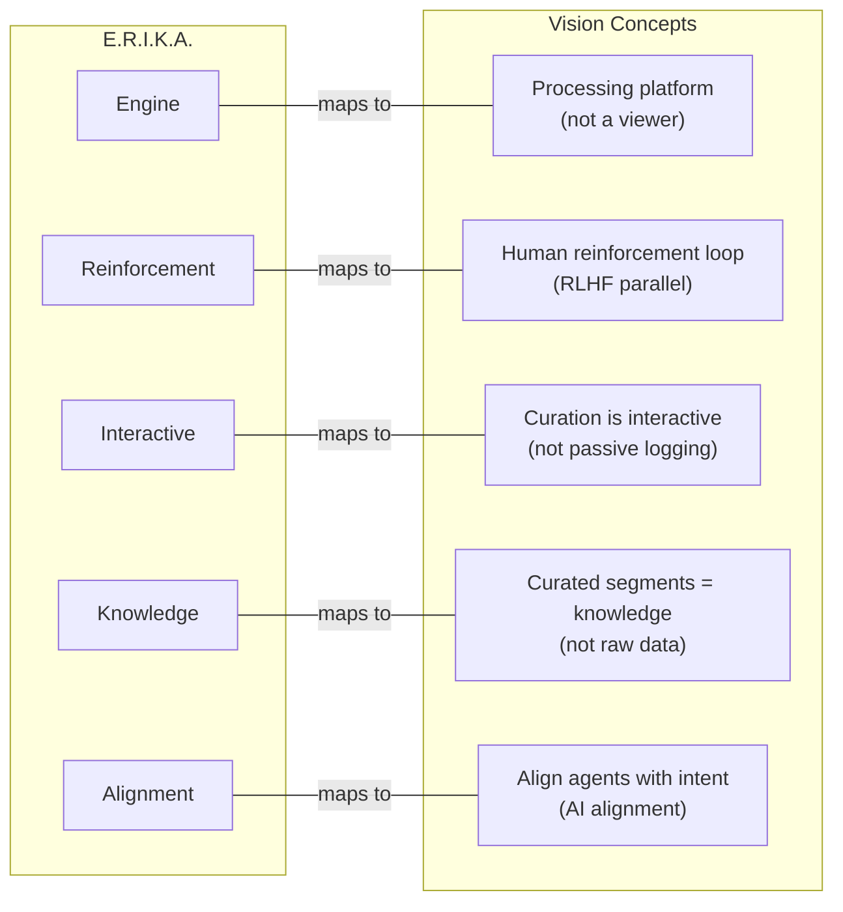
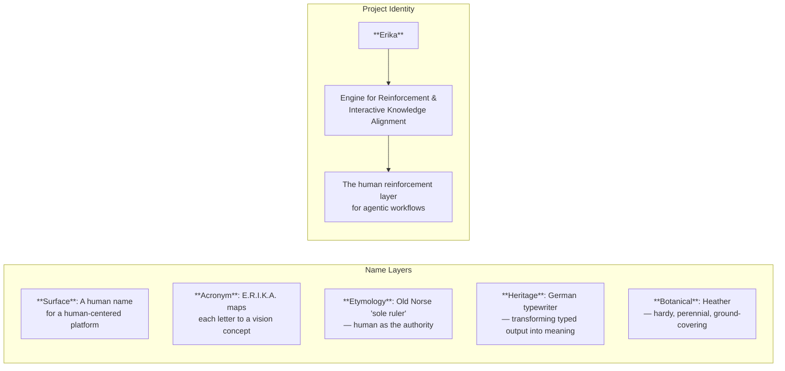

# Naming Research: Erika

Branch: `cursor/architecture-review-proposals-fb67`
Date: 2026-03-07
Status: Draft

---

## 1. Current State of Naming

The project currently carries **two names** used in different contexts:

| Name | Where Used | Meaning |
|------|-----------|---------|
| **RAGTS** | `package.json` (`"name": "ragts"`), `MEMORY.md`, `AGENTS.md`, `CLAUDE.md` | "Real Agentic Terminal Sessions" — originally "Reinforced Human Learning Platform" |
| **Erika** | `README.md`, `ARCHITECTURE.md`, `VISION.md`, GitHub repo (`thiscantbeserious/erika`), design system URL, Docker service prefixes | No formal expansion — used as the product/brand name |

This dual naming creates friction:

- `MEMORY.md` opens with "Bootstrap session context for continuing work on **RAGTS**" but links to the `erika` GitHub repo
- `README.md` headline says "**Erika**: The Self-Hosted, Collaborative Training Platform" — RAGTS doesn't appear
- `ARCHITECTURE.md` says "System architecture for **Erika**" — RAGTS doesn't appear
- `package.json` uses `ragts` — the npm identity disagrees with the brand
- Docker services use `erika-app`, `erika-db`, `erika-cache`, `erika-transform`
- The repo URL is `github.com/thiscantbeserious/erika`

**The brand is Erika. The technical identifier is RAGTS. The proposed expansion bridges both.**

---

## 2. Proposed Expansion

### **E.R.I.K.A.** — Engine for Reinforcement & Interactive Knowledge Alignment

| Letter | Word | Maps to Vision |
|--------|------|---------------|
| **E** | Engine | The platform is an engine — it processes, transforms, and serves. Not a passive viewer. |
| **R** | Reinforcement | Direct connection to the core thesis: "reinforce the human part in the agentic loop." Also echoes RLHF (Reinforcement Learning from Human Feedback) — the industry term for human-guided AI improvement. |
| **I** | Interactive | The curation workflow is interactive — humans engage with sessions, not just observe. Distinguishes from passive logging/monitoring. |
| **K** | Knowledge | The curated output is knowledge — structured, validated, retrievable. Not raw data, not logs. |
| **A** | Alignment | The end goal: aligning agent behavior with human intent. Borrows from AI alignment discourse — deliberate, meaningful word choice. |

### Why This Works

**Every letter carries weight:**

1. **"Engine"** counters the "just a viewer" risk identified in the architecture review. Erika is not a log viewer — it's a processing engine that transforms raw sessions into curated, retrievable knowledge.

2. **"Reinforcement"** is the single strongest word in the expansion. It directly echoes RLHF (Reinforcement Learning from Human Feedback) — the industry-standard technique for aligning AI with human preferences. The parallel is intentional and accurate: RLHF uses human feedback to train reward models; Erika uses human curation to train agent retrieval context. The difference is that Erika operates at the application layer (structured context), not the model layer (gradient updates). This positions Erika in the same conceptual family as RLHF without claiming to do the same thing.

3. **"Interactive"** distinguishes from passive observability tools (LangSmith, Helicone, DataDog). Those tools show you what happened. Erika invites you to do something about it — annotate, tag, curate, share. The interaction is the value.

4. **"Knowledge"** elevates the output. The curated segments aren't "data" or "annotations" — they're knowledge. This word positions the retrieval corpus as a knowledge base, not a database. It also connects to "Knowledge Alignment" as a compound concept.

5. **"Alignment"** is the goal-state word. AI alignment is one of the most discussed topics in the industry. Using it here positions Erika in that conversation — not as a safety tool, but as a practical alignment mechanism: aligning agent behavior with the specific intent and preferences of the humans who work with them.

---

## 3. Etymology and Cultural Layers

The name "Erika" carries multiple associations that reinforce the project's identity:

### 3.1 Old Norse Origin

From Old Norse *Eiríkr*: **ei** ("one, alone, unique" or "eternity") + **ríkr** ("ruler, powerful, rich").

Meaning: **"sole ruler"** or **"ever powerful."**

Resonance with project: The human is the sole ruler of what gets curated. The platform empowers human judgment as the ultimate authority over agent behavior — not the other way around.

### 3.2 The Erika Typewriter (1910-1991)

The Erika was a German typewriter brand by Seidel & Naumann AG, Dresden. It was renowned as an exceptionally well-engineered portable writing machine. The Erika Model M (1930s) is considered a masterpiece of typewriter engineering.

Key associations:

| Typewriter Trait | Project Parallel |
|-----------------|-----------------|
| **Portable** — designed for writers on the move | **Self-hostable** — runs anywhere, your infrastructure |
| **Well-engineered German precision** | **Technical depth** — WASM VT parser, scrollback dedup algorithms |
| **A writing tool, not a reading tool** | **An active engine, not a passive viewer** |
| **Used by East German writers for decades** | **Built for practitioners, not observers** |
| **Named after a person, not a company** | **Personal, human-centered identity** |

The typewriter connection is especially fitting: Erika transforms terminal sessions (modern-day typed output) into readable, navigable documents. A typewriter produces text; Erika makes that text meaningful.

### 3.3 Botanical Meaning

*Erica* (Latin) = heather, a genus of flowering plants. Heather is:
- **Hardy** — grows in poor soil where other plants fail (self-hostable, works with minimal infrastructure)
- **Perennial** — returns year after year (compounding knowledge base)
- **Covers ground** — spreads to fill gaps (the curation loop fills the gap in human-agent learning)

### 3.4 The "Lili Marleen" Connection

"Erika" (1930) is one of the most famous German marching songs, written by Herms Niel. While the song itself is culturally loaded, the name association in German-speaking contexts evokes recognition and memorability — a name people already know.

---

## 4. Naming Conflict Analysis

### 4.1 Direct Conflicts

| Existing "Erika" | Domain | Risk |
|------------------|--------|------|
| **ERIKA Enterprise / OpenERIKA** | Embedded RTOS kernel (automotive, IoT) | **Low** — completely different domain (embedded systems vs. web platform). No audience overlap. GPL/AUTOSAR licensed. Active since 2002. |
| **Erika (AI Recruitment Assistant)** | HR/recruiting SaaS at erikawork.com | **Low** — different domain, different audience. No open-source component. |
| **Erika (podcast manager)** | Linux podcast app (8 GitHub stars, inactive) | **Negligible** — abandoned project, tiny footprint |
| **erika-s3004 / erika3004** | Python library for Erika typewriter hardware | **Negligible** — niche hardware project, <50 stars, complements the typewriter heritage story |

### 4.2 Near-Miss Names

| Name | What | Confusion Risk |
|------|------|---------------|
| **Eric AI** | Governed runtime for high-stakes AI (ericaicontrol.dev) | **Low** — different spelling, different product category |
| **Eureka** (SymphonyAI) | Enterprise AI platform | **Low** — different name, enterprise SaaS, no open-source |
| **Erica** (various) | Common first name used in many projects | **Low** — the "k" spelling distinguishes |

### 4.3 Package Registry Availability

| Registry | `erika` available? | Notes |
|----------|-------------------|-------|
| **npm** | Likely available | No published package found; GitHub project `brandon-hiles/erika` exists but no npm publish |
| **PyPI** | Likely taken | `erika-s3004` typewriter library may hold the simple `erika` name |
| **crates.io** | Likely available | No `erika` crate found |
| **GitHub** | **Taken by project owner** | `thiscantbeserious/erika` — already the repo name |

**Recommendation:** If npm `erika` is taken, use `@erika/platform` or `erika-platform` as the package scope.

### 4.4 SEO / Discoverability

**Challenge:** "Erika" is a common first name. Searching "Erika" alone returns people, not software. This is true for many successful projects (Ruby, Crystal, Hugo, Astro) — the solution is always `[name] + [domain term]`.

**Search strategies that work:**

| Query | Expected Position |
|-------|------------------|
| "Erika agent platform" | High — no competition |
| "Erika terminal session" | High — unique combination |
| "Erika curation agent" | High — unique combination |
| "Erika RLHF platform" | Medium — novel positioning |
| "Erika" alone | Low — drowned by people/places |

The full expansion "Engine for Reinforcement & Interactive Knowledge Alignment" is highly unique and would dominate search results for that exact phrase.

---

## 5. RAGTS vs Erika — Resolving the Dual Identity

### 5.1 The Problem

Two names create confusion:
- Contributors don't know what to call the project
- Documentation oscillates between RAGTS and Erika
- The npm package is `ragts` but the repo is `erika`
- `MEMORY.md` says "RAGTS" stands for "Real Agentic Terminal Sessions" — but the project is evolving beyond terminal sessions (see architecture review Variant B)

### 5.2 RAGTS Limitations

| Issue | Detail |
|-------|--------|
| **"Terminal Sessions" bakes in format lock-in** | The architecture review identified asciicast lock-in as a strategic risk. "Terminal Sessions" in the name makes multi-format evolution harder. |
| **"Real Agentic" is vague** | What does "Real" add? It doesn't clarify what the product does. |
| **Requires explanation** | Every mention needs a parenthetical: "RAGTS (Real Agentic Terminal Sessions)." Erika needs no explanation — it's a name. |
| **Confusing with RAG** | "RAGTS" sounds like "RAG" + "TS" (TypeScript). `MEMORY.md` explicitly warns: "The 'TS' in RAGTS does NOT stand for TypeScript." If you have to explain what your name doesn't mean, the name has a problem. |
| **Not memorable** | Five consonants, no vowel flow. Hard to say, hard to remember, hard to spell. |

### 5.3 Erika Strengths

| Strength | Detail |
|----------|--------|
| **Memorable** | One word, four syllables, everyone can spell it and say it |
| **Human-centered** | A person's name for a human-centered platform — the name IS the thesis |
| **Format-agnostic** | Nothing in "Erika" ties it to terminal sessions. The name survives a pivot to multi-format. |
| **Already the brand** | The repo, the README, the architecture, the design system, the Docker services — all say Erika |
| **Cultural depth** | Old Norse "sole ruler" + German typewriter heritage + botanical hardiness |
| **Backronym-ready** | "Engine for Reinforcement & Interactive Knowledge Alignment" adds meaning without constraining |

### 5.4 Recommendation

**Unify on Erika. Retire RAGTS.**

| Action | Change |
|--------|--------|
| `package.json` name | `ragts` → `erika` |
| `MEMORY.md` project identity | Update to Erika with expansion |
| `AGENTS.md` / `CLAUDE.md` | Replace RAGTS references with Erika |
| npm package | Publish as `erika` or `@erika/platform` |
| Documentation | Single name throughout |
| Commit scopes | Already use directory-based scopes, not project name — no change needed |
| AGR relationship | "AGR powers Erika" (already the phrasing in README) |

**Keep RAGTS as a historical footnote** in `MEMORY.md` under "Previous Names" — don't erase the history, but don't perpetuate the confusion.

---

## 6. The Full Identity

### Proposed Taglines (in order of preference)

1. **"The human reinforcement layer for agentic workflows"** — Direct, positions in the RLHF conversation, emphasizes the human element.
2. **"Reinforce the human in the loop"** — Punchier, flips the "human in the loop" phrase, implies the human is being strengthened, not just included.
3. **"Where humans teach agents what matters"** — Accessible, explains the value proposition in plain language.
4. **"Curate. Align. Reinforce."** — Three verbs, maps to the workflow (curation → alignment → reinforcement loop).

### Usage Guidelines

| Context | Use |
|---------|-----|
| **Conversation / prose** | "Erika" — no expansion needed |
| **First mention in formal docs** | "Erika (Engine for Reinforcement & Interactive Knowledge Alignment)" |
| **README header** | "# Erika" with tagline below |
| **Technical identifiers** | `erika` (npm), `erika-app` (Docker), `@erika/*` (scoped packages) |
| **Domain / URL** | `erika.dev` or `geterika.dev` (check availability) |
| **Never** | "ERIKA" in all-caps (that's the RTOS) — use "Erika" with capital E only |

---

## 7. Alternative Expansions Considered

For completeness, other expansions were evaluated:

| Expansion | Verdict |
|-----------|---------|
| **E**ngine for **R**einforcement & **I**nteractive **K**nowledge **A**lignment | **Chosen** — every word carries weight, maps to vision, echoes RLHF |
| **E**ngine for **R**eview, **I**nsight, **K**nowledge & **A**gent learning | Weaker — "Review" and "Insight" are generic; "Agent learning" makes the agent the subject, not the human |
| **E**ngine for **R**etroactive **I**ntelligence & **K**nowledge **A**ugmentation | Misleading — "Intelligence" implies AI capabilities; "Augmentation" is vague |
| **E**ngine for **R**efinement & **I**terative **K**nowledge **A**ccumulation | Weaker — "Accumulation" is passive; "Iterative" is redundant (all loops are iterative) |
| **E**ngine for **R**einforced **I**nteraction & **K**nowledge **A**rchiving | Weaker — "Archiving" implies storage, not active feedback loop |
| **E**nvironment for **R**einforcement & **I**nteractive **K**nowledge **A**lignment | Close — but "Environment" is too generic; "Engine" implies active processing |

The chosen expansion wins because:
- **"Reinforcement"** connects to RLHF (industry recognition)
- **"Interactive"** distinguishes from passive tools (competitive positioning)
- **"Knowledge"** elevates the output beyond "data" or "logs" (value framing)
- **"Alignment"** connects to AI alignment discourse (strategic positioning)
- **"Engine"** conveys active processing, not passive storage (product identity)

---

## 8. Summary

| Dimension | Assessment |
|-----------|-----------|
| **Acronym fit** | Strong — every letter maps to a vision concept with no filler words |
| **RLHF parallel** | Strong — "Reinforcement" + "Knowledge Alignment" positions Erika in the RLHF conceptual family |
| **Naming conflicts** | Low risk — ERIKA Enterprise (RTOS) is different domain; other Erikas are negligible |
| **SEO** | Moderate — common first name requires "[Erika] + [domain term]" searches; the full expansion is unique |
| **Cultural depth** | Rich — Old Norse "sole ruler," German typewriter heritage, botanical hardiness |
| **Format-agnostic** | Strong — nothing in the name ties to terminal sessions (unlike RAGTS) |
| **Memorability** | Strong — real name, easy to spell, easy to say, easy to remember |
| **Dual-name resolution** | Retire RAGTS, unify on Erika — the brand already dominates the codebase |

**Verdict:** "Engine for Reinforcement & Interactive Knowledge Alignment" is a well-constructed expansion that adds meaning without constraining the product's evolution. It positions Erika in the right conversations (RLHF, AI alignment, human-in-the-loop) while preserving the warmth and accessibility of a human name.
