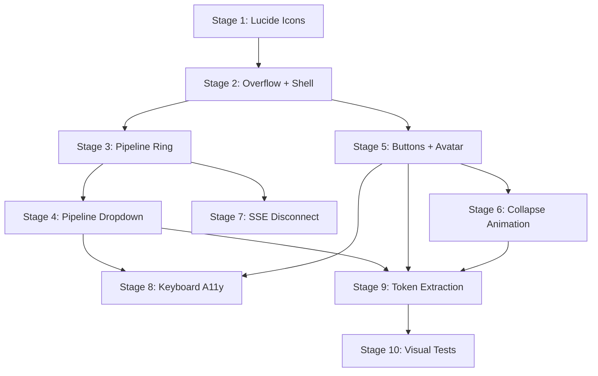

# Plan: Main Toolbar and Lucide Icon Migration

References: ADR.md

## Open Questions

Implementation challenges to solve (architect identifies, engineers resolve):

1. **Breadcrumb truncation after overflow change.** Does changing `.shell-header` from `overflow: clip` to `overflow: visible` break breadcrumb text-overflow ellipsis? The inner chain (`min-width: 0` + `overflow: hidden` on the breadcrumb nav) should be sufficient, but must be verified at 1024px viewport with a long filename.
2. **Global SSE endpoint design.** The new `/api/pipeline/status` SSE stream must broadcast aggregate pipeline state (processing/queued counts, session names+statuses, completion events). Must integrate with existing `EventBusAdapter`. Recently completed sessions need server-side tracking with a time-limited window.
3. **Collapse animation CSS.** Animating `width` or `max-width` with `overflow: hidden` on the pill. Need to determine whether `width: auto` to `width: 30px` (avatar only) can be transitioned smoothly, or whether a fixed expanded width is needed.
4. **Designer approval needed.** Three states are NOT in the approved mockup: (a) dormant/inactive pill, (b) collapsed pill, (c) SSE disconnection indicator. These require designer drafts and user approval before implementation. Stages that depend on these states are marked accordingly.

## Stages

### Stage 1: Lucide Icon Migration

Goal: Replace all 46 icon data URIs in `icons.css` with Lucide equivalents. Add license attribution. Zero visual regressions in existing components.

Owner: frontend-engineer

- [ ] Write Node.js extraction script (`.agents/scripts/extract-lucide-icons.mjs`) that: fetches Lucide SVGs from npm/GitHub for the 46 mapped icons, normalizes attributes (viewBox `0 0 24 24`, stroke-width `2`, stroke-linecap `round`, stroke-linejoin `round`, fill `none`, stroke `white`), URL-encodes, outputs CSS `-webkit-mask-image` + `mask-image` declarations
- [ ] Run the script and replace all 46 icon class declarations in `icons.css`
- [ ] Update the `icons.css` header comment: change viewBox documentation from `20x20` to `24x24`, update stroke attributes, add note about Lucide source
- [ ] Add developer documentation comment block in `icons.css` explaining how to add a new icon (find Lucide name, extract data URI, add CSS class)
- [ ] Create `THIRD-PARTY-LICENSES` file at repo root with Lucide ISC license text and Feather Icons MIT attribution
- [ ] Add reference to `THIRD-PARTY-LICENSES` in the project README
- [ ] Manually verify: open the running app, check icons at all size classes (xs through xl) in sidebar, session cards, section headers, toast notifications, upload zone, empty states
- [ ] Run existing visual regression tests (`npx playwright test`) and snapshot tests (`npx vitest run`) to confirm no unexpected failures

Files:
- `design/styles/icons.css` (modify: replace all 46 data URIs)
- `.agents/scripts/extract-lucide-icons.mjs` (create: extraction tool)
- `THIRD-PARTY-LICENSES` (create)
- `README.md` (modify: add license reference)

Depends on: none
Complexity: M

Considerations:
- The viewBox change from `0 0 20 20` to `0 0 24 24` should be invisible because `mask-size: contain` scales to the element's CSS width/height. But icons at `xs` (12px) may show subtle differences due to stroke-width 2 at small scale. Must verify at xs and sm sizes.
- Lucide `list-filter` is the mapping for `icon-filter` (FR-13 specifies this explicitly). The reference file confirms this.
- Lucide's `text-align-justify` maps to `icon-sections`. Verify this icon looks correct for "section count" semantic.
- The script must handle Lucide icon names that differ from Erika names (e.g., `close` -> Lucide `x`, `home` -> Lucide `house`, `warning` -> Lucide `triangle-alert`).

---

### Stage 2: Header Overflow Fix + Empty Toolbar Shell

Goal: Fix the header overflow to allow dropdown content, mount an empty glass pill toolbar component in the header. Establish the component structure.

Owner: frontend-engineer

- [ ] Change `.shell-header` `overflow` from `clip` to `visible` in the scoped styles of `ShellHeader.vue`
- [ ] Add `z-index: 50` to `.spatial-shell__header` in `shell.css` (matching the mockup)
- [ ] Create `ToolbarPill.vue` with the glass pill container markup and styles (copied from mockup: `toolbar-pill` class with backdrop-filter, border, box-shadow)
- [ ] Create `usePipelineStatus.ts` composable that injects `sessionListKey` and derives: `processingSessions`, `queuedSessions`, `processingCount`, `queuedCount`, `totalActive`, `recentlyCompleted`
- [ ] Mount `ToolbarPill.vue` inside `ShellHeader.vue`'s `shell-header__right` div
- [ ] Verify: breadcrumb text-overflow ellipsis still works with a long filename at 1024px viewport
- [ ] Verify: the empty pill renders in the correct position, vertically centered, right-aligned
- [ ] Write unit tests for `usePipelineStatus` composable (processing/queued filtering, count derivation)
- [ ] Write unit test for `ShellHeader.vue` confirming the toolbar is rendered

Files:
- `src/client/components/ShellHeader.vue` (modify: add overflow change, mount ToolbarPill)
- `src/client/components/toolbar/ToolbarPill.vue` (create)
- `src/client/composables/usePipelineStatus.ts` (create)
- `src/client/composables/usePipelineStatus.test.ts` (create)
- `design/styles/shell.css` (modify: add z-index to `.spatial-shell__header`)

Depends on: Stage 1
Complexity: M

Considerations:
- The overflow change is the riskiest part. If breadcrumb ellipsis breaks, fall back to Option C from the ADR (wrapper element with absolute positioning for the dropdown).
- `ToolbarPill.vue` at this stage is an empty glass pill container. Sub-components are added in subsequent stages.
- `usePipelineStatus` composable is created as a stub with empty reactive state — wired to the real SSE endpoint in Stage 2b.

---

### Stage 2b: Global Pipeline SSE Endpoint + Composable

Goal: Create the server-side `/api/pipeline/status` SSE stream and the client-side `usePipelineStatus` composable that connects to it.

Owner: backend-engineer (server), frontend-engineer (composable)

Server:
- [ ] Create route `GET /api/pipeline/status` that opens an SSE stream
- [ ] The stream emits the current pipeline snapshot on connection (all processing + queued sessions)
- [ ] The stream emits events when sessions change status (processing, queued, completed, failed)
- [ ] Recently completed sessions tracked server-side with a 5-minute rolling window
- [ ] Event format: `{ type: 'pipeline-status', data: { processing: [...], queued: [...], recentlyCompleted: [...] } }`
- [ ] Each session entry: `{ id, name, status, queuePosition?, progress? }`
- [ ] No infrastructure data exposed (no worker count, thread count, memory)
- [ ] Integrate with existing `EventBusAdapter` to listen for pipeline events
- [ ] Write integration tests for the SSE endpoint

Client:
- [ ] Create `usePipelineStatus` composable in `src/client/composables/`
- [ ] Connects to `/api/pipeline/status` SSE endpoint
- [ ] Exposes reactive state: `processingSessions`, `queuedSessions`, `recentlyCompleted`, `processingCount`, `queuedCount`, `totalActive`, `connected` (boolean for SSE connection health)
- [ ] Handles SSE disconnection: sets `connected = false`, attempts reconnect with backoff
- [ ] Handles SSE reconnection: sets `connected = true`, state refreshes from the snapshot event
- [ ] Write unit tests for the composable

Files:
- `src/server/routes/pipeline_status.ts` (create)
- `src/server/routes/pipeline_status.test.ts` (create)
- `src/client/composables/use_pipeline_status.ts` (create)
- `src/client/composables/use_pipeline_status.test.ts` (create)

Depends on: Stage 1 (icons must be migrated first so the toolbar can use Lucide icons)
Complexity: M

Considerations:
- The SSE endpoint must follow the same pattern as existing SSE endpoints in the codebase
- The `connected` boolean in the composable feeds FR-08 (SSE disconnection indicator)
- The composable should be provided at the SpatialShell level so all toolbar sub-components can inject it

---

### Stage 3: Pipeline Ring + Dormant/Active States

Goal: Add the SVG progress ring with count display and the pipeline label. Implement dormant (0 active) and active states with transitions.

Owner: frontend-engineer

- [ ] Create `PipelineRingTrigger.vue` with the SVG progress ring markup (copied from mockup: `progress-ring`, `progress-ring__bg`, `progress-ring__fill`, `ring-count`)
- [ ] Bind the ring count to `totalActive` from `usePipelineStatus` (wired to the global SSE endpoint from Stage 2b)
- [ ] Compute `stroke-dashoffset` from pipeline progress (or use a simple active/inactive binary for now since per-session progress percentage is out of scope)
- [ ] Implement dormant state: when `totalActive === 0`, reduce ring opacity, fade label to `--text-disabled`, remove glow
- [ ] Implement active state: when `totalActive > 0`, full opacity ring with cyan glow and animated stroke fill
- [ ] Animate transitions between dormant and active using `--duration-normal` and `--easing-default`
- [ ] Add `Pipeline` text label next to the ring (hidden when collapsed, styled per mockup)
- [ ] Mount `PipelineRingTrigger` inside `ToolbarPill`
- [ ] Write unit tests: ring count reflects processing+queued total, dormant state when count is 0, active state when count > 0

Files:
- `src/client/components/toolbar/PipelineRingTrigger.vue` (create)
- `src/client/components/toolbar/PipelineRingTrigger.test.ts` (create)
- `src/client/components/toolbar/ToolbarPill.vue` (modify: mount PipelineRingTrigger)

Depends on: Stage 2, Stage 2b
Complexity: M

Considerations:
- The dormant state is NOT in the approved mockup. **Designer approval required before implementation.** If not approved in time, implement active state only and defer dormant.
- The stroke-dashoffset calculation: the mockup uses `stroke-dasharray: 56.55` (circumference of r=9 circle: 2*pi*9 = ~56.55). Active state shows partial fill; dormant shows no fill. For MVP, the fill can represent a binary active/inactive rather than per-session progress percentage.
- `prefers-reduced-motion` must disable ring glow animation.

---

### Stage 4: Pipeline Dropdown

Goal: Implement the frosted dropdown panel showing Processing, Queued, and Recently Completed sections. Click-to-open/close behavior with keyboard support.

Owner: frontend-engineer

- [ ] Create `PipelineDropdown.vue` with the dropdown markup (copied from mockup: `pipeline-dropdown`, `pipeline-dropdown__header`, `pipeline-dropdown__section`, `pipeline-item`)
- [ ] Bind Processing section to `processingSessions` from composable (show spinner + name + percentage if available)
- [ ] Bind Queued section to `queuedSessions` (show queue dot + name + position number)
- [ ] Bind Recently Completed section to `recentlyCompleted` (show checkmark icon + name + relative timestamp)
- [ ] Omit Recently Completed section when empty
- [ ] Session names truncated with `text-overflow: ellipsis`
- [ ] Implement open/close: click `PipelineRingTrigger` toggles dropdown visibility
- [ ] Close on outside click (use a click-outside handler)
- [ ] Close on Escape key, return focus to trigger
- [ ] Add `aria-expanded` to the trigger button reflecting dropdown state
- [ ] Add dropdown positioning: absolute, anchored to right edge, below the pill
- [ ] Verify: dropdown renders fully below header with no clipping at any viewport height
- [ ] Verify: no infrastructure data (worker counts, thread pools) is exposed
- [ ] Write unit tests: dropdown renders sections based on session statuses, close on Escape, aria-expanded binding

Files:
- `src/client/components/toolbar/PipelineDropdown.vue` (create)
- `src/client/components/toolbar/PipelineDropdown.test.ts` (create)
- `src/client/components/toolbar/PipelineRingTrigger.vue` (modify: add click handler, aria-expanded)
- `src/client/components/toolbar/ToolbarPill.vue` (modify: wire dropdown open state)

Depends on: Stage 3
Complexity: L

Considerations:
- The click-outside handler should not conflict with other click-outside handlers in the app. A simple `document.addEventListener('click', ...)` with `stopPropagation` on the trigger/dropdown is sufficient.
- The dropdown z-index (100 in the mockup) must stack above all main content but below the mobile overlay (`--z-overlay-backdrop: 200`). This is already correct.
- The dropdown background uses `rgba(28, 28, 50, 0.95)` which is close to but not exactly `--bg-surface` (#212136). This should be extracted as a toolbar-scoped token (Decision 5 in ADR: design token extraction).
- `recentlyCompleted` rendering: relative timestamps ("2m ago") should use the existing `formatRelativeTime` utility from `src/shared/utils/format_relative_time.js`.

---

### Stage 5: Settings Button, Bell Placeholder, User Avatar

Goal: Add the three remaining toolbar controls: settings gear, bell notification placeholder, and user avatar with gradient initial circle.

Owner: frontend-engineer

- [ ] Create `ToolbarButton.vue` — a reusable 30px circular button with icon, label, hover state (from mockup: `toolbar-btn` class)
- [ ] Mount Settings button with `icon-settings` icon, `aria-label="Settings"`, `title="Settings"`. Wire click to `router.push('/settings')` (route may not exist yet; button is interactive regardless)
- [ ] Mount Bell button with `icon-bell` icon, `aria-label="Notifications"`, `title="Notifications"`. Click is a no-op
- [ ] Create `ToolbarAvatar.vue` with the gradient initial circle (from mockup: `toolbar-avatar` class, linear-gradient cyan-to-pink, initial letter, hover glow)
- [ ] Mount avatar at the right end of the pill, showing "S" as placeholder initial
- [ ] Add `toolbar-pill__separator` dividers between functional zones (pipeline | settings+bell | avatar) per mockup
- [ ] Verify: hover states match mockup (cyan background tint, border glow, box-shadow)
- [ ] Write unit tests: buttons render with correct aria-labels, avatar renders initial, separator dividers present

Files:
- `src/client/components/toolbar/ToolbarButton.vue` (create)
- `src/client/components/toolbar/ToolbarButton.test.ts` (create)
- `src/client/components/toolbar/ToolbarAvatar.vue` (create)
- `src/client/components/toolbar/ToolbarAvatar.test.ts` (create)
- `src/client/components/toolbar/ToolbarPill.vue` (modify: mount buttons, avatar, separators)

Depends on: Stage 2 (needs the pill shell; can run in parallel with Stages 3-4 since it owns different files)
Complexity: M

Considerations:
- `ToolbarButton` should accept props for `icon` (CSS class name), `label` (aria-label/title), and an optional `@click` handler. This makes it reusable for both settings and bell.
- The avatar gradient uses `rgba(0, 212, 255, 0.15)` to `rgba(255, 77, 106, 0.1)` which maps to `--accent-primary` and `--accent-secondary` at low opacity. These should be tokenized.
- The "S" initial is a placeholder. In the future, this will come from the user profile. For now, hardcode or derive from a config/env.

---

### Stage 6: Toolbar Collapse/Expand Animation

Goal: Implement the collapse mechanism where clicking the avatar toggles the pill between full and avatar-only states.

Owner: frontend-engineer

- [ ] Add `isCollapsed` ref to `ToolbarPill.vue`
- [ ] Wire `ToolbarAvatar` click to toggle `isCollapsed`
- [ ] When collapsed: hide pipeline ring, pipeline label, settings, bell, separators. Only avatar remains visible
- [ ] Animate the transition using CSS `width` or `max-width` transition with `overflow: hidden`
- [ ] Use `--duration-normal` (250ms) and `--easing-default` (ease-out) tokens
- [ ] Verify: no layout shift during transition (header content does not jump)
- [ ] Verify: collapsed state persists across in-app navigation (e.g., navigate from session list to session detail and back)
- [ ] Verify: collapsed state resets on page reload
- [ ] Write unit tests: clicking avatar toggles collapsed state, collapsed class applied, elements hidden

Files:
- `src/client/components/toolbar/ToolbarPill.vue` (modify: collapse state, CSS transitions)
- `src/client/components/toolbar/ToolbarAvatar.vue` (modify: emit click event for collapse toggle)

Depends on: Stage 5
Complexity: M

Considerations:
- **Collapsed visual is NOT in the approved mockup. Designer approval required.** If the designer has not approved the collapsed state by this stage, implement the toggle logic but defer the visual treatment to a follow-up designer review.
- CSS `width` transitions require a known start and end value. `width: auto` does not transition. Options: (a) use a fixed expanded width, (b) use `max-width` with a large value for expanded and `30px` for collapsed, (c) use `grid-template-columns` if the pill is a grid. Option (b) is simplest.
- The avatar must remain clickable and visible in both states. It serves as both the identity indicator and the expand/collapse toggle.

---

### Stage 7: SSE Disconnection Indicator

Goal: Show a subtle warning state on the pipeline ring when real-time updates are unavailable.

Owner: frontend-engineer

- [ ] Extend `usePipelineStatus` to track SSE connection health. Since the composable reads from the session list (not from SSE directly), disconnection detection needs a different approach: monitor whether the session list has stale data by checking if any processing sessions have not changed status within a timeout threshold
- [ ] Alternatively: add a lightweight global SSE health check by attempting a HEAD request to the server periodically when sessions are processing
- [ ] When disconnected: show a subtle visual state on the pipeline ring (grey ring, reduced opacity, small disconnect icon)
- [ ] When reconnected: restore normal ring appearance and refresh the session list
- [ ] No error toast or modal (FR-08: ambient, not disruptive)
- [ ] Write unit tests: disconnection state applies when health check fails, recovers on success

Files:
- `src/client/composables/usePipelineStatus.ts` (modify: add connection health tracking)
- `src/client/components/toolbar/PipelineRingTrigger.vue` (modify: add disconnection visual state)

Depends on: Stage 3
Complexity: M

Considerations:
- **SSE disconnection visual is NOT in the approved mockup. Designer approval required.** Implementation must wait for designer to produce and user to approve the disconnection state visual.
- The current architecture does not have a global SSE connection. The toolbar cannot directly know if SSE connections are healthy since those connections are per-SessionCard. A pragmatic approach: if any processing session's `useSSE` instance reports `isConnected: false`, consider the pipeline disconnected. This requires either lifting `isConnected` state up or using a lightweight server health check.
- A simple approach: periodic `fetch('/api/health')` when `totalActive > 0`. If it fails, show the disconnection state. This is simpler than plumbing SSE connection state from individual SessionCards.

---

### Stage 8: Keyboard Accessibility + ARIA

Goal: Full keyboard navigation through all toolbar controls with proper ARIA attributes.

Owner: frontend-engineer

- [ ] Tab order through pill controls follows visual layout: pipeline trigger > settings > bell > avatar
- [ ] All icon-only buttons have `aria-label` attributes (already added in Stage 5, verify completeness)
- [ ] Pipeline trigger has `aria-expanded` reflecting dropdown state (already added in Stage 4, verify)
- [ ] Dropdown items are navigable with arrow keys (up/down cycle through items)
- [ ] Focus ring visible on all interactive elements (verify existing `focus-visible` styles apply)
- [ ] Escape closes dropdown and returns focus to trigger (already implemented in Stage 4, verify)
- [ ] Verify: `role="button"` or native `<button>` used for all interactive elements
- [ ] Write integration-style test: simulate tab navigation through toolbar controls, verify focus order

Files:
- `src/client/components/toolbar/ToolbarPill.vue` (modify: verify tab order)
- `src/client/components/toolbar/PipelineDropdown.vue` (modify: arrow key navigation)
- `src/client/components/toolbar/ToolbarButton.vue` (verify: focus styles)
- `src/client/components/toolbar/ToolbarAvatar.vue` (verify: focus styles, button semantics)

Depends on: Stages 4, 5
Complexity: S

Considerations:
- The mockup uses `<button>` elements which are natively keyboard-accessible. Ensure the Vue components preserve this (no `
` substitution for buttons).
- Arrow key navigation in the dropdown: up/down move focus between pipeline items. This is a nice-to-have enhancement over simple tab navigation. If complex, defer to a follow-up.
- `tabindex` management: when dropdown is closed, its items should not be in the tab order.

---

### Stage 9: Design Token Extraction + Cleanup

Goal: Extract all raw `rgba()` values from toolbar components into design tokens. Ensure no hardcoded colors remain in the toolbar CSS.

Owner: frontend-engineer

- [ ] Audit all toolbar components for raw color values (grep for `rgba(`, `#`, `rgb(` in scoped styles)
- [ ] Extract toolbar-scoped tokens: `--toolbar-glass-bg`, `--toolbar-glass-border`, `--toolbar-separator`, `--toolbar-btn-hover-bg`, `--toolbar-btn-hover-border`, `--toolbar-btn-hover-shadow`, `--toolbar-dropdown-bg`, `--toolbar-dropdown-border`, `--toolbar-dropdown-section-border`, `--toolbar-ring-bg-stroke`, `--toolbar-ring-glow`
- [ ] Place tokens either in `layout.css` (if reusable across components) or in a toolbar-scoped `:root` / component-level custom properties block
- [ ] Replace all raw values in toolbar component styles with `var(--token-name)` references
- [ ] Verify: no visual change after tokenization (same colors, same rendering)
- [ ] Write a grep-based verification: no raw `rgba(` or `rgb(` values in toolbar component `<style>` blocks

Files:
- `src/client/components/toolbar/ToolbarPill.vue` (modify: replace raw values)
- `src/client/components/toolbar/PipelineRingTrigger.vue` (modify: replace raw values)
- `src/client/components/toolbar/PipelineDropdown.vue` (modify: replace raw values)
- `src/client/components/toolbar/ToolbarButton.vue` (modify: replace raw values)
- `src/client/components/toolbar/ToolbarAvatar.vue` (modify: replace raw values)
- `design/styles/layout.css` (modify: add new tokens if promoted to design system)

Depends on: Stages 4, 5, 6
Complexity: S

Considerations:
- Some mockup values intentionally differ from existing design tokens (e.g., `rgba(28, 28, 50, 0.95)` for dropdown background is a unique toolbar value, not `--bg-surface`). These get toolbar-scoped tokens.
- Tokens scoped to the toolbar should be defined in `ToolbarPill.vue`'s `<style>` section as component-level custom properties on the root element, not in `layout.css`, unless they have clear reuse potential.
- FR-18 is the governing requirement: "No raw color values in the toolbar component."

---

### Stage 10: Visual Regression Tests + Design Fidelity Verification

Goal: Add Playwright visual regression tests for the toolbar and verify design fidelity against the mockup.

Owner: frontend-engineer

- [ ] Add Playwright test: screenshot of header with toolbar at 1440x900 viewport (expanded state, dropdown closed)
- [ ] Add Playwright test: screenshot of header with toolbar dropdown open
- [ ] Add Playwright test: screenshot of header with collapsed toolbar
- [ ] Add Playwright test: screenshot comparison of icons before/after migration (session list view, session detail view)
- [ ] Side-by-side comparison: running app screenshot vs `draft-2b-lucide.html` screenshot at same viewport
- [ ] Verify: breadcrumb truncation at 1024px with a long filename (edge case from Stage 2)
- [ ] Verify: dropdown renders without viewport overflow at >= 1024px width (FR-24)
- [ ] Run full test suite: `npx vitest run` + `npx playwright test`

Files:
- `src/client/components/toolbar/__tests__/toolbar.visual.test.ts` (create: Playwright visual tests)
- `tests/visual/` or existing Playwright test directory (create/modify)

Depends on: All previous stages (9)
Complexity: M

Considerations:
- Visual regression baselines for the new toolbar need to be established. The first run creates the baseline screenshots; subsequent runs compare against them.
- The mockup comparison (running app vs static HTML) is a manual verification step, not an automated pixel-diff. The reviewer should perform this comparison.
- If snapshot tests fail due to the Lucide icon migration (expected: rounded stroke terminals instead of butt/miter), the snapshots need updating with `[snapshot-update]` in the commit message after user approval.

## Dependencies

- Stage 2 depends on Stage 1 (icons must be migrated first so the toolbar uses Lucide icons from day one)
- Stage 3 depends on Stage 2 (needs the pill container and composable)
- Stage 4 depends on Stage 3 (needs the ring trigger to open the dropdown)
- Stage 5 depends on Stage 2 (needs the pill container; can run in parallel with Stages 3-4)
- Stage 6 depends on Stage 5 (needs the avatar component for the collapse trigger)
- Stage 7 depends on Stage 3 (needs the pipeline ring to show disconnection state)
- Stage 8 depends on Stages 4 and 5 (needs all interactive elements to test keyboard nav)
- Stage 9 depends on Stages 4, 5, and 6 (needs all raw values present to extract)
- Stage 10 depends on Stage 9 (final visual verification after all implementation and cleanup)

**Parallelizable:** Stages 3 and 5 can run in parallel after Stage 2 completes (no file overlap). Stage 7 can run in parallel with Stage 4 if designer approval is available.

## Progress

Updated by engineers as work progresses.

| Stage | Status | Notes |
|-------|--------|-------|
| 1 | pending | Lucide icon migration + license |
| 2 | pending | Overflow fix + toolbar shell + composable |
| 3 | pending | Pipeline ring (needs designer approval for dormant state) |
| 4 | pending | Pipeline dropdown |
| 5 | pending | Settings, bell, avatar |
| 6 | pending | Collapse animation (needs designer approval for collapsed visual) |
| 7 | pending | SSE disconnection (needs designer approval for disconnect visual) |
| 8 | pending | Keyboard accessibility |
| 9 | pending | Design token extraction |
| 10 | pending | Visual regression tests |
