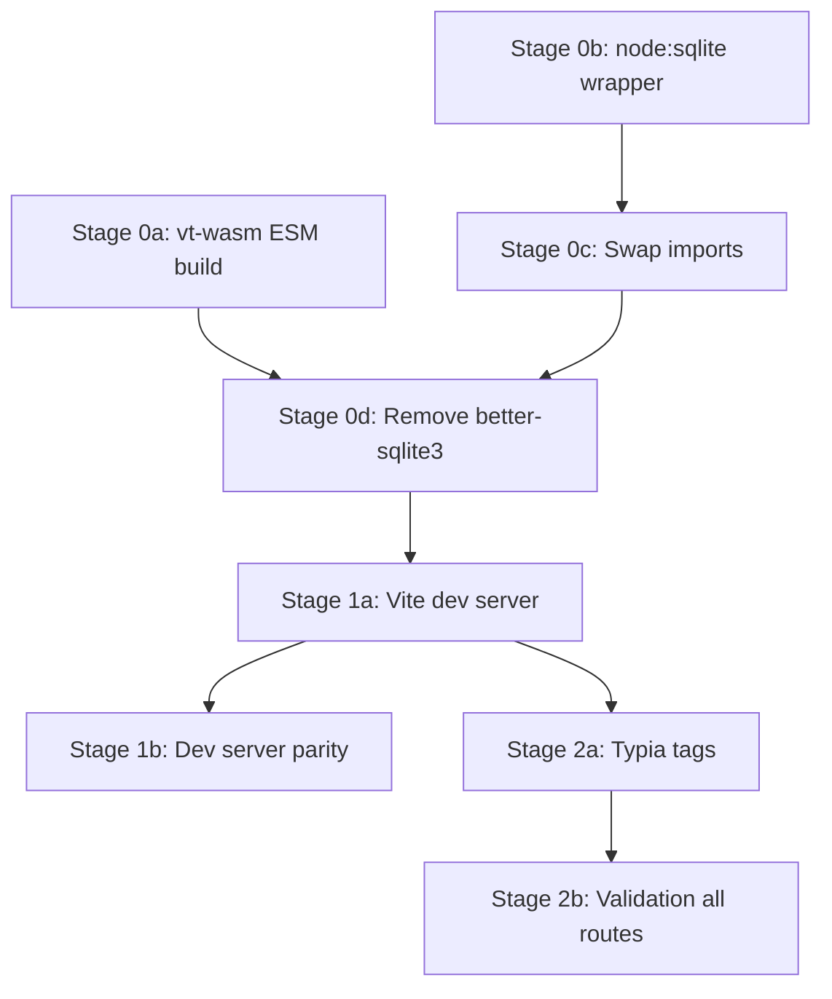

# Plan: Typia AOT Validation + Native Dependency Removal

References: ADR.md

## Open Questions

Implementation challenges to solve (architect identifies, engineers resolve):

1. **node:sqlite PRAGMA return values.** `db.prepare("PRAGMA journal_mode = WAL").get()` may return the result differently than `db.pragma("journal_mode = WAL")`. The engineer must verify the return shape and handle accordingly (likely `{ journal_mode: 'wal' }` vs `'wal'`).
2. **node:sqlite :memory: database support.** Tests rely on `new Database(':memory:')`. Verify `new DatabaseSync(':memory:')` works identically.
3. **@hono/vite-dev-server + @hono/node-server coexistence.** The production path still uses `@hono/node-server` via `start.ts`. The dev path needs `@hono/vite-dev-server`. These must not conflict. The engineer must determine how to structure the entry point (likely a separate `src/server/dev.ts` or conditional logic).
4. **vt-wasm WASM path resolution after ESM conversion.** The CJS version uses `__dirname` to locate the `.wasm` file. ESM replacement via `import.meta.url` + `new URL()` must produce the same path in both Vitest and production.
5. **Typia + Vitest compatibility.** Typia requires AOT compilation. Tests run through Vitest (which uses Vite). The `@typia/unplugin` must be in the Vitest config for tests that exercise validation logic.

## Stages

### Stage 0a: vt-wasm build script ESM output

Goal: Configure `wasm-pack` / `build.sh` to produce ESM output natively, so the package works in the Vite pipeline without manual patching.

Owner: backend-engineer

- [ ] Investigate `build.sh` and `Cargo.toml` for current wasm-pack target and output config
- [ ] Change wasm-pack target to produce ESM output (`--target web` or `--target bundler` or `--target nodejs` with ESM config)
- [ ] Verify the output `pkg/vt_wasm.js` uses `export` instead of `exports`, ESM imports instead of `require()`, and `import.meta.url` instead of `__dirname`
- [ ] Update `packages/vt-wasm/pkg/package.json` if needed (`"type": "module"`, `"exports"` field)
- [ ] Update `packages/vt-wasm/index.ts` wrapper if the import pattern changes
- [ ] Rebuild: run `build.sh`, verify output is ESM
- [ ] Verify: `npx vitest run` -- all existing tests pass

Files: `packages/vt-wasm/build.sh`, `packages/vt-wasm/Cargo.toml`, `packages/vt-wasm/pkg/*`, `packages/vt-wasm/index.ts`
Depends on: none

Considerations:
- Different wasm-pack targets produce different init patterns. `--target web` uses async init; `--target bundler` may use sync. The engineer must verify which matches the current sync init pattern in `index.ts`.
- The `.d.ts` file may change shape depending on the target — verify types still match `index.ts` wrapper.
- If Rust toolchain is not available locally, this stage may need CI or a contributor with Rust installed. Check if `build.sh` documents requirements.

### Stage 0b: node:sqlite compatibility wrapper

Goal: Create a thin wrapper around `node:sqlite`'s `DatabaseSync` that matches better-sqlite3's API surface. This wrapper is the only file that knows about `node:sqlite` — all downstream consumers keep their current code.

Owner: backend-engineer

- [x] Create `src/server/db/sqlite/node_sqlite_compat.ts` that wraps `DatabaseSync` with:
  - Constructor matching `new Database(path)` pattern
  - `.pragma(key)` and `.pragma('key = value')` matching better-sqlite3's API
  - `.transaction(fn)` matching better-sqlite3's transaction helper (wraps BEGIN/COMMIT/ROLLBACK)
  - `.prepare()` returning statement objects with `.run()`, `.get()`, `.all()` matching better-sqlite3
  - `.exec()` pass-through
  - `.close()` pass-through
  - `.open` property (boolean, tracks close state)
- [x] Add unit tests for the wrapper covering: pragma read/write, transaction commit, transaction rollback on error, prepare/run/get/all, close behavior
- [x] Verify: `npx vitest run` -- all existing tests pass (wrapper is new, no consumers yet)

Files: `src/server/db/sqlite/node_sqlite_compat.ts`, `src/server/db/sqlite/node_sqlite_compat.test.ts`
Depends on: none

Considerations:
- TypeScript needs `@types/node` >= 22.x for `node:sqlite` types. Current devDeps has `^25.3.5` — should be fine.
- The wrapper must handle `result.lastInsertRowid` type differences (bigint vs number). better-sqlite3 returns number; node:sqlite may return bigint. The wrapper normalizes this.
- The wrapper's type signature should match better-sqlite3's API so downstream files need ONLY an import path change.

### Stage 0c: Swap better-sqlite3 for wrapper in database impl + all consumers

Goal: Replace the better-sqlite3 import with the compat wrapper across the entire codebase. Because the wrapper matches the API, this is a one-line import change per file.

Owner: backend-engineer

- [x] Update `sqlite_database_impl.ts`: change import from `better-sqlite3` to `node_sqlite_compat`
- [x] Update `sqlite_session_impl.ts`: change type import
- [x] Update `sqlite_section_impl.ts`: change type import
- [x] Update `sqlite_job_queue_impl.ts`: change type import
- [x] Update `sqlite_event_log_impl.ts`: change type import
- [x] Update migration files (002, 003, 004): change type imports
- [x] Update test files: change value imports (004_pipeline_jobs_events.test.ts, tests/integration/db/*.test.ts)
- [x] Verify: `npx vitest run` -- all existing tests pass (1172 tests)
- [ ] Verify: start dev server, upload a fixture, confirm full pipeline works

Files: all files currently importing `better-sqlite3` (9 source + 2 test)
Depends on: Stage 0b

Considerations:
- Each file change should be a single import line. If any file needs more than an import change, the wrapper is missing API surface — fix the wrapper, not the consumer.
- Run the full test suite after each file change to catch any API mismatches immediately.

### Stage 0d: Remove better-sqlite3 from dependencies

Goal: Remove the native dependency from the project entirely.

Owner: backend-engineer

- [ ] Remove `better-sqlite3` from `dependencies` in `package.json`
- [ ] Remove `@types/better-sqlite3` from `devDependencies` in `package.json`
- [ ] Run `npm install` -- verify no node-gyp output in the log
- [ ] Verify: `npx vitest run` -- all existing tests pass
- [ ] Verify: grep for any remaining `better-sqlite3` references in `src/` and `tests/` -- should be zero

Files: `package.json`
Depends on: Stage 0c

Considerations:
- After Stage 0c, no file imports better-sqlite3 anymore. This stage just removes the dead dependency.
- Verify with a fresh `rm -rf node_modules && npm install` if possible.

### Stage 1a: Refactor server entry point + install @hono/vite-dev-server

Goal: Split the server into an app factory (pure Hono routes) and a bootstrap module (DB init, orchestrator, signal handlers). Then wire the app factory to `@hono/vite-dev-server` for Vite-native dev.

Owner: backend-engineer

**Sub-step 1: Refactor `src/server/index.ts` into app factory + bootstrap**

The current `index.ts` does too much at module scope: DB init, orchestrator startup, signal handlers, service instantiation, route registration, and static file serving. `@hono/vite-dev-server` needs a module that exports a Hono app (or factory function). On every HMR reload, module-scope side effects would re-open the DB, re-run migrations, and leak signal handlers.

- [x] Create `src/server/app.ts` — the app factory. Accepts dependencies (services, config) as arguments, returns a configured Hono app with all routes registered. No side effects, no top-level await, no signal handlers, no `@hono/node-server` imports.
- [x] Create `src/server/bootstrap.ts` — the bootstrap module. Handles DB init, migrations, orchestrator startup, service instantiation, signal handlers. Calls the app factory with the initialized dependencies.
- [x] Update `src/server/start.ts` — production entry point. Imports bootstrap, starts `@hono/node-server`. This is what `npm run start` uses.
- [x] Create `src/server/dev.ts` — dev entry point for `@hono/vite-dev-server`. Exports the app factory's return value (or a default export function that `@hono/vite-dev-server` expects). Handles dev-specific DB init.
- [x] Move `serveStatic` from `@hono/node-server/serve-static` into the production path only (it's incompatible with Vite's dev server which serves static files itself).
- [ ] Verify: `npm run start` still works with the refactored code (production path).

**Sub-step 2: Wire @hono/vite-dev-server + @typia/unplugin**

NOTE: `vite.config.ts` and `package.json` are outside the backend-engineer write scope (enforced by .agents/scripts/limit-write-backend.sh). Exact changes documented in `.state/feat/typia-shared-ddl/stage-1a-config-changes.md`. Coordinator must apply these.

- [x] Install `@hono/vite-dev-server` as a devDependency (^0.25.1 — installed via npm in worktree)
- [x] Install `@typia/unplugin` as a devDependency (^12.0.1 — installed via npm in worktree)
- [ ] Update `vite.config.ts` with:
  - `@hono/vite-dev-server` plugin pointing to `src/server/dev.ts` as entry
  - `@typia/unplugin` in the plugins array
  - Server port config matching current setup
- [ ] Update `package.json` scripts:
  - `dev` — single `vite` invocation (replaces `concurrently` of dev:server + dev:client)
  - `start` — production: `node dist/server/start.js`
- [ ] Verify: `npm run dev` starts both server and client from one process
- [ ] Verify: API requests from frontend work (proxy or same-origin)
- [ ] Verify: `npx vitest run` — all existing tests pass

**Sub-step 3: Update production build to use Vite for server too**

NOTE: Requires `vite.config.server.ts` (new file, not under src/) and `package.json` changes — both outside backend-engineer write scope. Exact content in stage-1a-config-changes.md.

- [ ] Add a Vite server build config (or `vite.config.server.ts`) that bundles `src/server/start.ts` for production
- [ ] Update `package.json` build script: `vite build` for client + `vite build --config vite.config.server.ts` for server (replaces `tsc -p tsconfig.build.json` for server)
- [ ] This ensures Typia AOT transforms apply in production builds too — same pipeline as dev
- [ ] Verify: `npm run build && npm run start` works end-to-end

Files: `src/server/app.ts` (new), `src/server/bootstrap.ts` (new), `src/server/dev.ts` (new), `src/server/start.ts` (updated), `src/server/index.ts` (replaced/removed), `vite.config.ts`, `package.json`, possibly `vite.config.server.ts`
Depends on: Stage 0d

Considerations:
- The app factory pattern is standard for Hono + Vite. The factory takes deps, returns app. Dev and prod entry points differ only in how deps are initialized.
- `@hono/vite-dev-server` expects a default export of the Hono app or a function returning one. The dev entry point must match this contract.
- The `serveStatic` import from `@hono/node-server/serve-static` is Node-specific and must NOT be in the app factory — only in the production bootstrap.
- Port management: `@hono/vite-dev-server` uses Vite's port. The proxy config from the current `vite.config.ts` may need adjustment or removal if both server and client run from one Vite instance.
- Building server with Vite ensures Typia transforms apply in production. No ts-patch needed.

### Stage 1b: Verify dev + production parity, remove tsx

Goal: Confirm the new setup is functionally equivalent. Remove tsx dependency.

Owner: backend-engineer

- [ ] Start `npm run dev` and manually verify:
  - Server responds to `GET /api/sessions`
  - Upload endpoint `POST /api/upload` works with sample fixture (`fixtures/sample.cast`)
  - SSE endpoint connects and streams events
  - Frontend loads and API calls work
- [ ] Verify server HMR: change a server file, confirm reload without manual restart
- [x] Verify: `npm run build && npm run start` — production build works end-to-end
- [x] Verify: `npx vitest run` — all existing tests pass (1172 tests)
- [x] Update `migrate:v2` script — tsx retained (vite-node not installed; node --experimental-strip-types fails on .js extension remapping; PLAN.md explicitly allows keeping tsx)
- [x] tsx: retained for migrate:v2 per PLAN.md consideration — "keep tsx for this one script if the build approach is too awkward"

Files: `package.json`
Depends on: Stage 1a

Considerations:
- `tsx` is used by `npm run migrate:v2`. Switch to `node dist/server/scripts/migrate_v2.js` (requires build first) or keep tsx for this one script if the build approach is too awkward.
- The `predev` script may need adjustment if the server port config changes.

### Stage 2a: Add Typia validation tags to all shared types

Goal: Annotate ALL API-boundary TypeScript interfaces with Typia validation tags. This establishes the pattern across the entire type surface.

Owner: backend-engineer

- [ ] Add Typia tag imports to `src/shared/types/asciicast.ts`:
  - `AsciicastHeader.version` -- `@minimum 2`
  - `AsciicastHeader.width`, `.height` -- `@type uint32 & @minimum 1`
  - Other fields as appropriate
- [ ] Add Typia tags to `src/shared/types/session.ts`:
  - `Session.id` -- `@format nanoid` or `@minLength 1`
  - `SessionCreate.filename` -- `@minLength 1`
  - `SessionCreate.size_bytes` -- `@minimum 1`
- [ ] Add Typia tags to `src/shared/types/section.ts`:
  - `Section.id`, `.session_id` -- string constraints
  - `Section.startEvent`, `.endEvent` -- `@minimum 0`
- [ ] Add Typia tags to `src/shared/types/api.ts`:
  - Response shapes -- validate what the server sends to the client
- [ ] Add Typia tags to `src/shared/types/pipeline.ts`:
  - `PipelineEvent` discriminated union validation
- [ ] Verify: `npx vitest run` -- all existing tests pass (tags are compile-time annotations, no runtime effect until middleware wires them)

Files: `src/shared/types/asciicast.ts`, `src/shared/types/session.ts`, `src/shared/types/section.ts`, `src/shared/types/api.ts`, `src/shared/types/pipeline.ts`
Depends on: Stage 1a (Typia unplugin must be in the Vite pipeline)

Considerations:
- Typia tags use JSDoc-style annotations or `tags.Format<>` intersection types. The engineer picks the style.
- Adding tags must not change runtime behavior of existing code -- they only activate when `typia.validate()` or middleware calls them.
- The `[key: string]: unknown` index signature on `AsciicastHeader` may interact with Typia -- verify how it handles index signatures.

### Stage 2b: Add Typia validation middleware to ALL routes

Goal: Wire validation to every API route — input validation on the way in, response validation on the way out. Establish the pattern so future routes just copy it.

Owner: backend-engineer

- [ ] Install `@hono/typia-validator` as a dependency
- [ ] **Upload route** (`POST /api/upload`):
  - Validate parsed asciicast header after multipart parsing, before DB write
  - Use `typia.validate()` in the service layer (multipart doesn't fit JSON middleware pattern)
  - Return structured 4xx on validation failure
- [ ] **Read routes** (`GET /api/sessions`, `GET /api/sessions/:id`):
  - Validate path params (`:id` format)
  - Validate response shape before sending (guards against DB corruption)
- [ ] **Event routes** (`GET /api/sessions/:id/events`):
  - Validate path param + query params
- [ ] **Write routes** (`POST /api/sessions/:id/redetect`, `POST /api/sessions/:id/retry`, `DELETE /api/sessions/:id`):
  - Validate path params
- [ ] **Status route** (`GET /api/sessions/:id/status`):
  - Validate path param + response shape
- [ ] Add tests for validation error responses:
  - Invalid path param returns 4xx
  - Malformed upload returns 4xx with field name
  - Valid requests still succeed (no regression)
- [ ] Verify: `npx vitest run` -- all existing tests pass + new validation tests pass

Files: `src/server/routes/*.ts`, `src/server/index.ts`, `package.json`, new test files for validation
Depends on: Stage 2a

Considerations:
- Upload route uses multipart form data, not JSON. Validation applies to *parsed* content inside the service, not as request body middleware.
- Path param validation is lightweight — just format/presence checks.
- Response validation catches DB corruption before it reaches the client. Use `typia.assert()` or `typia.validate()` on the response object.
- New tests should NOT modify existing test files. Create new test files.
- Typia's error format: `IValidation` with `errors[]` containing `path`, `expected`, `value`. Map to API error shape.

## Dependencies

Parallelizable:
- **Stage 0a** (vt-wasm ESM) and **Stage 0b** (node:sqlite wrapper) can run in parallel -- no file overlap
- **Stage 2a** (Typia tags) can start as soon as Stage 1a completes, in parallel with Stage 1b

## Progress

Updated by engineers as work progresses.

| Stage | Status | Notes |
|-------|--------|-------|
| 0a | pending | vt-wasm build script ESM output |
| 0b | complete | node:sqlite compatibility wrapper — 30 tests, all 1163 suite tests pass |
| 0c | complete | Swap better-sqlite3 imports for wrapper — 1172 tests pass, 11 files updated |
| 0d | blocked | package.json outside backend-engineer write scope; coordinator must apply the 2-line removal |
| 1a | partial | Sub-step 1 complete (server refactor, 9205bf6). Sub-steps 2+3 need vite.config.ts + package.json changes — see stage-1a-config-changes.md |
| 1b | complete | Production build fixed (index.js added); tsx retained for migrate:v2; 1172 tests pass |
| 2a | pending | Typia validation tags on all types |
| 2b | pending | Validation middleware on all routes |
