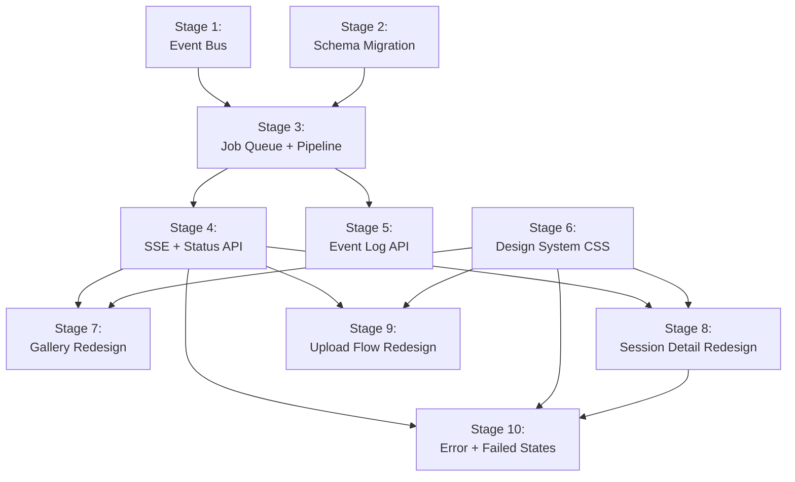

# Plan: Variant B — Event-Driven Pipeline

References: [ADR.md](ADR.md), [REQUIREMENTS.md](REQUIREMENTS.md), [STORIES.md](STORIES.md)

## Cross-Cutting Requirements

### Visual Verification (Non-Negotiable)

Every stage that touches frontend code MUST include:

1. **Playwright E2E tests** verifying page states match approved mockups in `design/drafts/`
2. **Screenshot tests** via Playwright for every visual component added or modified
3. **Visual regression baselines** committed with `[snapshot-update]` in the commit message
4. **Frontend-designer agent** uses Playwright MCP for real-time screenshot verification during implementation
5. **CI enforcement** via `npx playwright test` on every PR

No frontend stage may be marked complete without passing Playwright visual verification.

### Test Coverage

All stages must maintain 90% coverage thresholds (lines/functions/branches/statements). Existing 323 tests must continue passing.

### Git Contract

Variant: full-stack. Branch prefix: `feat/`. Commit scopes: `server`, `client`, `shared`, `db`, `wasm`.

---

## Open Questions

Implementation challenges to solve (architect identifies, implementer resolves):

1. **EventEmitter memory:** How many SSE connections can a single Node.js process sustain before EventEmitter listener warnings trigger? (Likely fine at self-hosted scale, but measure.)
2. **SSE reconnection:** What `Last-Event-ID` strategy do we use for SSE reconnection? (Suggestion: event log `id` column as the SSE event ID, replay missed events on reconnect.)
3. **Migration rollback:** If migration 004 fails partway through, how do we recover? (Suggestion: wrap in a transaction, SQLite DDL is transactional.)
4. **Existing `detection_status` values:** Sessions currently in `processing` state at migration time — mark as `interrupted` or leave as-is? (Suggestion: migration marks them `interrupted`.)
5. **Design system font loading:** How to load Geist fonts in the Vue app — self-hosted woff2 or CDN? (Suggestion: self-hosted in `public/fonts/`, no external CDN dependency for self-hosted platform.)

---

## Stages

### Stage 1: Domain Events and Event Bus

**Branch:** `feat/variant-b-stage-1-event-bus`
**Stories:** S13
**Requirements:** R9 (partial)
**Owner:** backend-engineer

#### Goal

Define the `PipelineEvent` type union and implement a typed `EventBus` interface with an in-process `EventEmitter` backend. No pipeline changes yet — this is pure infrastructure.

#### Files

- [x] `src/shared/pipeline-events.ts` — `PipelineEvent` discriminated union type, `PipelineStage` enum
- [x] `src/server/events/event-bus.ts` — `EventBus` interface: `emit(event)`, `on(type, handler)`, `off(type, handler)`, `once(type, handler)`
- [x] `src/server/events/emitter-event-bus.ts` — In-process `EventEmitter` implementation of `EventBus`
- [x] `src/server/events/index.ts` — Module exports
- [x] `src/server/events/emitter-event-bus.test.ts` — Unit tests

#### Tests

- [x] EventBus emits typed events and handlers receive correct payloads
- [x] Handlers can subscribe and unsubscribe
- [x] `once()` fires exactly once
- [x] Multiple listeners for the same event type all receive the event
- [x] Emitting an event with no listeners does not throw
- [x] Type safety: handler receives correctly narrowed event type

#### Acceptance

- [x] `PipelineEvent` type is importable from `src/shared/pipeline-events.ts` by both client and server
- [x] `EventBus` interface is generic enough that a future Redis/NATS implementation could replace `EmitterEventBus`
- [x] All existing 323 tests still pass

#### Dependencies

- Requires: none
- Blocks: Stage 2, Stage 3

#### Considerations

- The `PipelineEvent` type lives in `src/shared/` because the client will also need it for SSE event parsing
- EventEmitter default max listeners is 10 — the implementation should set a higher limit or use `setMaxListeners(0)`
- Keep the interface minimal; don't add features (wildcards, middleware) that aren't needed yet

---

### Stage 2: Schema Migration (Jobs + Events Tables)

**Branch:** `feat/variant-b-stage-2-schema-migration`
**Stories:** S10, S12
**Requirements:** R7
**Owner:** backend-engineer

#### Goal

Add migration 004 that creates the `jobs` and `events` tables, extends `detection_status` to support granular stages, and ensures pre-migration sessions remain fully functional.

#### Files

- [ ] `src/server/db/sqlite/migrations/004_pipeline_jobs_events.ts` — Migration: create `jobs` table, `events` table, indexes
- [ ] `src/server/db/sqlite/sql/004_pipeline_jobs_events.sql` — Raw SQL (if pattern matches existing migrations)
- [ ] `src/server/db/sqlite/sqlite_database_impl.ts` — Register migration 004 in the migration runner
- [ ] `src/server/db/sqlite/sqlite_database_impl.test.ts` — Migration tests

#### Tests

- [ ] Migration creates `jobs` table with correct schema
- [ ] Migration creates `events` table with correct schema
- [ ] Migration creates indexes on `jobs.session_id`, `jobs.status`, `events.session_id`
- [ ] Migration is idempotent (running twice does not error or duplicate)
- [ ] Pre-existing sessions are untouched after migration (R7 acceptance: filenames, agent types, section counts, dates preserved)
- [ ] Pre-existing sessions render their full terminal content correctly post-migration
- [ ] Brand-new database initializes correctly with all migrations
- [ ] Sessions in `processing` state at migration time are marked `interrupted`

#### Acceptance

- [ ] Starting the updated server against an existing database applies new schema without manual steps (R7)
- [ ] All sessions from before the upgrade appear in gallery with correct metadata (R7)
- [ ] Pre-upgrade sessions render full terminal content (R7)
- [ ] Migration is safe to run twice (idempotent)

#### Dependencies

- Requires: none (parallel with Stage 1)
- Blocks: Stage 3

#### Considerations

- SQLite DDL is transactional — wrap the migration in a transaction for atomicity
- The `detection_status` column already exists; adding new values (`queued`, `validating`, `detecting`, `replaying`, `deduplicating`, `storing`, `interrupted`) is just a convention change — no schema ALTER needed for TEXT columns
- Foreign key `ON DELETE CASCADE` ensures jobs and events are cleaned up when a session is deleted

---

### Stage 3: Job Queue and Pipeline Decomposition

**Branch:** `feat/variant-b-stage-3-job-queue-pipeline`
**Stories:** S9, S13, S18, M1
**Requirements:** R6, R9
**Owner:** backend-engineer

#### Goal

Decompose `processSessionPipeline` into discrete stage functions connected by the event bus. Implement the SQLite-backed job queue that tracks processing state, supports retry, and recovers interrupted jobs on boot.

#### Files

- [ ] `src/server/processing/stages/validate.ts` — Validate stage: reads .cast file, validates format, emits `session.validated`
- [ ] `src/server/processing/stages/detect.ts` — Detect stage: runs section detection, emits `session.detected`
- [ ] `src/server/processing/stages/replay.ts` — Replay stage: VT replay with snapshot capture, emits `session.replayed`
- [ ] `src/server/processing/stages/dedup.ts` — Dedup stage: scrollback deduplication, emits `session.deduped`
- [ ] `src/server/processing/stages/store.ts` — Store stage: atomic `completeProcessing()`, emits `session.ready`
- [ ] `src/server/processing/stages/index.ts` — Stage registry mapping stage names to handler functions
- [ ] `src/server/processing/pipeline_orchestrator.ts` — Orchestrator: listens for events, advances jobs through stages, handles failures
- [ ] `src/server/jobs/job-queue.ts` — `JobQueue` interface
- [ ] `src/server/jobs/sqlite-job-queue.ts` — SQLite implementation: create, advance, fail, retry, list, recover interrupted
- [ ] `src/server/jobs/index.ts` — Module exports
- [ ] `src/server/db/session_adapter.ts` — Extend with `updateProcessingStage(id, stage)` method
- [ ] `src/server/db/sqlite/sqlite_session_impl.ts` — Implement `updateProcessingStage`
- [ ] `src/server/routes/upload.ts` — Replace `runPipeline(processSessionPipeline(...))` with job creation + event emission
- [ ] `src/server/routes/sessions.ts` — Replace `runPipeline` in redetect with job creation
- [ ] `src/server/processing/session_pipeline.ts` — Deprecate (keep for reference), remove from exports
- [ ] `src/server/processing/pipeline_tracker.ts` — Deprecate (job queue replaces semaphore)
- [ ] `src/server/processing/index.ts` — Update exports
- [ ] `src/server/index.ts` — Wire up orchestrator on startup, run recovery for interrupted jobs

#### Tests

- [ ] Each stage function produces correct output given valid input
- [ ] Each stage function emits the correct event type
- [ ] Stage functions are idempotent (running twice produces same result)
- [ ] Job queue creates jobs with correct initial state
- [ ] Job queue advances jobs through stages
- [ ] Job queue marks jobs as failed with error details
- [ ] Job queue retry resets job to failed stage with incremented attempt count
- [ ] Job queue recovery on boot: non-terminal jobs marked `interrupted`
- [ ] Orchestrator advances a job through all 5 stages end-to-end
- [ ] Orchestrator catches stage errors and marks job as failed
- [ ] 10 concurrent uploads all reach terminal state (R6 acceptance)
- [ ] Upload route creates a job instead of calling `processSessionPipeline` directly
- [ ] Redetect route creates a job instead of calling `runPipeline`
- [ ] All existing pipeline tests still pass or are updated to use new stage functions

#### Acceptance

- [ ] Sessions that were processing when server restarts are recoverable (R6)
- [ ] 10 concurrent uploads all reach `completed` or `failed` — no stuck states (R6)
- [ ] Adding a new stage requires one handler + one event type, no changes to existing stages (R9)
- [ ] All existing stages produce correct output (R9)
- [ ] Removing or skipping a stage does not break other stages (R9)
- [ ] Unhandled stage errors are captured with stage name and error detail (R9)

#### Dependencies

- Requires: Stage 1 (event bus), Stage 2 (jobs + events tables)
- Blocks: Stage 4, Stage 5

#### Considerations

- The existing `processSessionPipeline` function contains 5 logical steps that map cleanly to the new stages: readCastFile (validate), detectBoundaries (detect), replaySession (replay), buildProcessedSession (dedup), completeProcessing (store)
- `pipeline_tracker.ts` semaphore is replaced by job queue concurrency control — the job queue should limit concurrent stage executions (e.g., 3 concurrent, matching current `MAX_CONCURRENT_PIPELINES`)
- Stage functions should accept explicit dependencies (session repo, storage adapter) via parameters, not module-level singletons
- The `validate` stage replaces the inline validation in `upload.ts` that currently calls `validateAsciicast` + `parseAsciicast` — the upload route should do minimal validation (file exists, size check) and defer format validation to the pipeline
- Watch out for the WASM initialization: `initVt()` must be called before replay stage, not globally

---

### Stage 4: SSE Endpoint and Session Status API

**Branch:** `feat/variant-b-stage-4-sse-status-api`
**Stories:** S1, M2
**Requirements:** R1 (backend portion)
**Owner:** backend-engineer

#### Goal

Add the SSE endpoint for real-time pipeline progress and the session status API for initial hydration. No frontend changes yet.

#### Files

- [x] `src/server/routes/sse.ts` — `GET /api/sessions/:id/events` SSE endpoint: subscribes to event bus, streams pipeline events for one session, closes on terminal state
- [x] `src/server/routes/status.ts` — `GET /api/sessions/:id/status` endpoint: returns current processing stage from job queue
- [x] `src/server/routes/retry.ts` — `POST /api/sessions/:id/retry` endpoint: creates retry job from failed stage
- [x] `src/server/index.ts` — Register new routes
- [x] `src/server/routes/sse.test.ts` — SSE endpoint tests
- [x] `src/server/routes/status.test.ts` — Status endpoint tests
- [x] `src/server/routes/retry.test.ts` — Retry endpoint tests

#### Tests

- [x] SSE endpoint returns `Content-Type: text/event-stream`
- [x] SSE endpoint streams events as they occur for the given session ID
- [x] SSE endpoint does not stream events for other sessions
- [x] SSE endpoint closes when session reaches `completed` state
- [x] SSE endpoint closes when session reaches `failed` state
- [x] SSE endpoint returns 404 for non-existent session
- [x] SSE reconnection with `Last-Event-ID` replays missed events from event log
- [x] Status endpoint returns current stage name and status
- [x] Status endpoint returns 404 for non-existent session
- [x] Status endpoint works for sessions in all states (queued, processing, completed, failed, interrupted)
- [x] Retry endpoint creates a new job starting from the failed stage
- [x] Retry endpoint returns 400 if session is not in `failed` or `interrupted` state
- [x] Retry endpoint returns 404 for non-existent session

#### Acceptance

- [x] Real-time SSE events flow from upload through all stages to completion
- [x] Session status is immediately available without SSE (M2)
- [x] Retry creates a new job that picks up from the failed stage (R2 backend)

#### Dependencies

- Requires: Stage 3 (job queue, orchestrator, event bus wiring)
- Blocks: Stage 7 (frontend SSE integration)

#### Considerations

- SSE uses `Last-Event-ID` header for reconnection — use the `events.id` auto-increment as the SSE event ID
- On reconnect, query the `events` table for events after the last seen ID and replay them before switching to live
- Set `Cache-Control: no-cache` and `Connection: keep-alive` on SSE responses
- Hono supports streaming responses via `c.stream()` or `c.streamText()` — verify which is appropriate for SSE format
- Consider a heartbeat comment (`:keepalive\n\n`) every 30 seconds to prevent proxy timeouts

---

### Stage 5: Event Log API

**Branch:** `feat/variant-b-stage-5-event-log-api`
**Stories:** S11
**Requirements:** R8
**Owner:** backend-engineer

#### Goal

Expose the event log as a queryable REST API for debugging. The events table is already populated by the orchestrator (Stage 3); this stage adds the read endpoint.

#### Files

- [x] `src/server/routes/event-log.ts` — `GET /api/events?sessionId=<id>` endpoint: returns event history
- [x] `src/server/routes/event-log.test.ts` — Tests
- [x] `src/server/index.ts` — Register route

#### Tests

- [x] Returns chronological list of events for a given session ID
- [x] Each event includes: event type, stage name, outcome (success/failure), timestamp
- [x] Returns events for sessions in all states (processing, completed, failed)
- [x] Returns events immediately after each stage transition (not batched)
- [x] Returns empty list for pre-upgrade sessions with no event history
- [x] Returns 404 for non-existent session
- [x] Returns 400 if `sessionId` query parameter is missing

#### Acceptance

- [x] Event history available for processing, finished, and failed sessions (R8)
- [x] History available immediately after each stage transition (R8)
- [x] Pre-upgrade sessions return empty list, not error (R8)

#### Dependencies

- Requires: Stage 3 (events table populated by orchestrator)
- Blocks: none (independent)

#### Considerations

- Simple read-only endpoint — no pagination needed at current scale (events per session is bounded by stage count * retry attempts)
- Consider adding an optional `?limit=N` parameter for future-proofing

---

### Stage 6: Design System CSS Integration

**Branch:** `feat/variant-b-stage-6-design-system-css`
**Stories:** S5 (partial)
**Requirements:** R4 (partial), R5 (partial)
**Owner:** frontend-designer

#### Goal

Integrate the design system CSS (`design/styles/`) into the Vue application via Vite imports. Set up Geist font loading, global tokens, and dark theme foundation. No component changes yet — this is the CSS foundation.

#### Files

- [ ] `src/client/main.ts` — Add imports for `design/styles/page.css`, `design/styles/layout.css`, `design/styles/components.css`
- [ ] `src/client/styles/fonts.css` — `@font-face` declarations for Geist Sans and Geist Mono (self-hosted woff2)
- [ ] `public/fonts/` — Geist Sans and Geist Mono woff2 files (self-hosted, no CDN)
- [ ] `vite.config.ts` — Add `design/` to resolve aliases if needed for clean import paths
- [ ] `src/client/styles/app-overrides.css` — Minimal overrides where Vue app needs to diverge from static mockups (e.g., Vue transition classes)

#### Tests (Playwright Visual Verification)

- [ ] **Playwright E2E:** Load the landing page — verify Geist fonts are rendering (font-family computed style check)
- [ ] **Playwright E2E:** Load the landing page — verify dark theme background color matches design system token `--color-bg-primary`
- [ ] **Playwright E2E:** Load the landing page — verify CSS custom properties from design system are accessible in computed styles
- [ ] **Playwright screenshot:** Full-page screenshot of landing page with design system CSS applied — baseline for regression
- [ ] **Playwright screenshot:** Full-page screenshot of session detail page with design system CSS applied — baseline for regression
- [ ] Existing component tests still pass (CSS changes should not break behavior)

#### Acceptance

- [ ] Design system CSS tokens (colors, spacing, typography) are available as CSS custom properties throughout the Vue app
- [ ] Geist Sans and Geist Mono fonts load correctly (self-hosted, no external requests)
- [ ] Dark theme foundation is active (background, text colors from tokens)
- [ ] No visual regressions in existing components (Playwright baselines)

#### Dependencies

- Requires: none (parallel with Stages 1-5)
- Blocks: Stage 7, Stage 8, Stage 9, Stage 10

#### Considerations

- Import order matters: `page.css` (tokens, reset) -> `layout.css` (grid, containers) -> `components.css` (component styles) -> `app-overrides.css`
- Existing component scoped styles may conflict with global design system styles — audit and resolve during this stage
- The `terminal-colors.css` file in `src/client/components/` must be preserved — it provides ANSI color mappings for terminal rendering
- Self-hosted fonts avoid CDN dependency, matching the self-hostability quality attribute

---

### Stage 7: Gallery Page Redesign

**Branch:** `feat/variant-b-stage-7-gallery-redesign`
**Stories:** S1 (partial), S4, S5, S8
**Requirements:** R3 (partial), R4
**Owner:** frontend-engineer + frontend-designer (designer for CSS, engineer for Vue logic)

#### Goal

Replace the current `SessionList.vue` and `LandingPage.vue` with the designed gallery from `design/drafts/landing-*.html` mockups. Includes session cards with status badges, search/filter, compact upload strip, skeleton loading, empty states, and SSE integration for live card updates.

#### Files

- [ ] `src/client/components/SessionCard.vue` — New component: filename, agent badge, markers, sections, date, size, status badge (processing/failed/ready)
- [ ] `src/client/components/SessionCardSkeleton.vue` — Skeleton loading card matching card shape
- [ ] `src/client/components/GallerySearch.vue` — Search bar + agent type filter pills
- [ ] `src/client/components/CompactUploadStrip.vue` — Drag-and-drop strip above the gallery list
- [ ] `src/client/components/EmptyState.vue` — Reusable empty state component (first-run, no-results variants)
- [ ] `src/client/components/SessionList.vue` — Rewrite to use new card components, skeleton loading, empty states
- [ ] `src/client/pages/LandingPage.vue` — Rewrite to compose gallery components, integrate SSE for processing card updates
- [ ] `src/client/composables/useSessionEvents.ts` — SSE composable: connects to `/api/sessions/:id/events`, exposes reactive event stream
- [ ] `src/client/composables/useSessionList.ts` — Update to support search, filter, and live status updates
- [ ] `src/shared/pipeline-events.ts` — May need SSE event parsing helpers (client-side)

#### Tests (Playwright Visual Verification)

- [ ] **Playwright E2E:** Gallery with populated sessions — screenshot matches `design/drafts/landing-populated.html` layout
- [ ] **Playwright E2E:** Gallery loading state — screenshot matches `design/drafts/landing-loading.html` (skeleton cards)
- [ ] **Playwright E2E:** Empty library first-run — screenshot matches `design/drafts/landing-empty.html`
- [ ] **Playwright E2E:** Empty search results — screenshot matches `design/drafts/landing-empty-search.html`
- [ ] **Playwright E2E:** Session card shows "Processing" badge with spinner for processing session
- [ ] **Playwright E2E:** Session card shows "Failed" badge with stage name for failed session
- [ ] **Playwright E2E:** Session card hover state highlights the card border
- [ ] **Playwright E2E:** Processing card updates in real-time via SSE when session completes (badge changes from Processing to Ready)
- [ ] **Playwright screenshot:** SessionCard component in ready state — baseline
- [ ] **Playwright screenshot:** SessionCard component in processing state — baseline
- [ ] **Playwright screenshot:** SessionCard component in failed state — baseline
- [ ] **Playwright screenshot:** SessionCardSkeleton — baseline
- [ ] **Playwright screenshot:** EmptyState first-run variant — baseline
- [ ] **Playwright screenshot:** EmptyState no-results variant — baseline
- [ ] **Playwright screenshot:** CompactUploadStrip — baseline
- [ ] **Playwright screenshot:** GallerySearch with filter pills — baseline
- [ ] Unit tests for `useSessionEvents` composable (mock EventSource)
- [ ] Unit tests for search/filter logic in `useSessionList`

#### Acceptance

- [ ] Gallery shows session cards with filename, badge, markers, sections, date, size (R4)
- [ ] Session card hover highlights visually (R4)
- [ ] Processing sessions show "Processing" badge with spinner (R4)
- [ ] Failed sessions show "Failed" badge with stage name (R4, R2)
- [ ] Compact upload strip accepts drag-and-drop (R4)
- [ ] Search bar and filter pills narrow the list (R4)
- [ ] Skeleton loading cards match card shape (R3)
- [ ] Empty library shows upload zone with CTA (R3)
- [ ] Empty search shows distinct "no results" message (R3)
- [ ] Processing card updates live via SSE (R4)
- [ ] All visual states match approved mockups verified by Playwright screenshots

#### Dependencies

- Requires: Stage 4 (SSE endpoint), Stage 6 (design system CSS)
- Blocks: none (parallel with Stage 8, 9)

#### Considerations

- `useSessionEvents` opens one SSE connection per processing/queued session visible in the gallery — close connections when cards scroll out of view or sessions reach terminal state
- The compact upload strip reuses the upload API (`POST /api/upload`) — it does not replace the modal, it supplements it
- Search and filter are client-side only (no server endpoint needed at current scale)
- Failed sessions in the gallery must show the stage name from the job queue, not just "Failed"

---

### Stage 8: Session Detail Page Redesign

**Branch:** `feat/variant-b-stage-8-session-detail-redesign`
**Stories:** S1, S5
**Requirements:** R1, R5
**Owner:** frontend-engineer + frontend-designer

#### Goal

Replace the current `SessionContent.vue` and `SessionDetailPage.vue` with the designed session detail from `design/drafts/session-detail.html`. Includes terminal chrome frame, sticky section headers, breadcrumb nav, SSE integration for live processing updates.

#### Files

- [ ] `src/client/components/SessionHeader.vue` — Breadcrumb, filename (monospace), agent badge, edit button, prev/next arrows
- [ ] `src/client/components/TerminalChrome.vue` — Terminal frame with titlebar (filename, size, markers, sections), colored dots
- [ ] `src/client/components/SectionHeader.vue` — Rewrite: chevron, label, Detected/Marker badge, line range, sticky positioning
- [ ] `src/client/components/SessionContent.vue` — Rewrite to use TerminalChrome, new SectionHeader, collapsible sections
- [ ] `src/client/components/ProcessingBanner.vue` — Processing state: spinner, stage name, skeleton section rows (from `design/drafts/processing-banner.html`)
- [ ] `src/client/pages/SessionDetailPage.vue` — Rewrite: compose header + terminal chrome + sections, SSE integration for processing state, auto-transition to rendered view on completion
- [ ] `src/client/composables/useSession.ts` — Update to integrate SSE for live processing updates, status hydration from `/api/sessions/:id/status`

#### Tests (Playwright Visual Verification)

- [ ] **Playwright E2E:** Fully processed session — screenshot matches `design/drafts/session-detail.html` layout
- [ ] **Playwright E2E:** Collapsed sections — screenshot matches `design/drafts/session-collapsed.html`
- [ ] **Playwright E2E:** Processing session — screenshot matches `design/drafts/session-processing.html` (processing badge, skeleton sections, info banner)
- [ ] **Playwright E2E:** Session detail loading — screenshot matches `design/drafts/session-loading.html` (skeleton breadcrumb, filename, terminal)
- [ ] **Playwright E2E:** Section headers are sticky when scrolling
- [ ] **Playwright E2E:** Processing session auto-transitions to rendered view when SSE sends `session.ready`
- [ ] **Playwright E2E:** Navigate to processing session — status hydrates from API before SSE connects (M2)
- [ ] **Playwright screenshot:** SessionHeader with breadcrumb and nav arrows — baseline
- [ ] **Playwright screenshot:** TerminalChrome with titlebar — baseline
- [ ] **Playwright screenshot:** SectionHeader in detected state — baseline
- [ ] **Playwright screenshot:** SectionHeader in marker state — baseline
- [ ] **Playwright screenshot:** ProcessingBanner with spinner and skeleton — baseline
- [ ] Unit tests for section collapse/expand logic
- [ ] Unit tests for prev/next session navigation

#### Acceptance

- [ ] Breadcrumb, monospace filename, agent badge, edit button, nav arrows in header (R5)
- [ ] Terminal chrome frame with titlebar showing filename, size, markers, sections (R5)
- [ ] Section headers show chevron, label, Detected/Marker badge, line range (R5)
- [ ] Section headers are sticky when scrolling (R5)
- [ ] Processing session shows processing badge and info banner, updates live (R1)
- [ ] Completed session auto-transitions to rendered view without refresh (R1)
- [ ] Status hydrates from API on page load before SSE (R1, M2)
- [ ] All visual states match approved mockups verified by Playwright screenshots

#### Dependencies

- Requires: Stage 4 (SSE endpoint), Stage 6 (design system CSS)
- Blocks: none (parallel with Stage 7, 9)

#### Considerations

- The `TerminalSnapshot.vue` component renders ANSI-colored terminal output — it should be wrapped inside `TerminalChrome.vue` without modifying its rendering logic
- Sticky section headers use `position: sticky` with z-index layering — test in Playwright with scrolling
- Previous/next session navigation uses the session list order from the gallery — needs session list context or API endpoint
- The processing banner uses the same skeleton pattern as gallery loading

---

### Stage 9: Upload Flow Redesign

**Branch:** `feat/variant-b-stage-9-upload-flow-redesign`
**Stories:** S1, S5
**Requirements:** R1 (partial), R4 (partial)
**Owner:** frontend-engineer + frontend-designer

#### Goal

Redesign the upload modal flow with the designed states from `design/drafts/upload-*.html`. Includes pre-drop, file selected, uploading with progress bar, and success state with "Open Session" button. Integrates SSE for live processing updates during upload.

#### Files

- [ ] `src/client/components/UploadModal.vue` — New multi-state upload modal: pre-drop, dropped, uploading, success
- [ ] `src/client/components/UploadZone.vue` — Rewrite with designed drag-and-drop zone
- [ ] `src/client/composables/useUpload.ts` — Update: integrate SSE subscription after upload succeeds, track processing progress in modal
- [ ] `src/client/components/UploadProgress.vue` — Progress bar component with percentage and stage name

#### Tests (Playwright Visual Verification)

- [ ] **Playwright E2E:** Upload modal pre-drop state — screenshot matches `design/drafts/upload-predrop.html`
- [ ] **Playwright E2E:** Upload modal with file dropped — screenshot matches `design/drafts/upload-dropped.html`
- [ ] **Playwright E2E:** Upload modal uploading state with progress bar — screenshot matches `design/drafts/upload-uploading.html`
- [ ] **Playwright E2E:** Upload modal success state with "Open Session" button — screenshot matches `design/drafts/upload-success.html`
- [ ] **Playwright E2E:** Full upload flow end-to-end: drop file -> upload -> processing progress -> success -> navigate to session
- [ ] **Playwright E2E:** "Open Session" button navigates to fully rendered session detail page (R1)
- [ ] **Playwright screenshot:** UploadModal pre-drop — baseline
- [ ] **Playwright screenshot:** UploadModal dropped — baseline
- [ ] **Playwright screenshot:** UploadModal uploading — baseline
- [ ] **Playwright screenshot:** UploadModal success — baseline
- [ ] **Playwright screenshot:** UploadProgress bar at 50% — baseline
- [ ] Unit tests for upload state machine transitions
- [ ] Existing `UploadZone.test.ts` updated or replaced

#### Acceptance

- [ ] Upload modal transitions to progress view showing current stage live (R1)
- [ ] "Open Session" button appears after processing completes (R1)
- [ ] "Open Session" navigates to fully rendered session (R1)
- [ ] All visual states match approved mockups verified by Playwright screenshots

#### Dependencies

- Requires: Stage 4 (SSE endpoint), Stage 6 (design system CSS)
- Blocks: none (parallel with Stage 7, 8)

#### Considerations

- The upload modal should close itself if the user navigates away — cleanup SSE connection on unmount
- Progress percentage can be calculated as `(completed_stages / total_stages) * 100`
- The compact upload strip in the gallery (Stage 7) should open this same modal when a file is dropped on it

---

### Stage 10: Error and Failed State Pages

**Branch:** `feat/variant-b-stage-10-error-failed-states`
**Stories:** S2, S4, S8
**Requirements:** R2, R3
**Owner:** frontend-engineer + frontend-designer

#### Goal

Implement all error, failed, and not-found pages from the approved mockups. Includes session failed with retry button, session not found, 404 route not found, and server error states.

#### Files

- [ ] `src/client/components/ErrorTerminalTrace.vue` — Reusable mini terminal trace component (used in 404, session error, session failed)
- [ ] `src/client/pages/SessionFailedState.vue` — Failed session state: error banner, terminal trace, "Retry Processing" button, error description (or inline in SessionDetailPage)
- [ ] `src/client/pages/NotFoundPage.vue` — 404 route not found page with terminal trace
- [ ] `src/client/pages/SessionDetailPage.vue` — Integrate failed state with retry button, session not found state
- [ ] `src/client/composables/useRetry.ts` — Composable: calls `POST /api/sessions/:id/retry`, subscribes to SSE for retry progress
- [ ] `src/client/router.ts` — Add catch-all 404 route

#### Tests (Playwright Visual Verification)

- [ ] **Playwright E2E:** Session failed state — screenshot matches `design/drafts/session-failed.html` (error banner, terminal trace, retry button)
- [ ] **Playwright E2E:** Session not found — screenshot matches `design/drafts/session-error.html` (terminal trace, SESSION_NOT_FOUND code)
- [ ] **Playwright E2E:** Route not found (404) — screenshot matches `design/drafts/404.html` (terminal trace, ROUTE_NOT_FOUND code)
- [ ] **Playwright E2E:** Click "Retry Processing" on failed session — processing resumes, page updates live via SSE
- [ ] **Playwright E2E:** Retry succeeds — session transitions from failed to rendered without page reload (R2)
- [ ] **Playwright E2E:** Retry fails again — new error message shown, retry button still available (R2)
- [ ] **Playwright E2E:** Server error on session list load shows error state, not empty state (R3)
- [ ] **Playwright E2E:** Network error on session detail shows error state with "Try again" (R3)
- [ ] **Playwright screenshot:** ErrorTerminalTrace component — baseline
- [ ] **Playwright screenshot:** Session failed state with retry button — baseline
- [ ] **Playwright screenshot:** Session not found state — baseline
- [ ] **Playwright screenshot:** 404 page — baseline
- [ ] Unit tests for `useRetry` composable (mock fetch + EventSource)
- [ ] Unit tests for retry state machine (idle -> retrying -> success/failed)

#### Acceptance

- [ ] Failed session shows red "Failed" badge, stage name, error message, retry button (R2)
- [ ] Retry re-runs from failed stage, page updates live (R2)
- [ ] After successful retry, page transitions to rendered view without reload (R2)
- [ ] Failed retry shows new error, retry button remains (R2)
- [ ] Session not found page with personality and "Back to sessions" link (R3)
- [ ] 404 page with personality and "Back to sessions" link (R3)
- [ ] Server error distinct from empty state (R3)
- [ ] All visual states match approved mockups verified by Playwright screenshots

#### Dependencies

- Requires: Stage 4 (retry endpoint, SSE), Stage 6 (design system CSS), Stage 8 (session detail page structure)
- Blocks: none

#### Considerations

- The `ErrorTerminalTrace` component appears in 3 different pages (404, session error, session failed) — extract as a reusable component
- Retry button should be disabled while retry is in progress to prevent double-submission
- The "Back to sessions" link in error pages should use `router-link` for SPA navigation, not a full page load
- Failed state in gallery cards (Stage 7) and detail page (this stage) use the same data — the failed stage name comes from the job queue via the sessions API

---

## Dependencies

### Parallelism Summary

| Phase | Stages | Notes |
|-------|--------|-------|
| Phase 1 | Stage 1 + Stage 2 + Stage 6 | All independent, no file overlap |
| Phase 2 | Stage 3 | Depends on Stage 1 + 2 |
| Phase 3 | Stage 4 + Stage 5 | Both depend on Stage 3, no file overlap |
| Phase 4 | Stage 7 + Stage 8 + Stage 9 | All depend on Stage 4 + 6, minimal file overlap (separate pages) |
| Phase 5 | Stage 10 | Depends on Stage 8 (session detail structure) |

---

## Progress

Updated by implementer as work progresses.

| Stage | Status | Notes |
|-------|--------|-------|
| 1 — Event Bus | complete | 12 new tests, 447 total passing |
| 2 — Schema Migration | complete | PR #63 merged |
| 3 — Job Queue + Pipeline | complete | PR #65 merged, 543 tests |
| 4 — SSE + Status API | complete | PR pending, 572 tests |
| 5 — Event Log API | complete | Combined with Stage 4 |
| 6 — Design System CSS | pending | |
| 7 — Gallery Redesign | pending | |
| 8 — Session Detail Redesign | pending | |
| 9 — Upload Flow Redesign | pending | |
| 10 — Error + Failed States | pending | |
