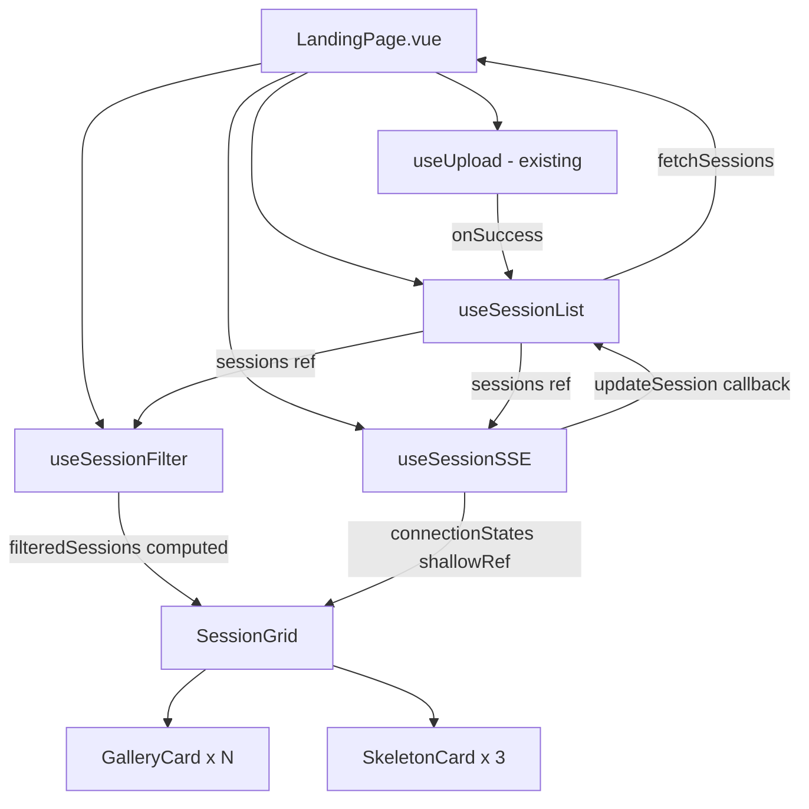

# ADR: Gallery Page Redesign (Stage 7)

## Status

Proposed (v6 -- audited line references, decorative labels note, single-session endpoint, skeleton variation)

## Context

The current landing page (`LandingPage.vue`) renders a full-height `UploadZone` at all times, a plain-text "Loading sessions..." indicator, flat single-column session cards with no status awareness, and no search/filter capabilities. The design system was established in Stage 6 with rich design drafts (`landing-populated.html`, `theme-tron-v1.html`) that define a fundamentally different layout: a grid gallery with terminal preview cards, a compact upload strip, toolbar with search and filter pills, skeleton loading, live SSE status updates, and an immersive TRON-themed empty state with SVG pipeline visualization.

This ADR covers the architectural decomposition of the gallery page to implement all 10 acceptance criteria from the requirements, plus reusable background atmosphere components, SSE connection state display, and toast quality improvements.

### Forces

1. **Separation of concerns (AC-8) is the primary architectural constraint.** The requirements explicitly mandate that SSE subscription logic, session list state, and search/filter state must not be mixed in a single module.

2. **useUpload.ts is frozen.** The requirements list it as an explicit non-change. The compact upload strip must be inline template in `LandingPage.vue` that delegates to `useUpload` -- not a modification of `useUpload.ts`. Note: `UploadZone.vue` was already refactored in a prior MR and is not frozen, though no modifications are planned for it in this stage. `useToast.ts` and `ToastContainer.vue` are also not frozen and will be improved to match the design system.

3. **The SSE endpoint already exists and is well-designed.** `GET /api/sessions/:id/events` streams `PipelineEvent` discriminated union messages with proper Last-Event-ID reconnection. The server sends **named events** (the `event:` SSE field is set to the pipeline event type, e.g. `session.ready`, `session.failed`). This means the client MUST use `addEventListener('session.ready', handler)` per event type -- NOT `onmessage`, which only fires for unnamed events.

4. **The design draft introduces a grid gallery with terminal preview areas** (`landing__preview`, `landing__preview-lines`). Terminal preview content (first N lines of the session snapshot) is not available from `GET /api/sessions` -- only the detail endpoint returns snapshot data. For **ready** cards, the preview area is omitted since no data is available. For **processing** cards, the preview area renders a spinner with "Analyzing..." label. For **failed** cards, the preview area renders an error icon with "Parse failed" label. This is an intentional visual deviation from the draft -- ready cards use `landing__card-body` directly without the `landing__preview` section.

5. **`detected_sections_count` on the Session type** provides section count for ready sessions. `marker_count` is already available. Both are needed for AC-1.

6. **Relative time formatting** (AC-1: "2 hours ago", "yesterday") requires replacing the current `Intl.DateTimeFormat` absolute date with a relative formatter. `Intl.RelativeTimeFormat` is available natively but requires manual threshold logic. A small utility function is appropriate; no external dependency needed.

7. **The design draft defines page-specific CSS classes** (`landing__*`, `landing__gallery-card`, etc.) that are NOT in `components.css` or `layout.css`. These are page-level layout styles that belong in the Vue component `<style>` blocks, matching the draft's `<style>` section.

8. **The empty state uses `theme-tron-v1.html` as the authoritative visual reference, superseding `landing-empty.html`.** The terminal typing animation from `landing-empty.html` is NOT included. The visible elements in `theme-tron-v1.html` are:
   - SVG grid pattern with intersection dots (`BackgroundGrid`)
   - 5 pipeline nodes with inner fill, inner ring, outer dashed ring, labels, and pulse animations (NO connecting S-curve path -- it is `display: none`)
   - 4 decorative Bezier paths + 6 anchor dots
   - 8 ambient drifting particles
   - Giant cursor-prompt `>_` background text with blinking underscore
   - Drop zone with glassmorphic styling (backdrop-filter blur, cyan border glow, hover lift)
   - Staggered CSS animation choreography
   - `prefers-reduced-motion: reduce` support throughout

   Note: The S-curve pipeline path and energy flow overlay are `display: none` in the reference HTML and are **excluded** from this implementation entirely.

9. **The current `ToastContainer.vue` does not match the design system.** The design system in `components.css` defines a richer toast structure with `.toast__icon` (colored icon strip), `.toast__title`, `.toast__content` -- but the current implementation only uses a flat `.toast__message` + `.toast__close`. The toast should be upgraded to match the design system's icon-in-colored-rectangle pattern.

10. **Background atmosphere elements should be reusable.** The SVG grid and ambient particles are not semantically tied to the landing page -- they are atmospheric layers that could enhance any page. The pipeline nodes, deco paths, anchor dots, and cursor prompt ARE semantically tied to the RAGTS processing pipeline narrative and are page-specific.

11. **SSE connection state needs to be visible in degraded states only.** The `EventSource` API exposes connection health (`CONNECTING`, `OPEN`, `CLOSED`). Processing cards should communicate: (a) what pipeline stage is active, using the granular `detection_status` values, and (b) whether the live connection is unhealthy. In the happy path (connected), no connection indicator is shown to avoid visual noise. Only degraded states (reconnecting, disconnected) display a connection dot.

12. **CSS body grid suppression.** The CSS body grid (84px repeating-linear-gradient) must be hidden when the landing page empty state is active -- the SVG TRON grid replaces it visually. The mechanism: add a `.no-body-grid` class to `<body>` when the empty state is active, which sets `background-image: none`. Remove the class on navigation away or when sessions arrive.

13. **`--status-error-dim` token.** This CSS custom property may be missing from `design/styles/layout.css`. It needs to be checked during implementation and added if absent.

14. **Copy-over principle for design prototype markup.** The designer hand-tuned all visual values in `design/drafts/theme-tron-v1.html` -- SVG pattern definitions, grid line opacities, intersection dot radii, particle positions/sizes/colors/animation parameters, node geometries, Bezier path coordinates, anchor dot positions, and all CSS animation keyframes. These values MUST be copied exactly from the reference HTML, not reimplemented or re-derived. Creative reinterpretation or "close enough" approximation is not acceptable. Every Vue component that incorporates markup from `theme-tron-v1.html` must include a comment referencing the source file and line range (e.g., `<!-- Copied from design/drafts/theme-tron-v1.html lines 1298-1308 -->`).

15. **Visual regression testing.** The Vue implementation must be visually verified against the reference HTML prototypes using Playwright screenshot comparison. The acceptance threshold is max 5% pixel drift. Screenshots are captured at key breakpoints (desktop 1280px, mobile 375px) and compared against baselines derived from the HTML prototypes. This provides an automated safety net ensuring the copy-over principle is honored.

16. **TDD RED-GREEN-REFACTOR methodology.** All frontend implementation stages follow strict test-driven development: (1) RED -- write failing tests first (unit tests for composables/utilities, component render tests for Vue components, visual regression tests for visual components), (2) GREEN -- write the minimum code to make tests pass, (3) REFACTOR -- clean up while keeping tests green. Tests are always written before implementation, never after.

17. **Pipeline node labels are decorative, not derived from code.** The 5 node labels in the empty state visualization ("record", "validate", "detect", "replay", "curate") are decorative text copied verbatim from the design prototype. They do NOT map 1:1 to the `PipelineStage` enum values (`validate`, `detect`, `replay`, `dedup`, `store`). Note the mismatches: "record" has no enum equivalent; "curate" maps conceptually to the dedup+store stages. Engineers must copy the labels exactly as they appear in `theme-tron-v1.html` (lines 1358, 1370, 1382, 1394, 1406) and must NOT derive them from the `PipelineStage` enum or `DetectionStatus` type.

18. **Single-session re-fetch endpoint.** When a session transitions to `completed`, the `updateSession` callback must re-fetch that individual session via `GET /api/sessions/:id` (confirmed at `src/server/index.ts` line 137: `app.get('/api/sessions/:id', ...)`), NOT re-fetch the entire list via `GET /api/sessions`. This avoids an O(N) list fetch for a single session completion.

## Decision

### Option A: Monolithic Rewrite (Rejected)

Rewrite `LandingPage.vue` and `SessionList.vue` in one pass with all logic inlined.

- **Pro:** Fewer files, faster to write initially.
- **Con:** Violates AC-8 (separation of concerns). Untestable composables. Harder to review. Single massive diff.

### Option B: Composable Decomposition with Reusable Atmosphere (Selected)

Split into focused composables with clear data flow boundaries. Extract reusable atmospheric visual components (grid, particles) from page-specific content (pipeline nodes, deco paths). SSE composable uses named event listeners and exposes per-session connection state. All animation is CSS-only. Visual markup is copied verbatim from the designer's reference HTML. All stages follow TDD RED-GREEN-REFACTOR.

- **Pro:** Each composable is independently testable. Clear data flow. Satisfies AC-8. Atmosphere components are reusable across future pages. SSE health is visible to users in degraded states only. CSS-only animation avoids JS lifecycle complexity. Copy-over principle preserves designer intent. Visual regression tests catch drift.
- **Con:** More files. Slightly more boilerplate for composable wiring. TDD adds upfront test effort.

### Option C: Pinia Store (Rejected)

Introduce Pinia for global session state management.

- **Pro:** Would centralize state, making SSE updates trivially reactive.
- **Con:** Overengineered for current scale. ARCHITECTURE.md explicitly notes "no Pinia at current scale". Adds a dependency for a single page.

## Architecture

### Component Tree

```
LandingPage.vue (orchestrator)
  |-- [empty state]:
  |     |-- BackgroundGrid.vue (reusable: SVG grid pattern layer)
  |     |-- AmbientParticles.vue (reusable: 8 drifting glowing dots, hardcoded positions)
  |     |-- PipelineVisualization.vue (page-specific: 5 nodes + deco paths + anchor dots + cursor prompt, CSS-only)
  |     |-- UploadZone.vue (existing, used as drop zone content overlay)
  |-- [populated state]:
  |     |-- [inline compact upload strip template]
  |     |-- SessionToolbar.vue (new: search bar + filter pills + count)
  |     |-- SessionGrid.vue (new: grid container)
  |           |-- GalleryCard.vue (new, per session: ready/processing/failed states)
  |           |     |-- [processing state]: connection dot (degraded only) + pipeline stage label + preview area
  |           |     |-- [failed state]: preview area with error icon
  |           |-- SkeletonCard.vue (new: loading placeholder)
  |-- ToastContainer.vue (existing, improved)
```

### Copy-Over Principle

All visual components that draw from `design/drafts/theme-tron-v1.html` must copy the exact markup and CSS values from the reference file. The specific source regions (audited against the actual file):

| Component | Source reference | HTML lines | CSS lines |
|-----------|----------------|------------|-----------|
| `BackgroundGrid.vue` | SVG grid pattern, from `<defs>` to closing `</rect>` | 1298-1308 | 241-243 (`.grid-dots` base opacity), 891-894 (`gridFadeIn` keyframe), 940-942 (animation assignment in `@media no-preference`) |
| `AmbientParticles.vue` | 8 particle divs | 1411-1418 | 670-676 (`.ambient-particle` base styles), 814-876 (8 `particleDrift` keyframes), 1098-1199 (per-particle positions/colors/animations in `@media no-preference`) |
| `PipelineVisualization.vue` | Deco paths, anchor dots, 5 node groups, cursor prompt | 1312-1319 (4 deco paths), 1322-1327 (6 anchor dots), 1349-1407 (5 node `<g>` groups), 1421-1423 (cursor prompt) | 275-282 (deco path), 285-360 (node ring/fill/label/outer-ring/anchor styles), 628-648 (cursor prompt), 713-736 (decoFadeIn/nodeAppear/outerRingAppear/fillAppear/labelReveal keyframes), 782-811 (3 nodePulse keyframes), 880-883 (cursorBlink), 885-888 (cursorFadeIn), 897-900 (anchorFadeIn), 944-1053 (per-node animation assignments in `@media no-preference`), 1202-1208 (cursor animation) |
| `LandingPage.vue` (drop zone) | Drop zone content + glassmorphic styling | 1427-1491 (from `<div class="landing-empty__drop-zone">` to closing `</footer>`) | 382-424 (drop zone + hover + focus), 502-530 (upload icon + disc ring), 1058-1093 (content entrance choreography in `@media no-preference`) |

**Note on removed lines:** Lines 498-500 (`.landing-empty__grid-overlay { display: none }`) are NOT relevant to BackgroundGrid -- that class is an unrelated overlay element.

Each Vue component must include a comment at the top of the `<template>` and `<style>` blocks referencing the source:
```
<!-- Copied from design/drafts/theme-tron-v1.html lines XXX-YYY -->
```

The `prefers-reduced-motion` rules (lines 910-931) and mobile responsive rules (lines 1214-1264) are also copied from the reference.

**Rationale:** The designer hand-aligned positions, opacities, sizes, animation durations, and easing curves in the prototype. Reimplementing from description introduces drift. Pixel-exact copy ensures the Vue output matches the designer's intent.

### Visual Regression Testing

Playwright screenshot tests verify that the Vue implementation matches the reference HTML prototypes:

- **Baseline capture:** Open the reference HTML files (`theme-tron-v1.html`, `landing-populated.html`) in Playwright at standard viewports and capture baseline screenshots.
- **Implementation capture:** Navigate to the Vue app's landing page in both empty and populated states and capture comparison screenshots.
- **Comparison:** Assert that pixel difference is within 5% threshold.
- **Breakpoints:** Desktop (1280x800), Mobile (375x812).
- **States:** Empty state (no sessions), Populated state (3+ sessions with mixed statuses), Loading state (skeleton cards).
- **Reduced motion:** Capture with `prefers-reduced-motion: reduce` forced to verify static fallback.

Visual regression tests run as part of the Playwright test suite (`npx playwright test`).

### TDD Methodology

Every implementation stage follows RED-GREEN-REFACTOR:

1. **RED:** Write failing tests that describe the expected behavior. For composables: unit tests with Vitest. For Vue components: component render tests (`@vue/test-utils` mount/shallow-mount). For visual components: Playwright screenshot tests.
2. **GREEN:** Write the minimum implementation to make all tests pass.
3. **REFACTOR:** Clean up code, extract shared logic, improve naming -- while keeping all tests green.

Test files are always created before or alongside implementation files, never after. Each stage's commit includes both tests and implementation.

### Reusable vs Page-Specific Component Boundary

The visual layers from `theme-tron-v1.html` are decomposed based on semantic specificity:

| Layer | Component | Reusable? | Rationale |
|-------|-----------|-----------|-----------|
| SVG grid pattern (40x40 lines + dots) | `BackgroundGrid.vue` | Yes | Pure atmosphere, not content-specific. Any page can use it. |
| Ambient drifting particles (8 dots) | `AmbientParticles.vue` | Yes | Pure atmosphere. Hardcoded 8 particles with exact positions from theme-tron-v1.html. |
| 5 pipeline nodes with rings/labels/pulse | `PipelineVisualization.vue` | No | Semantically tied to the RAGTS pipeline narrative. Labels are decorative (see Force 17). |
| 4 decorative Bezier paths + 6 anchor dots | `PipelineVisualization.vue` | No | Visually tied to the pipeline node composition. |
| Giant cursor prompt `>_` | `PipelineVisualization.vue` | No | Tied to the "no sessions yet" empty state narrative. |

**`BackgroundGrid.vue`** renders an SVG element containing a `<pattern>` definition and a `<rect>` fill, copied verbatim from `theme-tron-v1.html` lines 1298-1308 (HTML, from `<defs>` to closing `</rect>`) and lines 241-243, 891-894, 940-942 (CSS). The pattern ID uses a unique identifier (`background-grid-${uid}`) to avoid SVG ID collisions when multiple instances coexist. It positions itself as an absolute-fill layer. Props: none (the pattern is standardized). The component handles its own `prefers-reduced-motion` (shows grid at full opacity immediately, line 911) and fade-in animation.

**`AmbientParticles.vue`** renders 8 absolutely-positioned particle divs with positions, sizes, colors, and animation parameters copied verbatim from `theme-tron-v1.html` lines 1411-1418 (HTML, 8 particle divs) and lines 670-676 (base styles), 814-876 (8 `particleDrift` keyframes), 1098-1199 (per-particle positions/colors/animations). No `count` prop -- the positions are carefully aligned in the design and must be preserved as-is. Color distribution: 6 cyan (`var(--accent-primary)`) + 2 pink (`var(--accent-secondary)`). Each particle gets a unique drift keyframe from the 8 predefined CSS animations. Respects `prefers-reduced-motion` (particles hidden, line 925).

**`PipelineVisualization.vue`** renders the 5 pipeline nodes, 4 decorative Bezier paths, 6 anchor dots, and the giant cursor-prompt background character, all copied verbatim from `theme-tron-v1.html` lines 1312-1319, 1322-1327, 1349-1407, 1421-1423 (HTML) and lines 275-360, 628-648, 713-736, 782-811, 880-900, 944-1053, 1202-1208 (CSS). All animations are CSS-only. No JS-driven animation. The 5 node labels ("record", "validate", "detect", "replay", "curate") are decorative text from the prototype -- they do NOT correspond to `PipelineStage` enum values.

### Composable Decomposition

```
useSessionList.ts (modified)
  - Owns: sessions ref, loading ref, error ref, fetchSessions(), deleteSession()
  - Extended: updateSession(id, patch) for in-place SSE-driven updates
  - On completed: re-fetches single session via GET /api/sessions/:id (not full list)

useSessionSSE.ts (new)
  - Owns: EventSource connections per processing session
  - Input: reactive sessions list (to know which need SSE)
  - Output: calls updateSession() when pipeline events arrive
  - Output: connectionStates: shallowRef<Map<string, SseConnectionState>>
  - Event handling: uses addEventListener per named event type, NOT onmessage
  - Lifecycle: auto-subscribes to processing sessions, auto-closes on ready/failed/unmount

useSessionFilter.ts (new)
  - Owns: searchQuery ref, activeFilter ref
  - Input: Readonly<Ref<Session[]>>
  - Output: computed filteredSessions
  - Pure derivation: no side effects, no API calls
```

### SSE Connection State and Pipeline Stage Display

The `useSessionSSE` composable exposes connection health per session:

```typescript
type SseConnectionState = 'connecting' | 'connected' | 'disconnected';

interface UseSessionSSEReturn {
  connectionStates: Readonly<ShallowRef<Map<string, SseConnectionState>>>;
}
```

The `connectionStates` map uses `shallowRef` with replace-on-mutation for Vue reactivity (since Vue cannot deeply track `Map` mutations, the entire Map reference must be replaced on each update).

This map is passed to `GalleryCard.vue` and consumed by processing cards to render:

1. **Connection dot (degraded states only)** -- A small (4px) dot rendered within or adjacent to the "Processing" badge, but ONLY when the connection is NOT healthy:
   - `connecting` (amber pulse, `var(--status-warning)`) -- Connection initializing or reconnecting after a drop. Uses a subtle pulse animation to draw attention.
   - `disconnected` (red, `var(--status-error)`) -- Connection permanently failed. Static red dot.
   - `connected` -- **No dot shown.** The happy path has no visual indicator to avoid noise.

2. **Pipeline stage label** -- Instead of a hardcoded "Detecting sections..." label, the card meta area displays the current pipeline stage derived from `detection_status`. The mapping is a utility function:

```
formatPipelineStage(status: DetectionStatus): string
  'pending'         -> 'Waiting to start...'
  'queued'          -> 'Queued for processing...'
  'processing'      -> 'Processing...'
  'validating'      -> 'Validating format...'
  'detecting'       -> 'Detecting sections...'
  'replaying'       -> 'Replaying terminal...'
  'deduplicating'   -> 'Deduplicating output...'
  'storing'         -> 'Storing results...'
  'completed'       -> 'Ready'
  'failed'          -> 'Failed'
  'interrupted'     -> 'Interrupted'
```

This gives users real-time visibility into what the pipeline is actually doing, not just a generic "Processing" label.

**Design decision: no global connection indicator.** SSE connections are per-session and only exist for processing sessions. A global indicator would show "disconnected" in the normal steady state (no processing sessions), which would be misleading. Per-card indicators (degraded-only) are the correct granularity.

### Data Flow



### SSE Integration Strategy

1. **When to subscribe:** `useSessionSSE` watches the `sessions` ref. Any session with `detection_status` not in `['completed', 'failed']` gets an `EventSource` connection to `/api/sessions/${id}/events`.

2. **Event handling via named listeners:** For each `EventSource`, register `addEventListener` for each pipeline event type from `ALL_PIPELINE_EVENT_TYPES`. The `onmessage` handler is NOT used -- the server sends named events. On each event, map it to a partial `Session` update:
   - `session.detected` -> `{ detected_sections_count: event.sectionCount, detection_status: 'detecting' }`
   - `session.ready` -> `{ detection_status: 'completed' }` + re-fetch that single session via `GET /api/sessions/${id}` for final counts
   - `session.failed` -> `{ detection_status: 'failed' }`
   - `session.retrying` -> `{ detection_status: 'processing' }`
   - Other intermediate events -> update `detection_status` to the corresponding stage

3. **Connection state tracking:** Each `EventSource` is wrapped to track `readyState` changes. The `onopen` handler sets `'connected'`, the `onerror` handler checks if reconnecting (`readyState === CONNECTING`) or closed. The state is stored in a `shallowRef<Map<string, SseConnectionState>>`. On each state change, a new Map is created (replace-on-mutation) to trigger Vue reactivity.

4. **Cleanup:** `EventSource.close()` on terminal events and on component unmount via `onUnmounted`. Connection state entry is removed from the map when the EventSource is closed.

5. **New upload flow:** `useUpload.onSuccess` calls `fetchSessions()` (existing behavior). The re-fetched list will include the new processing session, and `useSessionSSE` will auto-subscribe to it.

### Search and Filter State

- `searchQuery`: `ref<string>('')` bound to the search input.
- `activeFilter`: `ref<'all' | 'processing' | 'ready' | 'failed'>('all')`.
- `filteredSessions`: `computed` that chains text filter (case-insensitive substring on `filename`) with status filter (map detection_status values to the three filter groups: processing = pending/queued/processing/validating/detecting/replaying/deduplicating/storing; ready = completed; failed = failed/interrupted).
- The "no results" state is shown when `filteredSessions` is empty but `sessions` is not.
- Input parameter type: `Readonly<Ref<Session[]>>` (not a raw array).

### Toast Improvement

The current `ToastContainer.vue` uses a flat structure (`.toast__message` + `.toast__close`) that does not match the design system's richer toast pattern. The design system in `components.css` defines:

- `.toast__icon` -- a colored vertical strip (background matches status color) containing an icon
- `.toast__content` -- contains `.toast__title` and `.toast__message`
- `.toast__close` -- dismiss button

The improvement adds:
- Status-appropriate icons per toast type (check-circle for success, error-circle for error, info for info)
- `.toast__icon` colored strip
- Optional `.toast__title` support (the `Toast` interface gains an optional `title` field)
- The existing inline color overrides in `ToastContainer.vue`'s scoped styles are removed since `components.css` already provides `.toast--success .toast__icon` etc.

**Prerequisite:** Verify that `components.css` is globally imported in the Vue app (confirmed at `src/client/main.ts` line 2: `import '../../design/styles/components.css'`) before relying on its toast classes.

### Page-Level Layout CSS

The design drafts define page-specific CSS in `<style>` blocks (not in `components.css`). These styles will be placed in the relevant Vue component `<style scoped>` blocks:

- `LandingPage.vue`: `.landing` container, `.landing-empty` empty state layout, inline compact upload strip styles, `.landing__toolbar`, body grid suppression (`.no-body-grid`), responsive breakpoints
- `BackgroundGrid.vue`: Grid pattern SVG styles, unique pattern ID, fade-in animation, reduced-motion fallback
- `AmbientParticles.vue`: Particle positioning (hardcoded from theme-tron-v1.html), drift keyframes (8 variants), reduced-motion
- `PipelineVisualization.vue`: `.landing-empty__pipeline`, `.landing-empty__node-*`, `.landing-empty__deco-*`, `.landing-empty__anchor-*`, `.landing-empty__cursor-prompt`, CSS keyframes for node pulse/appearance, reduced-motion, mobile responsive
- `GalleryCard.vue`: `.landing__gallery-card`, `.landing__card-body`, `.landing__card-meta`, `.landing__card-footer`, `.landing__preview` (processing/failed only), state modifiers (`--processing`, `--failed`), `.landing__card-status` badge overlay, connection dot styles (degraded states only)
- `SkeletonCard.vue`: `.landing__skeleton-card`, `.landing__skeleton-preview`, `.landing__skeleton-body`, skeleton bar width variation per instance (see Skeleton Card Width Variation below)
- `SessionToolbar.vue`: `.landing__search`, `.landing__toolbar-right`, `.landing__session-count`, filter pill tinted variants

Note: Because these classes are page-specific (defined in the draft `<style>` block, not in `components.css`), they use `scoped` styles in Vue. The BEM classes from `components.css` (like `.search-bar`, `.filter-pill`, `.badge`, `.spinner`, `.toast`, `.dot-spinner`) are global and used directly.

### Skeleton Card Width Variation

The design prototype (`landing-populated.html` lines 895-950) shows 3 skeleton cards with intentionally different `.skeleton--text` bar widths to avoid an identical, unrealistic appearance:

- Card 1: preview bars at 60%/80%/45%/70%, body bar at 75%, meta at 70px/80px, footer at 60px/45px
- Card 2: preview bars at 50%/90%/65%/55%, body bar at 85%, meta at 65px/90px, footer at 55px/50px
- Card 3: preview bars at 70%/55%/85%/40%, body bar at 65%, meta at 75px/85px, footer at 70px/40px

Implementation approach: use a `variant` prop (1, 2, or 3) or inline `:nth-child` pseudo-selectors to vary the widths per skeleton instance. The exact approach is at the engineer's discretion, but the widths must vary across the 3 instances.

### Relative Time and Size Formatting

A single consolidated utility file `src/client/utils/format.ts` containing:

- `formatRelativeTime(iso: string): string` using `Intl.RelativeTimeFormat`:
  - < 1 minute: "just now"
  - < 1 hour: "X minutes ago"
  - < 24 hours: "X hours ago"
  - < 2 days: "yesterday"
  - < 7 days: "X days ago"
  - Otherwise: short date ("Mar 6", "Feb 24")

- `formatSize(bytes: number): string` (extracted from SessionList.vue):
  - B, KB, MB thresholds

- `formatPipelineStage(status: DetectionStatus): string`:
  - Maps all 11 DetectionStatus values to human-readable labels

### Delete Functionality

The design draft does not show an inline delete button. The current `confirmDelete` in `SessionList.vue` will not be carried over to `GalleryCard.vue`. The `deleteSession` method remains available on `useSessionList` for future use but is not wired to any UI element in this stage.

## Consequences

### Positive

- Clear separation of concerns satisfies AC-8 and makes each composable independently unit-testable.
- SSE integration is reactive and automatic -- no manual polling or refresh buttons.
- Per-session connection state gives users visibility when live updates are degraded (reconnecting/disconnected) without visual noise in the happy path.
- Granular pipeline stage labels ("Replaying terminal...") are more informative than generic "Processing".
- The composable pattern is consistent with the existing codebase style (`useUpload`, `useToast`, `useSession`).
- `BackgroundGrid.vue` and `AmbientParticles.vue` are reusable on any future page (session detail, settings, etc.) without duplication.
- CSS-only animation in `PipelineVisualization.vue` avoids JS lifecycle complexity (`requestAnimationFrame` cleanup, `Float64Array` allocations) and integrates naturally with `prefers-reduced-motion`.
- Toast improvement aligns the implementation with the design system that already exists in `components.css`.
- Consolidated `format.ts` reduces file count while keeping utilities testable.
- Copy-over principle preserves the designer's exact visual intent -- no drift from hand-tuned values.
- Visual regression testing provides automated verification that the Vue output matches the HTML prototypes (5% threshold).
- TDD ensures every feature has test coverage from the start, preventing regressions and guiding implementation.

### Negative

- More files than the current implementation (3 new composables, 6 new components, 1 new utility file + tests + visual regression tests).
- The `useSessionSSE` composable introduces `EventSource` connections that need careful lifecycle management to avoid leaks.
- TDD adds upfront effort writing tests before implementation, though this pays off in fewer bugs and clearer specifications.
- Visual regression tests require Playwright and add CI time.

### Risks

- Terminal preview content in ready cards is not feasible without either adding snapshot data to `GET /api/sessions` or making per-session detail requests. Deferred intentionally. Processing and failed cards use the preview area for status display; ready cards omit it.
- The connection dot on processing cards is only visible in degraded states. If the SSE connection is flaky, the dot may flicker between hidden/visible. A brief debounce (e.g., 500ms before showing reconnecting state) could be added if this becomes a problem.
- The `--status-error-dim` CSS token may not exist in `design/styles/layout.css`. If missing, it needs to be added during implementation.
- Visual regression tests may show minor anti-aliasing differences across platforms. The 5% threshold accounts for this, but baselines should be captured on a consistent environment.

## References

- Requirements: `.state/feat/variant-b-stage-7-gallery-redesign/REQUIREMENTS.md`
- User stories: `.state/feat/variant-b-stage-7-gallery-redesign/STORIES.md`
- Populated draft: `design/drafts/landing-populated.html`
- Empty state authority: `design/drafts/theme-tron-v1.html` (supersedes `landing-empty.html`)
- Pipeline types: `src/shared/types/pipeline.ts`
- Single session endpoint: `src/server/index.ts` line 137 (`GET /api/sessions/:id`)
- SSE route: `src/server/routes/sse.ts`
- Design system toasts: `design/styles/components.css` (lines 709-786)
- Design system dot-spinner: `design/styles/components.css` (lines 1644-1669)
- Vue app CSS import: `src/client/main.ts` (line 2)
