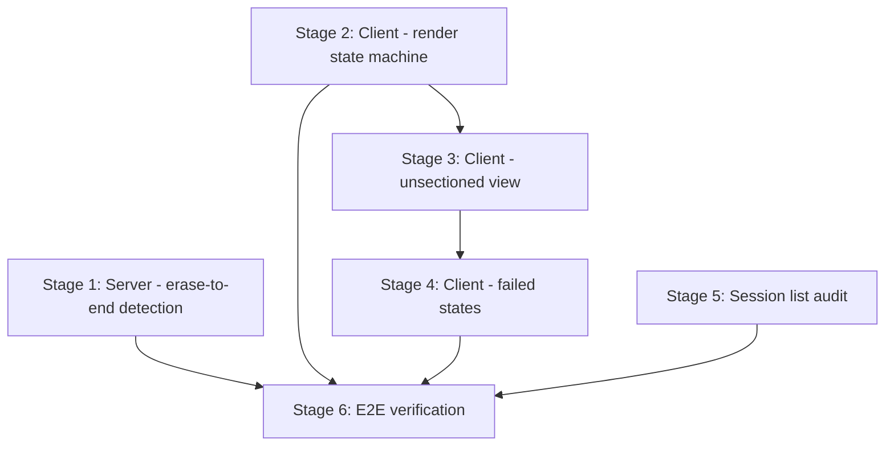

# Plan: Fix Empty Session Display -- Server Detection + Client Fallback

References: ADR.md

## Open Questions

Implementation challenges to solve (architect identifies, engineers resolve):

1. **`\x1b[J` filtering heuristic.** Should detection require the cursor to be in the top N rows to count as a section boundary, or should any `\x1b[J` qualify? The engineer should experiment with the fixture -- if unfiltered `\x1b[J` produces too many candidates after merge/filter, add a heuristic (e.g., only count when preceded by `\x1b[H` or `\x1b[1;1H` within the same event data string).
2. **Signal score for `\x1b[J`.** Start at 0.8 (same as alt-screen exit) and adjust based on fixture output. The merge pipeline handles over-production, so the score mainly affects which boundaries survive when capped at 50.
3. **Render mode composable placement.** Should `useSessionRenderState` be a new composable or an extension of the existing `useSession`? The architect recommends a separate composable that takes `useSession` outputs as inputs -- keeps separation of concerns. The engineer decides if this creates prop-drilling issues.

## Stages

### Stage 1: Add `\x1b[J` erase-to-end detection signal

Goal: The `SectionDetector` detects `\x1b[J` (erase from cursor to end of display) as a boundary signal, producing non-zero boundaries for the Codex fixture.

Owner: backend-engineer

- [ ] Add `detectEraseToEnd()` private method to `SectionDetector` -- follows the same pattern as `detectScreenClears()`, scanning for `\x1b[J` in output events. Must exclude events that contain `\x1b[2J` or `\x1b[3J` (already handled by screen clear signal) to avoid double-counting.
- [ ] Wire `detectEraseToEnd()` into `detect()` alongside existing signals. It does not depend on `isTimingReliable()`.
- [ ] Add unit tests: (a) detects `\x1b[J` as boundary, (b) does not double-count events already matched by `\x1b[2J`, (c) handles `\x1b[0J` (equivalent to `\x1b[J`), (d) existing Claude Code detection tests still pass unchanged
- [ ] Add fixture integration tests against ALL fixtures: `fixtures/failing-session.cast` (Codex, must produce >0 boundaries), `fixtures/codex-small.cast`, `fixtures/codex-medium.cast`, `fixtures/gemini-small.cast`, `fixtures/gemini-medium.cast`, `fixtures/claude-small.cast`, `fixtures/claude-medium.cast`. Assert: Codex/Gemini fixtures produce boundaries where content exists; Claude fixtures still produce the same (or better) boundaries as before (no regression).
- [ ] Tune: if unfiltered detection produces too many candidates after merge/filter, add a heuristic (see Open Question 1). Document the tuning rationale in code comments.

Files: `src/server/processing/section_detector.ts`, `src/server/processing/section_detector.test.ts`
Depends on: none

Considerations:
- `\x1b[J` without parameter = erase from cursor to end of display. `\x1b[0J` is equivalent. Both should be detected. `\x1b[1J` (erase to beginning) and `\x1b[2J` (erase all) are different purposes -- do not detect those here.
- The new signal must NOT be gated on `isTimingReliable()` -- it is an escape-sequence signal.
- Watch out for: regex vs. string matching. The existing `detectScreenClears` uses `data.includes('\x1b[2J')`. For `\x1b[J`, a naive `includes` would also match `\x1b[2J` and `\x1b[3J`. Use a regex like `/\x1b\[J/` or `/\x1b\[0?J/` and verify the match is not preceded by a digit.

### Stage 2: Handle all Session states in SessionDetailView

Goal: Update `SessionDetailView.vue` to render all states of the `Session` model — not just the "has sections" case. The shared `Session` type in `src/shared/types/session.ts` is the contract. No new types or composables.

Owner: frontend-engineer

- [ ] Update `SessionDetailView.vue` to branch on `detection_status`, `sections.length`, and `snapshot` per the ADR decision table
- [ ] Handle: completed + sections (existing), completed + 0 sections + snapshot (pass to unsectioned view), completed + 0 sections + no snapshot (empty state), failed/interrupted + snapshot (error + content), failed/interrupted + no snapshot (error state), non-terminal (loading, existing)
- [ ] Add unit tests for `SessionDetailView` covering all branches: each combination of `detection_status` × sections × snapshot renders the correct state
- [ ] Do not change `SessionContent.vue` yet — that is Stage 3. Stage 2 only ensures the view routes to the right rendering path.

Files: `src/client/pages/SessionDetailView.vue`, `src/client/pages/SessionDetailView.test.ts`
Depends on: none (parallel with Stage 1 — no shared files)

Considerations:
- The `Session` type already has `DetectionStatus` from `src/shared/types/pipeline.ts`. Use it directly.
- `interrupted` is a terminal state — treat it like `failed` for rendering purposes.
- Keep the branching in one component (`SessionDetailView`), not scattered across children.

### Stage 3: Unsectioned rendering (State A -- zero sections, completed)

Goal: When `renderMode` is `'unsectioned'`, the client renders the full session snapshot as a continuous document with an informational banner. No blank page.

Owner: frontend-engineer

- [ ] In `SessionContent.vue`: add an unsectioned rendering branch. When `sections.length === 0` and `snapshot` exists, render the full snapshot via `TerminalSnapshotComponent` with `:lines="snapshot.lines"` and `:start-line-number="1"`. Wrap in `OverlayScrollbar` for consistency.
- [ ] Add an informational banner above the unsectioned content. Use `--status-info` and `--status-info-subtle` design tokens. Text: "Section boundaries were not detected for this session." (Factual, not apologetic.)
- [ ] Style the banner using existing patterns from `design/styles/components.css` (reference `.badge--info` token usage). No custom colors.
- [ ] Add unit tests for `SessionContent.vue`: (a) renders snapshot lines when sections is empty and snapshot provided, (b) shows info banner with correct text, (c) does not show info banner when sections exist, (d) the unsectioned view does not include section headers or fold controls

Files: `src/client/components/SessionContent.vue`, `src/client/components/SessionContent.test.ts`
Depends on: Stage 2 (the render mode drives when this branch is shown)

Considerations:
- The unsectioned view should feel like a natural part of the platform, not a degraded fallback. Same terminal chrome, same fonts, same scrollbar.
- No fold controls, no section headers -- single continuous document.
- The info banner should be unobtrusive and not take significant vertical space.

### Stage 4: Failed processing rendering (State B -- error states)

Goal: When `renderMode` is `'failed-with-content'` or `'failed-no-content'`, the client renders an error banner and whatever content is available.

Owner: frontend-engineer

- [ ] In `SessionContent.vue` or `SessionDetailView.vue` (depending on Stage 2 structure): add rendering for the two failed states.
- [ ] `'failed-with-content'`: error banner using `--status-error` / `--status-error-subtle` tokens + snapshot rendered below. Text: "Session processing encountered an error. Showing available content."
- [ ] `'failed-no-content'`: centered error state. Text: "Session processing failed and no content is available."
- [ ] Ensure the `detection_status === 'failed'` case routes through the render mode, not through the existing generic HTTP error branch.
- [ ] Add unit tests: (a) failed + snapshot shows error banner + content, (b) failed + no snapshot shows error-only state, (c) error banner visually distinct from info banner (different CSS classes), (d) generic HTTP error still works for fetch failures

Files: `src/client/components/SessionContent.vue`, `src/client/components/SessionContent.test.ts`, `src/client/pages/SessionDetailView.vue`, `src/client/pages/SessionDetailView.test.ts`
Depends on: Stage 3 (shares `SessionContent.vue`, builds on the rendering branch structure)

Considerations:
- Error banner must be visually distinct from info banner (Stage 3). Different color tokens.
- Messaging is honest: State B is an error, not a limitation.
- `interrupted` status with content should behave like `failed-with-content`.

### Stage 5: Session list -- no false alarms for zero-section sessions

Goal: Zero-section sessions with `detection_status: 'completed'` appear as normal list entries with no error/warning indicators.

Owner: frontend-engineer

- [ ] Audit session list components -- check if they show any indicator for `detected_sections_count: 0` or `detection_status`
- [ ] If they already show nothing, no code change needed -- just add the confirming test
- [ ] Add a unit test confirming zero-section + completed renders without error/warning indicators
- [ ] If any indicator exists for zero sections, remove it or gate it on `detection_status !== 'completed'`

Files: `src/client/components/SessionCard.vue` (or equivalent list item component), corresponding test file
Depends on: none (parallel with all other stages -- different component files)

Considerations:
- This may already be correct. Verify before writing code.
- The unsectioned state should only be revealed when the user opens the session.

### Stage 6: End-to-end verification

Goal: Verify the full fix works: detection produces sections for the fixture, client renders all states correctly, no regressions.

Owner: backend-engineer + frontend-engineer (integration)

- [ ] Run the full test suite (`npx vitest run`) -- all existing + new tests pass
- [ ] Verify the fixture produces sections through the full pipeline detect stage
- [ ] Verify no regressions: existing section detection tests pass unchanged
- [ ] Document expected behavior for each render mode for the reviewer

Files: none (verification only)
Depends on: Stages 1, 2, 3, 4, 5

## Dependencies

**Parallelism:**
- Stage 1 (backend) runs in parallel with Stage 2 (frontend) and Stage 5 (frontend) -- no shared files
- Stage 2 must complete before Stage 3 (composable defines the contract)
- Stage 3 must complete before Stage 4 (share `SessionContent.vue`)
- Stage 5 runs in parallel with all other stages (different component files)
- Stage 6 runs after all others

**Maximum parallelism schedule:**
| Round | Backend | Frontend |
|-------|---------|----------|
| 1 | Stage 1 | Stage 2 + Stage 5 |
| 2 | -- | Stage 3 |
| 3 | -- | Stage 4 |
| 4 | Stage 6 (integration) | Stage 6 (integration) |

## Progress

Updated by engineers as work progresses.

| Stage | Status | Notes |
|-------|--------|-------|
| 1 | pending | |
| 2 | pending | |
| 3 | pending | |
| 4 | pending | |
| 5 | pending | |
| 6 | pending | |
