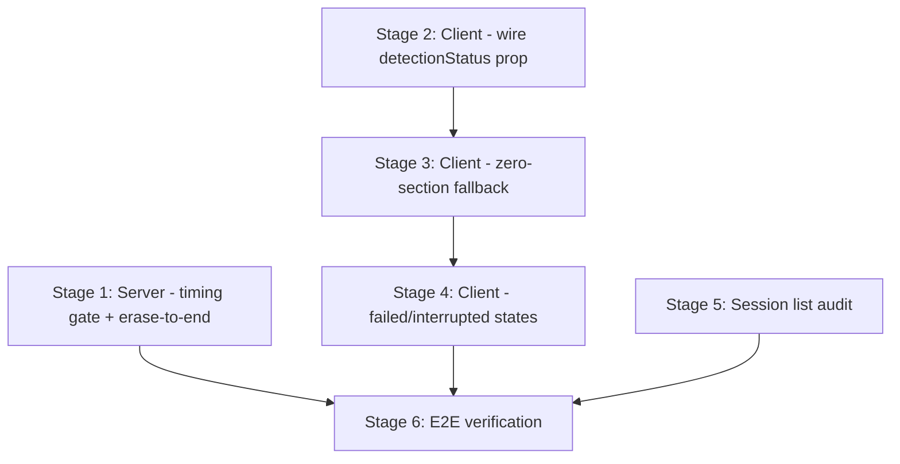

# Plan: Fix Empty Session Display -- Server Detection + Client Fallback

References: ADR.md

## Open Questions

Implementation challenges to solve (architect identifies, engineers resolve):

1. **`\x1b[J` matching without false positives on `\x1b[2J]` / `\x1b[3J]`.** The existing `detectScreenClears()` uses `data.includes('\x1b[2J')`. A naive `includes('\x1b[J')` would also match `\x1b[2J]` and `\x1b[3J]`. Use a regex like `/\x1b\[0?J/` that only matches `\x1b[J]` or `\x1b[0J]`, or check via `includes` and then verify no digit precedes `J`. The engineer decides the approach; the test suite validates correctness.

2. **Timing gate significance floor.** The ADR specifies "at least one gap > 0.5s" as the presence check. The engineer should validate this threshold against all fixtures: it must pass for codex-medium (gaps at 1.2s, 3.2s, 4.6s), gemini-medium (19 gaps > 1s), and claude-medium (12 gaps > 1s), while still filtering synthetic sessions with uniformly sub-0.01s gaps. Adjust if needed.

3. **Adaptive threshold (Part B) -- defer or implement?** The ADR notes the engineer may keep the fixed 5s `TIMING_GAP_THRESHOLD` if it proves adequate for the fixture suite. Decision: run the fixture tests with the fixed threshold first. If codex-medium produces 0 timing boundaries (its max gap is 4.6s < 5s), the threshold must be lowered or made adaptive. This is a Stage 1 decision point.

4. **`\x1b[J]` score: 0.8 vs 0.6.** Start at 0.8. If codex-medium produces too many surviving candidates after merge/filter (> ~15 sections), tune down to 0.6. Document the rationale in a code comment.

## Stages

### Stage 1: Server -- Relax timing gate + add `\x1b[J]` detection

Goal: The `SectionDetector` produces non-zero boundaries for codex-medium (via `\x1b[J]`) and gemini-medium (via timing gaps). No regressions for claude-medium or sample.cast.

Owner: backend-engineer

**TDD anchor tests (write FIRST, expect failures, then implement):**
- [ ] Write fixture integration test: `SectionDetector` against `fixtures/codex-medium.cast` events must produce > 0 boundaries. Assert boundary count is in range 3-20 and at least one boundary has signal `'erase_to_end'`.
- [ ] Write fixture integration test: `SectionDetector` against `fixtures/gemini-medium.cast` events must produce > 0 boundaries. Assert boundary count is in range 3-20 and at least one boundary has signal `'timing_gap'`.
- [ ] Write regression test: `SectionDetector` against `fixtures/claude-medium.cast` must produce >= 1 boundary with signal `'screen_clear'` (existing behavior preserved).
- [ ] Write unit test: `isTimingReliable()` returns `true` for events with gaps [0.0, 0.0, 0.0, 2.0, 0.0, 0.0] (one significant gap among many fast ticks).
- [ ] Write unit test: `isTimingReliable()` returns `false` for events with all gaps < 0.01s (truly compressed timing, no real pauses).

**Part A -- Relax `isTimingReliable()`:**
- [ ] Replace the median-based check in `isTimingReliable()` with a presence check: return `true` if at least one gap exceeds a significance floor (default 0.5s). Remove or comment the median calculation.
- [ ] Update `TIMING_RELIABILITY_THRESHOLD` constant name/value to reflect the new semantics (e.g., `TIMING_SIGNIFICANCE_FLOOR = 0.5`).

**Part B -- Evaluate timing threshold:**
- [ ] Run fixture tests with the fixed `TIMING_GAP_THRESHOLD = 5`. Check if codex-medium produces timing gap boundaries (its max gap is 4.6s -- below 5s, so it will NOT produce timing boundaries with the current threshold).
- [ ] If codex-medium needs timing boundaries for adequate detection: lower `TIMING_GAP_THRESHOLD` to 2 or make it adaptive. If `\x1b[J]` alone gives sufficient sections for Codex, keep the 5s threshold and note it as a follow-up.
- [ ] Document the threshold decision in a code comment.

**Part C -- Add `\x1b[J]` / `\x1b[0J]` detection:**
- [ ] Add `detectEraseToEnd()` private method to `SectionDetector`. Pattern: scan output events for `\x1b[J]` or `\x1b[0J]`, excluding events that match `\x1b[2J]` or `\x1b[3J]` (already handled by `detectScreenClears()`). Score: 0.8. Signal name: `'erase_to_end'`.
- [ ] Wire `detectEraseToEnd()` into `detect()` alongside existing signals (line 64 area). It is NOT gated on `isTimingReliable()`.
- [ ] Write unit tests: (a) detects `\x1b[J]` as boundary with score 0.8, (b) detects `\x1b[0J]` as boundary, (c) does NOT fire on events containing only `\x1b[2J]` or `\x1b[3J]`, (d) does NOT fire on non-output events.

**Verification:**
- [ ] All TDD anchor tests pass (the fixture tests that were initially failing now pass).
- [ ] All existing `section_detector.test.ts` tests still pass (no regressions).
- [ ] Run `npx vitest run src/server/processing/section_detector` -- all green.

Files: `src/server/processing/section_detector.ts`, `src/server/processing/section_detector.test.ts`
Depends on: none

Considerations:
- The `detect()` method (line 48-72) is the integration point. Timing signals are gated on `isTimingReliable()` (lines 60-62, 66-68). Escape sequence signals are not gated (line 64). The new `detectEraseToEnd()` goes on line 64 alongside `detectScreenClears()` and `detectAltScreenExits()`.
- `detectWithMarkers()` (line 78) calls `detect()` internally. Any change to `detect()` flows through to marker-based detection automatically.
- The `processCandidates()` pipeline (merge, filter, cap, label) handles over-production from multiple signals. No changes needed there.
- codex-medium and failing-session are identical files. Testing one covers both.
- Open Question 3 is critical: if the fixed 5s threshold means Codex gets 0 timing boundaries, that is acceptable as long as `\x1b[J]` alone produces adequate sections. But Gemini MUST get timing boundaries since it has no other signal.

### Stage 2: Client -- Pass `detectionStatus` to SessionContent

Goal: `SessionDetailView.vue` passes `detection_status` to `SessionContent.vue` as a prop. `SessionContent.vue` accepts the prop. No rendering changes yet -- this stage only wires the data flow.

Owner: frontend-engineer

- [ ] In `SessionDetailView.vue`: destructure `detectionStatus` from `useSession()` (currently only `sections`, `snapshot`, `loading`, `error` are destructured -- line 16).
- [ ] Pass `detectionStatus` to `SessionContent` as a prop: `:detection-status="detectionStatus"`.
- [ ] In `SessionContent.vue`: add `detectionStatus` to the props interface. Type: `import type { DetectionStatus } from '../../shared/types/pipeline.js'`. Default value: `'completed'` (backward-compatible).
- [ ] Remove the `hasContent` computed from `SessionDetailView.vue` (line 19) and the `v-else-if="!hasContent"` branch (lines 33-37) -- this "no content" state will be handled by `SessionContent` in Stage 3.
- [ ] Update the `v-else` on `SessionContent` (line 38) to render whenever not loading and not error -- `SessionContent` now owns all content-level decisions.
- [ ] Write unit test: `SessionDetailView` passes `detectionStatus` prop to `SessionContent`.
- [ ] Write unit test: `SessionContent` accepts `detectionStatus` prop without errors.
- [ ] All existing tests still pass.

Files: `src/client/pages/SessionDetailView.vue`, `src/client/pages/SessionDetailView.test.ts`, `src/client/components/SessionContent.vue`, `src/client/components/SessionContent.test.ts`
Depends on: none (parallel with Stage 1 -- backend and frontend files do not overlap)

Considerations:
- `SessionDetailView.vue` currently does NOT destructure `detectionStatus` from `useSession()` even though the composable exposes it (useSession.ts line 96). Adding it to the destructure is the only change to the view's script.
- The `hasContent` computed (line 19) is being removed because its logic ("sections or snapshot exists") will be subsumed by `SessionContent`'s new branching in Stage 3. Without this removal, there would be two competing decision points.
- This is a pure wiring stage. No visual changes. The rendered output should be identical to the current behavior (existing tests pass).

### Stage 3: Client -- Zero-section fallback rendering (State A)

Goal: When `detection_status === 'completed'` and `sections.length === 0`, `SessionContent.vue` renders the full snapshot with an info banner instead of an empty container.

Owner: frontend-engineer

- [ ] In `SessionContent.vue` template: restructure the top-level `v-if` to branch on detection state before rendering sections.
- [ ] Add State A branch: when `sections.length === 0 && snapshot && detectionStatus === 'completed'`, render:
  - Info banner: "Section boundaries were not detected for this session." using `--status-info` / `--status-info-subtle` design tokens.
  - Full snapshot via `TerminalSnapshotComponent` with `:lines="snapshot.lines"` and `:start-line-number="1"`, wrapped in `OverlayScrollbar`.
- [ ] Add State A (no snapshot): when `sections.length === 0 && !snapshot && detectionStatus === 'completed'`, render "No content" state (similar to existing `terminal-empty` block but with clearer messaging).
- [ ] Style the info banner: background `var(--status-info-subtle)`, text color `var(--status-info)`, padding `var(--space-3) var(--space-4)`, border-radius `var(--radius-md)`, font-size `var(--text-sm)`. No custom colors.
- [ ] Write unit tests: (a) renders full snapshot lines when sections is empty, snapshot provided, and status is completed, (b) shows info banner with correct text, (c) does NOT show info banner when sections exist, (d) no section headers or fold controls in unsectioned view, (e) "No content" state when snapshot is null.
- [ ] All existing `SessionContent` tests still pass.

Files: `src/client/components/SessionContent.vue`, `src/client/components/SessionContent.test.ts`
Depends on: Stage 2 (the `detectionStatus` prop must be wired)

Considerations:
- The current `v-if="snapshot || sections.length > 0"` on line 51 must be restructured. The new top-level logic: sections > 0 -> existing section rendering, else check detection status for fallback states.
- The `preambleLines` computed (line 38-45) returns `[]` when `sections.length === 0`. This is correct -- the preamble concept does not apply to the unsectioned view.
- Reuse `TerminalSnapshotComponent` and `OverlayScrollbar` -- no new rendering components needed.
- The info banner should look like a natural part of the terminal chrome, not a jarring alert.

### Stage 4: Client -- Failed/interrupted rendering (State B)

Goal: When `detection_status` is `'failed'` or `'interrupted'`, `SessionContent.vue` renders an error banner and whatever content is available.

Owner: frontend-engineer

- [ ] Add State B (with snapshot): when `detectionStatus` is `'failed'` or `'interrupted'` and `snapshot` exists, render:
  - Error banner: "Session processing encountered an error. Showing available content." using `--status-error` / `--status-error-subtle` design tokens.
  - Full snapshot via `TerminalSnapshotComponent` (same pattern as Stage 3).
- [ ] Add State B (no snapshot): when `detectionStatus` is `'failed'` or `'interrupted'` and no `snapshot`, render centered error state: "Session processing failed and no content is available."
- [ ] Add non-terminal status branch: when `detectionStatus` is not a terminal state (`'pending'`, `'processing'`, `'queued'`, etc.), render a processing indicator.
- [ ] Style error banner: background `var(--status-error-subtle)`, text color `var(--status-error)`, same spacing as info banner. Visually distinct from State A's info banner.
- [ ] Write unit tests: (a) failed + snapshot shows error banner + snapshot content, (b) failed + no snapshot shows error-only state, (c) interrupted behaves same as failed, (d) error banner CSS classes are distinct from info banner, (e) non-terminal status shows processing indicator.
- [ ] All existing tests still pass.

Files: `src/client/components/SessionContent.vue`, `src/client/components/SessionContent.test.ts`
Depends on: Stage 3 (shares `SessionContent.vue` template structure, builds on the branching pattern)

Considerations:
- `interrupted` is a terminal state -- treat identically to `failed` for rendering purposes.
- The error banner must be visually distinct from the info banner (Stage 3). Different color tokens, potentially a different icon or prefix.
- The generic HTTP error in `SessionDetailView` (fetch failure, 404) is a different branch -- it still lives in the view, not in `SessionContent`. Ensure no overlap.
- The `DetectionStatus` type from `src/shared/types/pipeline.ts` has all the status values. Use it for type-safe checks.

### Stage 5: Session list audit -- no false alarms

Goal: Zero-section sessions with `detection_status: 'completed'` appear as normal entries in the session list with no error/warning indicators.

Owner: frontend-engineer

- [ ] Audit session list components (`SessionCard.vue` or equivalent) for any rendering that flags `detected_sections_count: 0` or zero sections.
- [ ] If they already show nothing special, no code change needed -- add a confirming test.
- [ ] If any indicator exists for zero sections, remove it or gate it on `detection_status !== 'completed'`.
- [ ] Write unit test: zero-section + completed session renders without error/warning indicators in the list.

Files: `src/client/components/SessionCard.vue` (or equivalent), corresponding test file
Depends on: none (parallel with all other stages -- different component files)

Considerations:
- This may already be correct. Verify before writing code.
- The unsectioned state should only be revealed when the user opens the session detail view.

### Stage 6: End-to-end verification

Goal: Full pipeline verification: detection produces sections for all fixture formats, client renders all states, no regressions.

Owner: backend-engineer + frontend-engineer (integration)

- [ ] Run the full test suite: `npx vitest run` -- all existing + new tests pass.
- [ ] Verify fixture detection results:
  - codex-medium: > 0 sections, at least one `'erase_to_end'` signal
  - gemini-medium: > 0 sections, at least one `'timing_gap'` signal
  - claude-medium: >= 1 section with `'screen_clear'` signal (no regression)
  - sample.cast: marker-based detection still works (3 markers)
- [ ] Verify no regressions in existing section detection tests.
- [ ] Run `npm run lint` -- no new lint errors.
- [ ] Run `npx tsc --noEmit` -- no new type errors (pre-existing ones are known).
- [ ] Document expected section counts per fixture for the reviewer.

Files: none (verification only)
Depends on: Stages 1, 2, 3, 4, 5

## Dependencies

**Parallelism:**
- Stage 1 (backend) runs in parallel with Stage 2 (frontend) and Stage 5 (frontend) -- no shared files.
- Stage 2 must complete before Stage 3 (the `detectionStatus` prop must exist).
- Stage 3 must complete before Stage 4 (both modify `SessionContent.vue` template branching).
- Stage 5 runs in parallel with all other stages (different component files).
- Stage 6 runs after all others.

**Maximum parallelism schedule:**

| Round | Backend Engineer | Frontend Engineer |
|-------|------------------|-------------------|
| 1 | Stage 1 | Stage 2 + Stage 5 |
| 2 | (available for review) | Stage 3 |
| 3 | (available for review) | Stage 4 |
| 4 | Stage 6 (integration) | Stage 6 (integration) |

**File ownership (no overlaps across parallel stages):**

| Stage | Owns | Does NOT touch |
|---|---|---|
| 1 | `src/server/processing/section_detector.ts`, `section_detector.test.ts` | Any client files |
| 2 | `SessionDetailView.vue`, `SessionDetailView.test.ts`, `SessionContent.vue` (props only), `SessionContent.test.ts` | `section_detector.ts` |
| 3 | `SessionContent.vue` (template + styles), `SessionContent.test.ts` | `SessionDetailView.vue`, `section_detector.ts` |
| 4 | `SessionContent.vue` (template + styles), `SessionContent.test.ts` | `SessionDetailView.vue`, `section_detector.ts` |
| 5 | `SessionCard.vue` (or equivalent), its test file | All files from stages 1-4 |
| 6 | None (verification only) | None (read-only) |

## Progress

Updated by engineers as work progresses.

| Stage | Status | Notes |
|-------|--------|-------|
| 1 | pending | |
| 2 | pending | |
| 3 | pending | |
| 4 | pending | |
| 5 | pending | |
| 6 | pending | |
