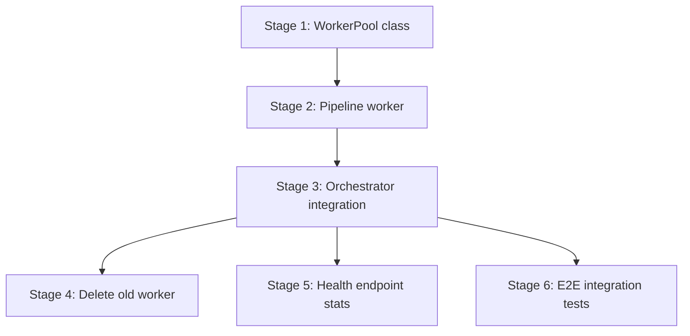

# Plan: Generic Worker Pool for Pipeline Processing

References: ADR.md

## Open Questions

1. **Worker path resolution in dev vs prod:** The Vite server build outputs compiled JS to `dist/server/`. In dev, `vite-node` or `tsx` handles TS directly. The engineer needs to verify how `new Worker(path)` resolves in both modes — likely needs a small helper that checks `import.meta.url` to determine the correct extension.

2. **Structured clone cost for large sessions:** The ADR asserts ~10ms for 60K events. The engineer should add a timing log in the pool dispatch path to validate this assumption and flag if it exceeds 50ms.

## Stages

### Stage 1: WorkerPool Generic Class

Goal: Create the reusable, generic `WorkerPool<TPayload, TResult>` with spawn, dispatch, FIFO queue, crash recovery, graceful shutdown, and stats. No pipeline-specific code.

Owner: backend-engineer

- [ ] Define `WorkerPoolOptions` interface (size, workerPath, workerData, shutdownTimeoutMs)
- [ ] Define `PoolStats` type (total, busy, idle, queued)
- [ ] Implement `WorkerPool<TPayload, TResult>` class
  - [ ] `constructor(options)` — spawns N workers, waits for `ready` from each
  - [ ] `start(): Promise<void>` — resolves when all workers are warmed up
  - [ ] `execute(payload: TPayload): Promise<TResult>` — dispatch or queue, returns result promise
  - [ ] `shutdown(): Promise<void>` — drain queue (reject pending), wait for in-flight, terminate
  - [ ] `stats(): PoolStats` — current pool state
  - [ ] Internal: FIFO queue, idle worker set, crash-and-replace logic
- [ ] Unit tests: pool lifecycle (start/shutdown), dispatch to idle worker, queue when all busy, crash recovery spawns replacement, shutdown rejects queued jobs, stats accuracy

Files:
- `src/server/workers/worker_pool.ts`
- `src/server/workers/worker_pool.test.ts`
- `src/server/workers/test_echo_worker.ts` (minimal worker for pool tests — echoes payload back)

Depends on: none

Considerations:
- The `ready` handshake must use a timeout — if a worker fails to init (bad WASM binary), `start()` should reject rather than hang forever.
- Crash recovery must not enter an infinite respawn loop if the worker script is fundamentally broken. Cap at 3 consecutive failures per slot, then mark the slot as dead and reject future dispatches.
- The pool must be generic: `TPayload` and `TResult` are the only pipeline-specific types. The pool itself imports nothing from `processing/`.

### Stage 2: Pipeline Worker Entry Point

Goal: Create the worker that runs validate+detect+replay+dedup in sequence. Receives `{ filePath, sessionId }`, returns `ProcessedSession`.

Owner: backend-engineer

- [ ] Define `PipelineWorkerPayload` type (`{ filePath: string, sessionId: string }`)
- [ ] Define `PipelineWorkerResult` type (matches `ProcessedSession` shape)
- [ ] Implement `pipeline_worker.ts` — listens for `job` messages, runs the four stages, posts result
  - [ ] On startup: call `initVt()`, post `{ type: 'ready' }`
  - [ ] On `job` message: run validate -> detect -> replay -> dedup, post result
  - [ ] Replay logic extracted from current `replay_worker.js` (the `runReplay` function and helpers)
- [ ] Refactor `replay.ts`: remove Worker import, export `replayInThread()` as a pure function callable from within the worker (takes header/events/boundaries, returns ReplayResult — the `runReplay` logic moved here from the JS worker)
- [ ] Unit tests: worker message protocol (ready signal, job processing, error response)

Files:
- `src/server/workers/pipeline_worker.ts`
- `src/server/workers/pipeline_worker.test.ts`
- `src/server/processing/stages/replay.ts` (refactored — pure function, no Worker import)

Depends on: Stage 1

Considerations:
- The worker must handle errors at each stage and return a structured error with the failing stage name, so the orchestrator can emit the correct `session.failed` event.
- The `runReplay` function and its helpers (countLFs, buildCriticalIndices, etc.) move from `replay_worker.js` into `replay.ts` as proper TypeScript. This is the bulk of the migration.
- `detect.ts` and `dedup.ts` stage functions are called directly inside the worker — they are pure functions with no thread-safety concerns.
- `validate.ts` uses `NdjsonStream` which reads from the filesystem — this works in worker threads but the file path must be absolute.

### Stage 3: Integrate Pool into PipelineOrchestrator

Goal: Replace the orchestrator's direct stage calls and replay worker with a single `pool.execute()` call. Maintain the same public API and event emission pattern.

Owner: backend-engineer

- [ ] Add `WorkerPool` as a dependency of `PipelineOrchestrator` (injected or created in constructor)
- [ ] Refactor `start()`: create and start the pool (replaces `initVt()` call on main thread)
- [ ] Refactor `runJob()`: replace stages 1-4 with `pool.execute({ filePath, sessionId })`, then run store on main thread
- [ ] Refactor `stop()`: call `pool.shutdown()` (replaces raw `Promise.allSettled`)
- [ ] Remove `MAX_CONCURRENT` constant — concurrency is now governed by pool size
- [ ] Preserve event emissions: the orchestrator still emits `session.validated`, `session.detected`, etc. — but now emits them after the pool returns the full result (batch emission) rather than between stages. Document this behavioral change.
- [ ] Update integration tests in `tests/integration/pipeline/pipeline_orchestrator.test.ts`

Files:
- `src/server/processing/pipeline_orchestrator.ts`
- `tests/integration/pipeline/pipeline_orchestrator.test.ts`

Depends on: Stage 2

Considerations:
- **Event emission timing change:** Currently events are emitted between stages (interleaved). With the pool, all four stages run in the worker and events are emitted in a burst after the result returns. If any SSE consumers depend on the interleaved timing, this is a behavioral change. Acceptable because SSE is used for progress indication, and the stages execute in <1s except for replay — the interleaved events were already near-instant for validate/detect/dedup.
- The orchestrator no longer needs `activeCount` / `inflight` tracking — the pool handles concurrency. But `waitForPending()` must still work for tests — it can delegate to tracking outstanding `pool.execute()` promises.
- Error handling: if the pool returns `{ ok: false, error, stage }`, the orchestrator calls `handleStageError` with the correct stage.

### Stage 4: Delete Old Worker and Clean Up

Goal: Remove dead code — the old plain-JS replay worker, the worker-spawning wrapper, and any unused imports.

Owner: backend-engineer

- [ ] Delete `src/server/processing/stages/replay_worker.js`
- [ ] Remove old worker-spawning code from `replay.ts` (already refactored in Stage 2, but verify no remnants)
- [ ] Remove `initVt()` call from main thread in orchestrator (already done in Stage 3, but verify)
- [ ] Update `src/server/processing/index.ts` if it re-exports anything from the deleted files
- [ ] Verify no other imports reference the deleted files (grep for `replay_worker`)

Files:
- `src/server/processing/stages/replay_worker.js` (deleted)
- `src/server/processing/stages/replay.ts` (verify clean)
- `src/server/processing/index.ts` (update if needed)

Depends on: Stage 3

Considerations:
- Check that `replay.test.ts` tests still pass — they currently test the Worker-based `replay()` function. After Stage 2, `replay.ts` exports a pure function, so these tests need to call the new API.

### Stage 5: Pool Stats on Health Endpoint

Goal: Expose `pool.stats()` (total, busy, idle, queued) on the health/status endpoint.

Owner: backend-engineer

- [ ] Add `getPoolStats()` method to `PipelineOrchestrator` (delegates to pool)
- [ ] Wire pool stats into existing health endpoint response
- [ ] Test: health endpoint returns pool stats

Files:
- `src/server/processing/pipeline_orchestrator.ts`
- `src/server/routes/health.ts` (or wherever the health endpoint lives)
- Corresponding test file

Depends on: Stage 3

Considerations:
- This stage is parallelizable with Stage 4 (no file overlap).

### Stage 6: End-to-End Pipeline Integration Test

Goal: Verify the full pipeline (upload -> pool dispatch -> worker processing -> store) works with the new architecture. This is the final confidence gate.

Owner: backend-engineer

- [ ] Write integration test: upload a .cast file, verify session is processed and stored correctly
- [ ] Write integration test: upload N files concurrently (N > pool size), verify all complete (backpressure test)
- [ ] Write integration test: verify graceful shutdown mid-processing does not lose data

Files:
- `tests/integration/pipeline/worker_pool_integration.test.ts`

Depends on: Stage 3, Stage 4

Considerations:
- Use the existing `fixtures/sample.cast` for the integration test.
- The concurrent upload test should use pool size = 2 and submit 4 jobs to verify queuing.

## Dependencies

- Stage 2 depends on Stage 1 (pool class must exist to test the worker with it)
- Stage 3 depends on Stage 2 (pipeline worker must exist to wire into orchestrator)
- Stages 4, 5, 6 depend on Stage 3 but are independent of each other (no file overlap)

## Progress

Updated by engineers as work progresses.

| Stage | Status | Notes |
|-------|--------|-------|
| 1 | pending | WorkerPool generic class |
| 2 | pending | Pipeline worker entry point |
| 3 | pending | Orchestrator integration |
| 4 | pending | Delete old replay_worker.js |
| 5 | pending | Health endpoint stats |
| 6 | pending | E2E integration tests |
