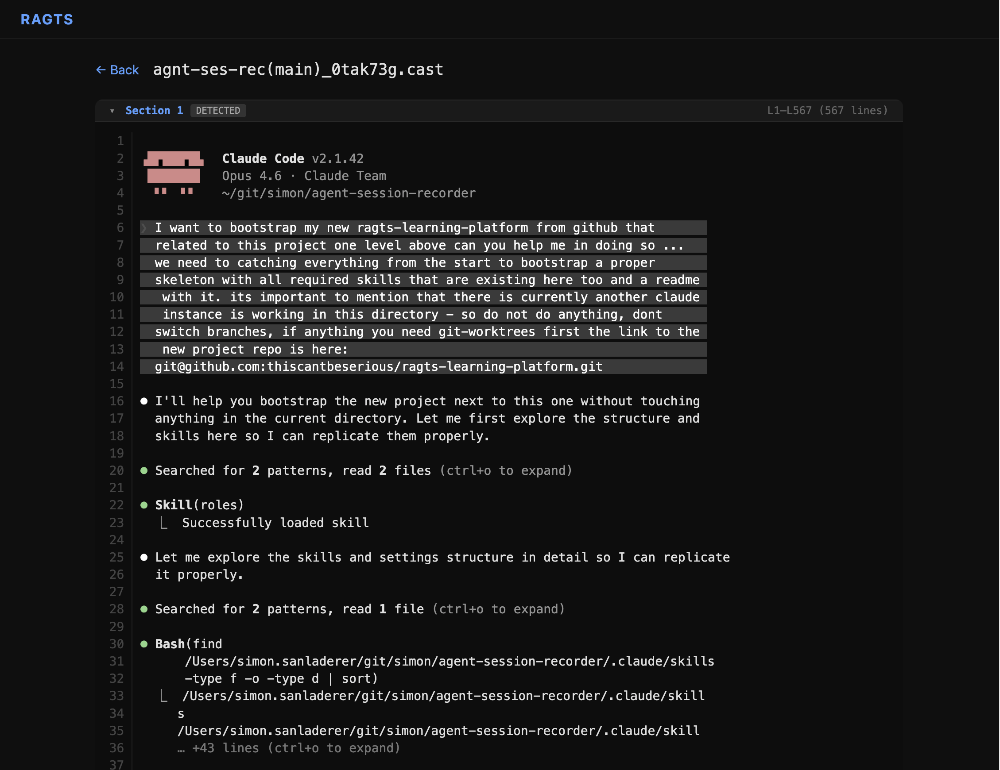
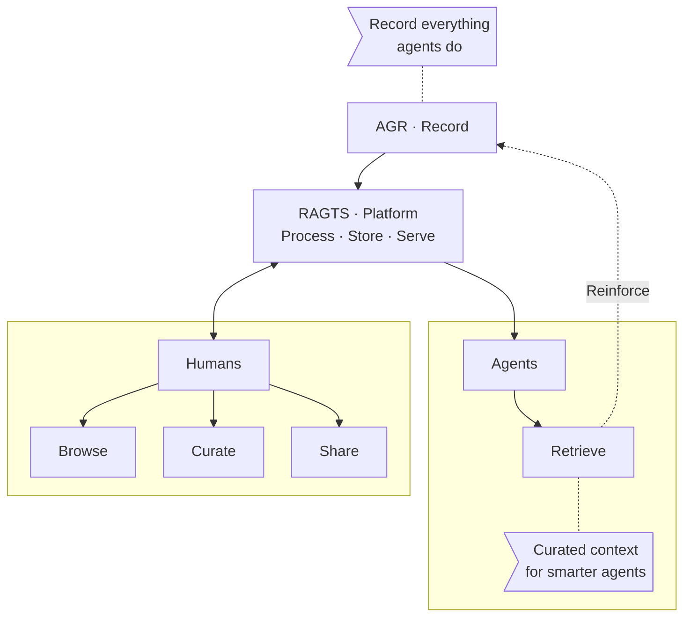

# RAGTS - Reinforced Human Learning Platform

> Reinforce the human part in the agentic loop. 

**Real Agentic Terminal Sessions** - Just like RAG, but more useful for humans and agents to learn from the unfolded mess when the refactoring deleted half your codebase again and the subagents thought it would be smart to skip the tests.

```Currently in MVP state - Heavy refactorings incomming!```

> 
>
> _**Screenshot of early MVP v2**. Browsing a recorded Claude Code session — terminal output of a 2 hour session in 2500 lines with split sections and fold/unfold. Later on you can use that with Markers and use these for RAG-Feeding with additional Context (adding Comments, Voting Results for example)_


## Problem

**Agent sessions are fire-and-forget. Thousands of lines of terminal output** - commands, reasoning, errors, recoveries - generated and never looked at again (or if autonomous, never). When something goes wrong, you're left digging through raw logs with no structure, no context, no way to search.

Up until now it was always about reinforcing the agents. But what about the humans?

## Solution

**RAGTS puts you back in the loop. Every session becomes a browsable document you can fold, search, and understand**. Curate what matters into retrievable context for the next sessions so that your agents learn from next time - so the same mistake doesn't happen twice. 

Didn't work out? Adjust and repeat! Reinforce to the max. Your knowledge, your power, your control.

## Features

- **Read sessions like documents.** Generate optimized RAG retrieval on-the-fly.
- **Context you control.** Understand, curate, and feed back to your agents.
- **Fold/unfold with markers.** Collapse noise, expand what matters - powered by asciicast v3.
- **Self-hostable & white-label.** Your sessions, your infrastructure.

## How It Works



## Service
Powered by [Agent Session Recorder (AGR)](https://github.com/thiscantbeserious/agent-session-recorder) - the recording and transformation engine that captures sessions, removes silence, and prepares them for browsing and retrieval.

## Getting Started

### Prerequisites

- Node.js 20+
- npm

### Development

```bash
# Install dependencies
npm install

# Start dev servers (Vite frontend + Hono backend)
npm run dev
```

Open http://localhost:5173 to use the app. Upload `.cast` files (asciicast v3 format) via drag & drop or file picker.

### Production Build

```bash
npm run build
npm start
```

### Testing

```bash
npm test              # Run tests in watch mode
npx vitest run        # Single run
npx vitest run --coverage  # With coverage report
```

### Sample Data

A sample `.cast` file is included at `fixtures/sample.cast` for testing and demo purposes.

## License

This project uses **dual licensing**:

| Scope | License | File |
|-------|---------|------|
| Application code (`src/`, scripts, config) | **AGPL-3.0** | [LICENSE](LICENSE) |
| RAGTS Design System (tokens, components, icons, page scaffold) | **Elastic License 2.0 (ELv2)** | [LICENSE (ELv2)](.state/design-system-bootstrap/shared/LICENSE) |

The **RAGTS Design System** includes all design tokens, CSS component styles, icon definitions, and page scaffold classes. Files covered by the ELv2 are marked with a copyright header. The license path will move to its final location once the design system graduates from the bootstrap phase into `src/`.

**What this means:**
- The **application** is copyleft open-source — you can use, modify, and distribute it, but network use requires sharing your source (AGPL).
- The **design system** is source-available but **may not be offered as a hosted or managed service**. You can use it freely in your own deployments.

See each LICENSE file for full terms.
