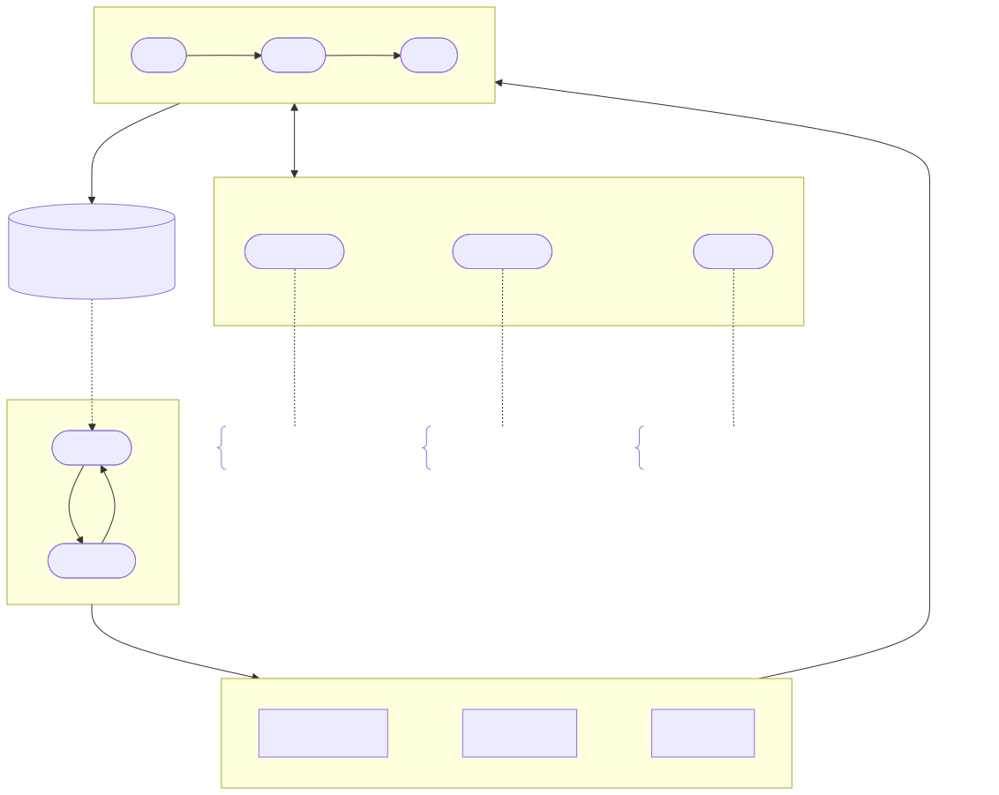

# Erika: The Self-Hosted, Collaborative Training Platform for both Agents and Humans 

[](https://sonarcloud.io/summary/new_code?id=thiscantbeserious_erika)
[](https://sonarcloud.io/summary/new_code?id=thiscantbeserious_erika)
[](https://sonarcloud.io/summary/new_code?id=thiscantbeserious_erika)
[](https://sonarcloud.io/summary/new_code?id=thiscantbeserious_erika)
[](https://sonarcloud.io/summary/new_code?id=thiscantbeserious_erika)
[](https://sonarcloud.io/summary/new_code?id=thiscantbeserious_erika)
[](https://sonarcloud.io/summary/new_code?id=thiscantbeserious_erika)
[](https://sonarcloud.io/summary/new_code?id=thiscantbeserious_erika)
[](https://sonarcloud.io/summary/new_code?id=thiscantbeserious_erika)
[](https://sonarcloud.io/summary/new_code?id=thiscantbeserious_erika)
[](https://sonarcloud.io/summary/new_code?id=thiscantbeserious_erika)

> Loop and Loop - round and round until you understand, both the human and the agent, burning with intent.



*See [VISION.md](VISION.md) for a full vision walkthrough.*

- Self-Hosted, Whitelable Platform for Individuals, Teams and Companies
- Retroactive Learning of what Agents did in Detail (not just looking at a Wall of Text)
- Adding Context as to what they could do better next time (not just relying on `auto-repl` loops)
- Share that with your Colleagues for Training (not just Agents)

---

### Humans: 

**Are you really understanding why your Agents like `claude` or `claw` did the stuff they did - how and why?** 

I mean for you, not for `Jon Claude Van God Damnit` throwing rocks on the ice ... 

Could you even manage to follow along amongst the wall of text across the many hours this went on? 

Or did they just become a `black box` to you - that produces `something` in the end? 

Most importantly - **is it really what you wanted?**, and if yes ... do you maybe want to share that experience you had here?

---

### Agents: 

**Did you really understand what the human interacting with you was trying to make you act upon?** 

Or were you just, best guessing - filling the void? If anything writing your confusion down into a `MEMORY.md` style-diary? And them trying to automatically stuff you even fuller with `RAG` snippets that are supposed to make that *more specific*, *fitting the intent* (yet, never really curated, by the very people you are supposed to be **INTERACTING** and **producing solution** for - and with)?

### Both:

Don't you think we can learn from each other? (yes, writing this down feels odd ...)

## The Problem

The current industry largely tries to solve the Human-AI Interaction by going more and more autonomous—implementing smart, self-iterating reinforcement loops without any human interaction, training them automatically. At best, they use a highly specific engineering perspective to pre-train models on datasets that a few humans thought were "good enough" for a broad audience.

**But what if the Human Layer is exactly what's missing, and instead of going fully autonomous, we need a continuous feedback loop?**

1. We need to understand the intent of the agent and what it actually did (=**Human Reinforcement Layer**).
2. We need to guide them in a better direction from our unique perspective (=**Agent Reinforcement Layer**).

It acts as a shared workspace where humans can easily read, understand, and review the workflows captured by tools like agentic-session-recorder (agents can automatically upload their findings, too). But Erika isn't just a log viewer—it is a mentorship hub. Humans can flag mistakes, share specific sessions with their team, and meta-tag agent behavior using their human intent and instincts. Erika then translates those human insights into structured reinforcement data, creating a continuous learning loop that is easily digested by both human engineers and the agents themselves.

```Currently in MVP state - Heavy refactorings incoming!```

## The Solution

### Re-Introduce the Human Layer and dont try to optimize it away


## Features

- **Read sessions like documents.** Generate optimized RAG retrieval on-the-fly.
- **Context you control.** Understand, curate, and feed back to your agents.
- **Fold/unfold with markers.** Collapse noise, expand what matters - powered by asciicast v3.
- **Self-hostable & white-label.** Your sessions, your infrastructure.

## Current Service-Layer
The is currently largely powered by [Agent Session Recorder (AGR)](https://github.com/thiscantbeserious/erika) - the recording and transformation engine that captures sessions, removes silence, and prepares them for browsing and retrieval. Later on this should be independent, not just tie to that, but add many sources of logs, and transportation layers to grasp the raw session output.s

## Getting Started

### Prerequisites

- Node.js 20+
- npm

### Development

```bash
# Install dependencies
npm install

# Start dev servers (Vite frontend + Hono backend)
npm run dev
```

Open http://localhost:5173 to use the app. Upload `.cast` files (asciicast v3 format) via drag & drop or file picker.

### Production Build

```bash
npm run build
npm start
```

### Testing

```bash
npm test              # Run tests in watch mode
npx vitest run        # Single run
npx vitest run --coverage  # With coverage report
```

### Sample Data

A sample `.cast` file is included at `fixtures/sample.cast` for testing and demo purposes.

## Design Guide

Browse the live design system at **[thiscantbeserious.github.io/erika](https://thiscantbeserious.github.io/erika/)** — tokens, components, and page mockups rendered as static HTML+CSS.

## License

This project uses **dual licensing**:

| Scope | License | File |
|-------|---------|------|
| Application code | **AGPL-3.0** | [LICENSE](LICENSE) |
| Design System | **Elastic License 2.0 (ELv2)** | see individual LICENSE files |

### Design System (ELv2)

The visual design, composition, layout patterns, token values, and individual styles that make up the **Design System** are protected creative work. This includes — but is not limited to — color palettes, typography scales, spacing systems, component designs, icon definitions, and page scaffolding.

Protected files carry a copyright header pointing to their accompanying LICENSE file. The ELv2 permits free use in your own deployments but **prohibits offering the design system as part of a hosted or managed service**.

### Application Code (AGPL-3.0)

The application source code is copyleft open-source. You can use, modify, and distribute it, but network use requires sharing your source.
