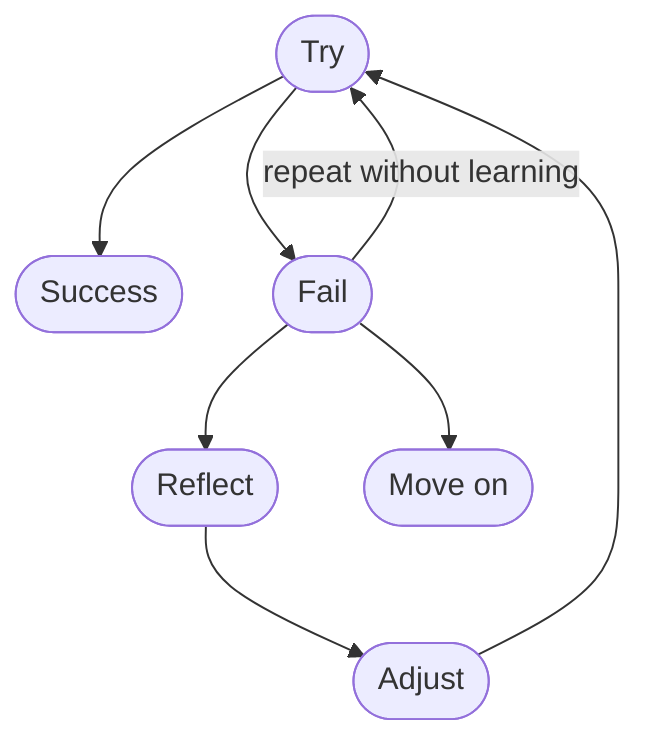
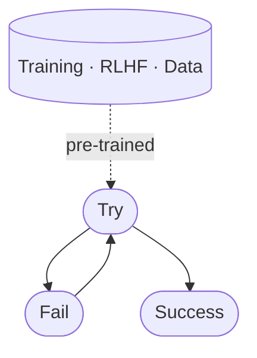
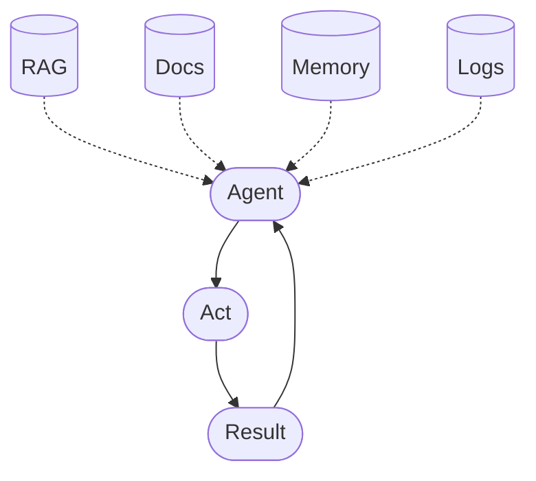
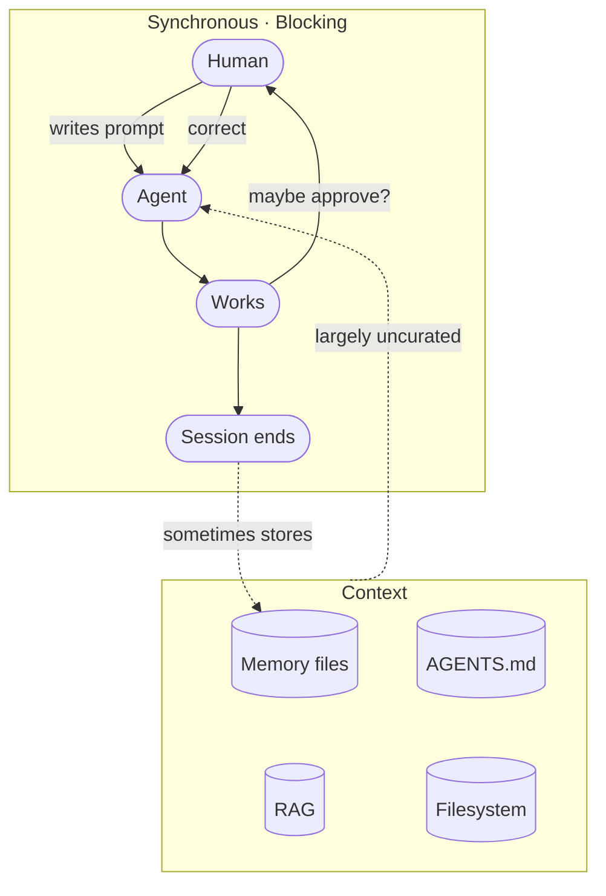
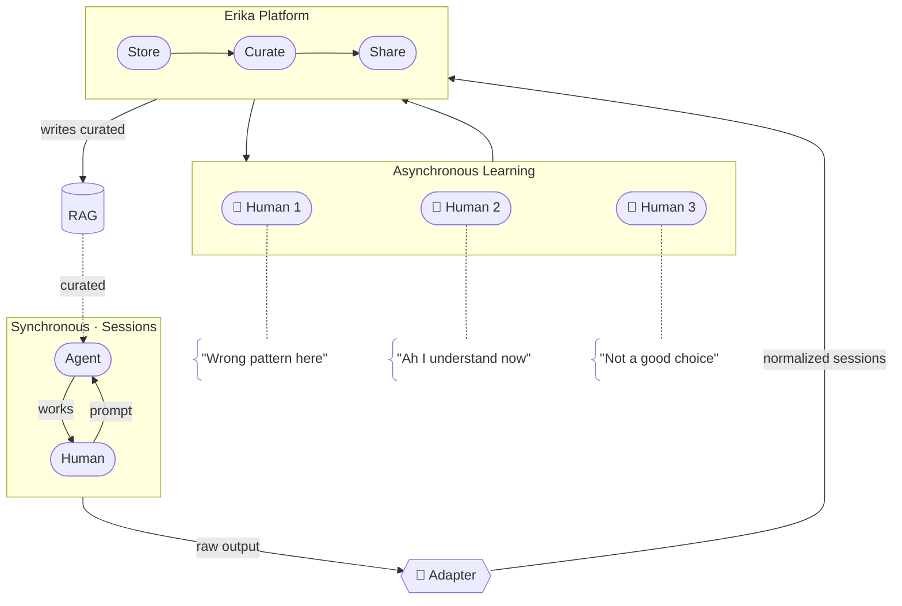

# Vision

How learning works — from first principles to the asynchronous refinement loop that Erika builds.

---

## Step 1: The Human Loop

Humans learn through failure and repetition. The critical ingredient isn't the failure — it's the reflection between attempts. Without understanding *why* something failed, repetition is just noise.

This loop is slow, expensive, and irreplaceable. It's how we build intuition.

---

## Step 2: How Machines Compress This

AI compresses the same cycle — millions of attempts, no reflection needed. Audiovisual models, reinforcement learning, massive training corpora. Fast, tireless, increasingly autonomous.

The reflection step disappears. **Speed replaces understanding.**

---

## Step 3: The Context Problem

To compensate, the industry adds retrieval layers — RAG, memory files, auto-injected snippets. More context, **but not better context**.

Every source is another fork in the road. The agent gets more directions, not better ones.

---

## Step 4: The Current State of Things

This is how agentic coding works today. The human writes a prompt. The agent grabs whatever context it can find — memory files it wrote itself, retrieval snippets matched by keyword similarity, instruction files. None of this is curated by a human. The agent decides what to load, and it decides the way a search engine does: by surface-level relevance, without understanding what actually mattered last time.

Then it works — sometimes with the human watching and approving, sometimes on full auto-accept. Either way, the human is either blocked waiting, or absent entirely.

The context the agent works with is **not chosen by the human**. Memory files, RAG, instructions, filesystem — the agent decides what to load, matched by surface-level relevance, not by intent. A critical architectural decision gets the same weight as a stale TODO.

The session itself is a **synchronous, blocking loop**. If the human is involved, they sit and wait. If they're not, the agent runs unsupervised. Either way, corrections stay trapped in the session. Next time, the agent loads the same unchosen context, maybe overwrites its own memory, and the cycle repeats.

Nothing the human learned carries over. And if you're on a team, none of it helps your colleagues either.

---

## Step 5: The Asynchronous Refinement Loop

This is what Erika builds.

Instead of requiring humans to supervise agents in real-time, Erika captures every session and makes it reviewable after the fact. Humans browse what happened, understand why, mark what mattered, and annotate what should have gone differently — on their own time, at their own pace.

Those curated insights feed back to agents as structured context for future sessions. Not raw logs. Not auto-retrieved snippets. Human-validated, intent-aware context that tells agents not just what happened, but what *should* have happened.

Each cycle sharpens both sides. Humans browse sessions, curate what matters, share with the team — on their own time, not blocking the agent. Curated insights flow back as structured context, replacing the uncurated noise from Step 4.

The loop is **asynchronous** — humans refine at their own pace. It's **compounding** — every curation pass improves the next session. And it's **collaborative** — the whole team contributes, not just whoever happened to be watching.

The loop doesn't replace human judgment. It scales it.
