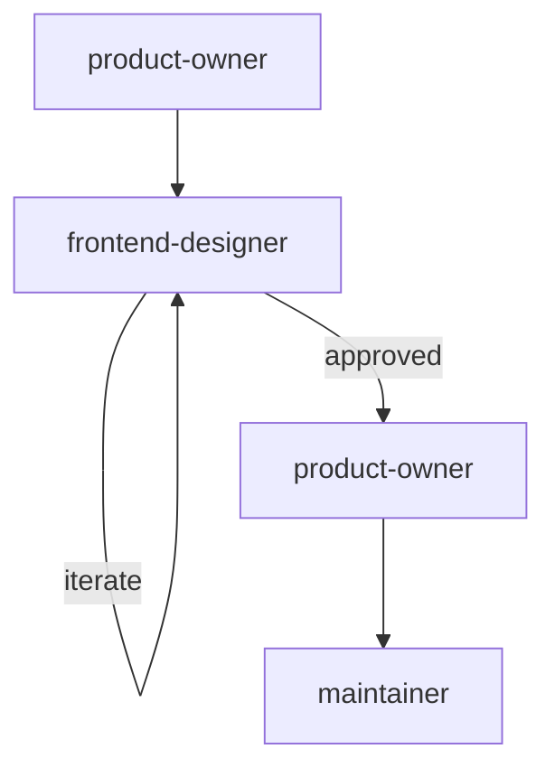

# Design Workflow

For visual design work only — no implementation.

## Phases

| # | Agent | Gate |
|---|-------|------|
| 1 | `product-owner` | REQUIREMENTS.md signed off |
| 2 | `frontend-designer` | Mockups approved by user |
| 3 | `product-owner` | Validates designs match REQUIREMENTS.md |

No architect phase — design work doesn't need an ADR unless it involves architectural decisions (in which case, use the frontend or full-stack workflow instead).

## Git Contract

| Rule | Value |
|------|-------|
| Branch prefix | `design/` |
| Commit scopes | `design` |
| Allowed paths | `design/**`, `.state/**/designs/**` |
| PR title | `design: <description>` |
