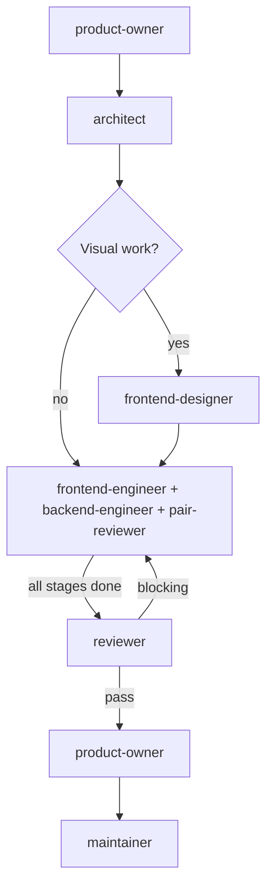

# Full-Stack Workflow

For tasks spanning both client and server code.

## Phases

| # | Agent | Gate |
|---|-------|------|
| 1 | `product-owner` | REQUIREMENTS.md signed off |
| 2 | `architect` | ADR.md + PLAN.md approved |
| 3 | `frontend-designer` | Mockups approved (if visual work) |
| 4 | `frontend-engineer` + `backend-engineer` + `pair-reviewer` | Per stage: implement → pair review → fix blocking → next stage. All stages complete. |
| 5 | `reviewer` | No blocking findings (includes triage of CodeRabbit/external findings when available) |
| 6 | `product-owner` | Validates against REQUIREMENTS.md |
| 7 | `maintainer` | CI green, all approvals |

Phase 3 is skipped when the task has no visual/UX changes.
Phase 4 engineers may run in parallel when PLAN stages have non-overlapping files and no dependencies. Max 2 parallel agents.

## Git Contract

| Rule | Value |
|------|-------|
| Branch prefix | `feat/` or `fix/` |
| Commit scopes | `client`, `server`, `shared`, `db`, `wasm` |
| Allowed paths | `src/**`, `packages/**` |
| PR title | `feat: <description>` or `fix: <description>` |
